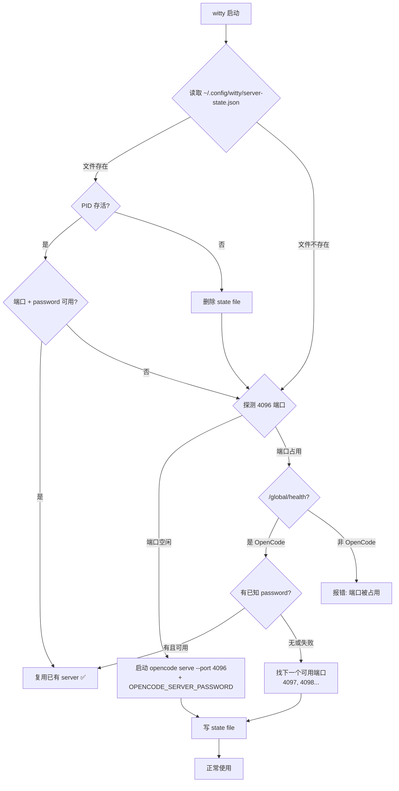

# 设计文档：OpenCode Server 生命周期管理

> **适用范围**：`witty` CLI 对 `opencode serve` 的自动启动、检测、发现与安全隔离

---

## 1. 背景与动机

### 1.1 当前问题

当前 `witty` 依赖用户**提前手动启动** `opencode serve --port 4096`。这带来三个体验问题：

1. **两步操作**：用户必须先启动 server，再使用 `witty ask`，认知负担重。
2. **终端关闭后失效**：终端退出后 server 仍然运行，用户下次启动 `witty` 时不知道"我的 server 还在不在"。
3. **错误提示不友好**：当前 hint 是 `ensure 'opencode serve --port 4096' is running and reachable`，对人不友好。

### 1.2 目标

- **自动启动**：`witty` 首次使用时自动启动 `opencode serve`，无需用户手动操作。
- **自动检测**：`witty` 启动时自动检测是否已有可用 server，优先复用。
- **跨会话复用**：`witty` 退出后 server 继续运行，下次启动 `witty` 时无缝复用。
- **多用户隔离**：同一台 openEuler 服务器上，不同用户的 server 互相隔离，无法互相访问。
- **安全可控**：用户可以通过配置关闭自动启动，保持向后兼容。

---

## 2. 调研结论

### 2.1 OpenCode 不具备 Server 发现能力

经过对 OpenCode CLI（v1.17.9）、SQLite 数据库（`opencode.db`）、OpenAPI 端点、mDNS 机制的全面调查：

| 机制 | 是否存在 | 结论 |
| ---- | -------- | ---- |
| `opencode list` / `opencode servers` 命令 | ❌ | 不存在 |
| `/global/*` REST 端点（list instances） | ❌ | 只有 health/event/config/dispose/upgrade |
| SQLite 数据库 server 表 | ❌ | 只有 session/message/project 等业务表 |
| PID 文件 | ❌ | 不写任何 pidfile |
| mDNS 服务发现 | ⚠️ | `--mdns` flag 存在，但需要 avahi-daemon（openEuler 默认不安装），且要求 hostname≠127.0.0.1 |

**结论：Witty 必须自己实现 Server 发现和生命周期管理。**

### 2.2 业界先例：`opencode-mcp`

社区 `opencode-mcp`（如 [AlaeddineMessadi/opencode-mcp](https://github.com/AlaeddineMessadi/opencode-mcp)）已经做到了自动启动，但它们的实现路径与 Witty 不同：

- **探测机制相同**：启动时 probing `OPENCODE_BASE_URL/global/health`，可达则复用。
- **启动方式不同**：不可达时通过 `@opencode-ai/sdk` 的 `createOpencodeServer()` **进程内启动** HTTP server——不 spawn 独立子进程，不依赖 `opencode` 二进制。
- **Witty 的差异**：Witty 是 Go 项目，无法直接使用 TypeScript SDK。因此 Witty 采用 `os/exec` spawn `opencode serve` 子进程的方式——这是 Go 生态下等效且合理的替代方案。

---

## 3. 整体设计

### 3.1 核心状态文件

```text
~/.config/witty/
├── config.toml           # 用户配置
├── server-state.json     # Server 状态（权限 0600）  ← 新增
└── session.json          # 当前 session 状态
```

**`server-state.json` 结构**：

```json
{
  "port": 4097,
  "password": "f1a8b3c4d5e6f7a8b9c0d1e2f3a4b5c6",
  "pid": 12345,
  "started_at": "2026-06-24T10:30:00+08:00",
  "last_used": "2026-06-24T10:45:00+08:00"
}
```

| 字段 | 用途 |
| ---- | ---- |
| `port` | Server 实际监听端口 |
| `password` | HTTP Basic Auth 密码（`OPENCODE_SERVER_PASSWORD`） |
| `pid` | OS 进程 ID，快速判断进程存活 |
| `started_at` | 调试/诊断用 |
| `last_used` | 用于 idle timeout 自动清理（Phase 3 已实现） |

### 3.2 密码的双重作用

`password` 不仅是安全措施，也是**身份识别**机制：

```text
B 的 witty 启动时探测 4096：
├─ /global/health 返回 200
├─ 用 B 的 password 尝试请求
│   ├─ 200 → 对方是 B 的 server（复用）✅
│   └─ 401 → 对方是 A 的 server（隔离）→ 换端口
└─ 端口空闲 → 启动新 server
```

### 3.3 启动流程



### 3.4 端口选择策略

1. **优先**：state file 中记录的端口（上次使用的）
2. **次选**：4096（默认端口）
3. **兜底**：逐个尝试 4097, 4098, … 4096+N（最多 10 个）

并发保护：两个 `witty` 进程同时启动时，通过 `O_EXCL` 创建 lock file 或使用 file-based advisory lock 避免竞态。

### 3.5 witty 退出策略：守护模式

```text
witty CLI 进程生命周期 ≠ opencode serve 进程生命周期
```

- witty 退出时**不杀** server 子进程（守护模式）
- opencode serve 作为孤儿进程被 init (PID 1) 收养，继续运行
- 下次启动 witty 时通过 state file 复用

**停止 server 的方式**：

- 用户显式执行 `witty server stop`——通过 `POST /global/dispose` API 优雅关机（跨进程，任何 witty 实例均可调用），SIGTERM 兜底
- idle timeout 自动清理——`Ensure()` 启动时检查 `last_used`，超时则惰性清理旧 server
- OS 重启 / 用户登出（进程自然终止）

---

## 4. 安全设计

### 4.1 威胁模型

同一台 openEuler 服务器上，用户 A（UID 1001）和用户 B（UID 1002）同时使用 witty。

| 威胁 | 严重程度 | 缓解措施 |
| ---- | -------- | -------- |
| B 连接 A 的 server | 🔴 高 | HTTP Basic Auth password + state file 隔离 |
| A 读取 B 的 API key | 🔴 高 | Server password 阻止未认证请求 |
| A 扫描 B 的端口 | 🟡 中 | state file 权限 0600，端口不可预测 |
| 磁盘上的 state file 泄露 | 🟡 中 | 文件权限 0600，不同 UID 无法读取 |

### 4.2 防御层次

```text
Layer 1: 文件系统权限（state file 0600）
Layer 2: Server Password（随机生成，不可猜测）
Layer 3: 非固定端口（降低被扫描命中概率）
```

### 4.3 其他安全考虑

- password 通过 `crypto/rand` 生成，32 字节 hex 编码
- password 仅通过环境变量 `OPENCODE_SERVER_PASSWORD` 传递给子进程，不出现在命令行参数中（`/proc` 安全）
- 日志中不输出 password
- `.agents/config.yaml` 不记录 password（已在 .gitignore 中）

---

## 5. 配置设计

### 5.1 新增配置项

`~/.config/witty/config.toml`:

```toml
[server]
auto_start = true           # 默认开启自动启动
port = 0                    # 0 = 自动选择端口，正整数 = 固定端口
hostname = "127.0.0.1"      # 绑定地址
startup_timeout_seconds = 10 # 等待 server 启动的最大时间
```

### 5.2 环境变量覆盖

| 环境变量 | 对应配置 | 说明 |
| -------- | -------- | ---- |
| `WITTY_SERVER_AUTO_START` | `server.auto_start` | `true`/`false` |
| `WITTY_SERVER_PORT` | `server.port` | 端口号 |
| `WITTY_SERVER_HOSTNAME` | `server.hostname` | 绑定地址 |

### 5.3 向后兼容

- `auto_start = false`（或环境变量 `WITTY_SERVER_AUTO_START=false`）时，行为完全回退到当前模式（需要手动启动 server）
- 新增字段不影响现有配置文件的解析

---

## 6. 模块设计：`internal/server`

### 6.1 模块职责

管理 `opencode serve` 进程的完整生命周期：启动、检测、复用、停止。

### 6.2 接口设计

```go
// package server

// Manager 管理 opencode serve 进程的生命周期。
type Manager interface {
    // Ensure 确保 server 可用。如果已有可用 server，直接返回其地址和认证信息；
    // 否则启动一个新的 server 进程。
    //
    // 如果配置了 IdleTimeout 且 state file 中的 last_used 已超时，
    // Ensure 会先停掉闲置的旧 server（惰性清理），再启动新的。
    Ensure(ctx context.Context) (Connection, error)

    // Stop 停止 state file 指向的 server。
    // 优先调用 POST /global/dispose 进行优雅关机；
    // 如果 HTTP 不可达，兜底用 SIGTERM 发送给 state file 中记录的 PID。
    // 不要求 server 由当前进程启动——任何持有 state file password 的
    // witty 进程都可以停止 server。
    Stop(ctx context.Context) error

    // Status 返回当前 server 的状态信息，用于诊断。
    // 不产生副作用（不启动 server）。
    Status(ctx context.Context) Status

    // TouchLastUsed 更新 state file 中的 last_used 时间戳。
    // 由 transport 层在每次成功 HTTP 请求后调用，确保 idle timeout
    // 不会在活跃使用期间误触发。
    TouchLastUsed()

    // Close 释放 Manager 资源（停止 idle monitor goroutine）。
    // 应在应用退出时调用。
    Close()
}

// Connection 描述一个可用的 server 连接信息。
type Connection struct {
    URL      string // 完整 URL，例如 http://127.0.0.1:4097
    Password string // HTTP Basic Auth 密码
}

// Status 描述 server 的运行时状态。
type Status struct {
    Running   bool   // server 是否在运行
    Port      int    // 监听端口
    PID       int    // 进程 ID（来自 state file）
    Managed   bool   // 是否由当前 witty 进程启动（false = 从 state file 恢复或非托管）
    StartedAt string // 启动时间
}

// Options 配置 Manager。
type Options struct {
    StateDir            string        // state file 目录（默认 ~/.config/witty）
    AutoStart           bool          // 是否自动启动
    PreferredPort       int           // 首选端口（0 = 自动选择）
    Hostname            string        // 绑定地址
    StartupTimeout      time.Duration // 等待 server 就绪的最大时间
    IdleTimeout         time.Duration // 闲置超时，超过后自动停止 server（0 = 禁用）
    OpenCodeBinaryPath  string        // opencode 二进制路径（默认 "opencode"）
}
```

### 6.2.1 Stop 的双层停止策略

opencode 提供 `POST /global/dispose` 端点（见 OpenAPI spec），用于
"Clean up and dispose all OpenCode instances, releasing all resources"。
这等同于 `gpgconf --kill gpg-agent` 的 API 层关机机制，任何持有 password
的进程都可以调用。

`Stop()` 的执行流程：

```text
Stop(ctx):
  1. 读取 state file → 获取 URL + password + PID
  2. 尝试 POST {URL}/global/dispose（带 Authorization header）
     ├─ 200 → server 已优雅关机
     │        取消 idle monitor，清零 managedPID
     │        删除 state file → 返回 nil
     ├─ 连接拒绝/超时 → server 可能已死或 HTTP 不可达 → 进入步骤 3
     └─ 其他错误 → 进入步骤 3
  3. 兜底：SIGTERM 信号
     如果 state.PID > 0 且 PID 存活：
       发送 SIGTERM
       等待进程退出（带 5s 超时，轮询 isPIDAlive）
     删除 state file → 返回
  4. 如果步骤 2 和 3 都无法停止 → 返回错误
```

**为什么不用 managedPID 检查**：每个 `witty` CLI 命令是独立进程。
`managedPID` 仅在启动 server 的那个进程中非零，其他进程（包括
`witty server stop`）的 `managedPID` 始终为 0。因此以 `managedPID`
为前置条件会导致 `stop` 命令在正常使用场景下永远无法工作。

**PID 复用风险缓解**：SIGTERM 兜底仅在 `/global/dispose` 不可达时触发。
在发送信号前，可额外验证 PID 对应的进程命令行包含 `opencode serve`
（通过 `/proc/{pid}/cmdline`），避免误杀 PID 复用后的无关进程。

### 6.3 子组件

```text
internal/server/
├── server.go         # Manager 接口 + 构造函数
├── manager.go        # 核心生命周期逻辑
├── state.go          # state file 读写
├── discovery.go      # 端口探测 + health 检查
├── process.go        # 子进程管理（spawn + PID 追踪）
├── password.go       # 随机密码生成
├── server_test.go    # 单元测试
└── export_test.go    # 测试辅助
```

### 6.4 与应用层的集成

在 `internal/app/wiring.go` 中：

```go
serverMgr, err := server.NewManager(server.Options{
    StateDir:           wittyStateDir,
    AutoStart:          cfg.Server.AutoStart,
    PreferredPort:      cfg.Server.Port,
    Hostname:           cfg.Server.Hostname,
    StartupTimeout:     time.Duration(cfg.Server.StartupTimeoutSeconds) * time.Second,
    IdleTimeout:        time.Duration(cfg.Server.IdleTimeoutMinutes) * time.Minute,
    OpenCodeBinaryPath: "opencode",
})
// Ensure 在 transport client 创建之前调用
conn, err := serverMgr.Ensure(ctx)

// 用 conn.URL 创建 transport client，注入 TouchLastUsed 回调
transportClient, err := transport.NewClient(transport.Options{
    BaseURL:  conn.URL,
    Password: conn.Password,
    OnRequestSuccess: func() {
        serverMgr.TouchLastUsed() // 每次成功请求后刷新 last_used
    },
})
```

### 6.5 status/stop 命令的轻量初始化

`witty server status` 和 `witty server stop` 不应调用 `Ensure()`（避免
启动 server 的副作用）。这两种命令通过 `app.Options.SkipServerEnsure`
标志跳过 `Ensure()`，仅创建 Manager 实例用于读取状态或停止 server。

```go
// app/wiring.go
func New(ctx context.Context, opts Options) (Container, error) {
    // ...
    serverMgr, err = server.NewManager(server.Options{...})
    if !opts.SkipServerEnsure {
        conn, err = serverMgr.Ensure(ctx)
        // ...
    }
    // Manager 始终创建，但 Ensure 仅在需要时调用
    // ...
}
```

---

## 7. 边界情况与错误处理

| 场景 | 处理方式 |
| ---- | -------- |
| **首次启动** | 没有 state file，走完整探测→启动流程 |
| **Server 崩溃（witty 不在运行）** | 下次启动时 PID 检测失败 → 删旧 state → 重新启动 |
| **State file 被误删但 server 还活着** | 端口探测找到 server 但无 password 可用 → 生成新密码重启（或降级为无密码连接 + warn） |
| **目标端口被非 OpenCode 进程占用** | 端口连通但 `/global/health` 返回非预期 → 报错并提示端口冲突 |
| **磁盘满，state file 写失败** | 降级为"本次会话有效"模式（内存中的 connection info），warn 用户 |
| **opencode 二进制不在 PATH** | 报明确错误，提示安装 opencode |
| **`opencode serve` 启动超时** | 等 startup_timeout_seconds 秒后 health check 仍失败 → 报错退出 |
| **并发启动（两个 witty 进程同时启动）** | 文件锁 + coalesce 防御，防止 spawn 两个 server |
| **`witty server stop` 跨进程停止** | 读取 state file → `POST /global/dispose`（带 auth）→ 兜底 SIGTERM。不以 `managedPID` 为前置条件 |
| **Server 闲置超时（CLI 模式）** | `Ensure()` 启动时检查 `last_used`，超时则先停旧 server 再启新的（惰性清理）。不依赖后台 goroutine |
| **Server 闲置超时（REPL 模式）** | 后台 goroutine 检查 `last_used`（由 transport 层 `OnRequestSuccess` 实时更新） |
| **`/global/dispose` 不可达但 PID 存活** | 兜底 SIGTERM + 等待退出。发送信号前验证 `/proc/{pid}/cmdline` 含 `opencode serve` |
| **PID 复用（旧 PID 被无关进程占用）** | SIGTERM 前检查 cmdline；`/global/dispose` 优先避免依赖 PID |

---

## 8. 开发路线图

### Phase 1（本阶段）：核心自动启动

- [x] `internal/server` 模块骨架 + 接口定义
- [x] state file 读写
- [x] 端口探测 + health check
- [x] 子进程启动（`os/exec`）
- [x] PID 验证
- [x] 配置文件 `server.auto_start` 字段
- [x] `internal/app/wiring.go` 集成
- [x] 单元测试（mock opencode binary）

### Phase 2（后续）：安全加固

- [x] 随机 password 生成 + HTTP Basic Auth
- [x] 密码认证探测（区分"我的"和"别人的" server）
- [x] 非固定端口自动选择
- [x] 并发启动的 coalesce 防御

### Phase 3（后续）：运维能力

> **注意**：Phase 3 初版实现存在设计缺陷（详见 Phase 3.1），以下标记初版完成状态
> 和修正方向。

初版已完成（存在缺陷）：

- [x] `witty server status` 诊断命令
- [x] `witty server stop` 停止命令
- [x] idle timeout + 自动清理
- [x] `witty doctor` 增强（显示 server 管理状态）

初版缺陷：

1. **`witty server stop` 无法停止跨进程 server** — `Stop()` 以 `managedPID` 为前置条件，但 CLI 模式下每个命令是独立进程，`managedPID` 始终为 0
2. **idle timeout 在 CLI 模式失效** — `last_used` 仅在 `Ensure()` 更新（每次调用都刷新），后台 goroutine 随进程退出
3. **`status`/`stop` 命令有启动副作用** — `loadApp` → `Ensure()` 链路无条件执行，`status` 可能启动 server

### Phase 3.1：Phase 3 修正

- [x] `Stop()` 改用 `POST /global/dispose` API + SIGTERM 兜底，移除 `managedPID` 前置检查
- [x] `status`/`stop` 命令跳过 `Ensure()`（`app.Options.SkipServerEnsure`）
- [x] idle timeout 惰性清理：`Ensure()` 中检查 `last_used`，超时先停旧 server
- [x] transport 层 `OnRequestSuccess` 回调：每次成功请求刷新 `last_used`
- [x] `Manager.TouchLastUsed()` 和 `Manager.Close()` 方法
- [x] `Stop()` 中 SIGTERM 后等待进程退出（带超时）
- [x] `transport.Client` 增加 `Dispose(ctx)` 方法

---

## 9. 参考

- [OpenCode Server 文档](https://opencode.ai/docs/server/)
- [opencode-mcp 自动启动实现（in-process SDK）](https://github.com/AlaeddineMessadi/opencode-mcp)
- [opencode-mcp 架构文档](https://github.com/AlaeddineMessadi/opencode-mcp/blob/main/docs/architecture.md)
- [OpenCode CLI 文档](https://opencode.ai/docs/cli/)
