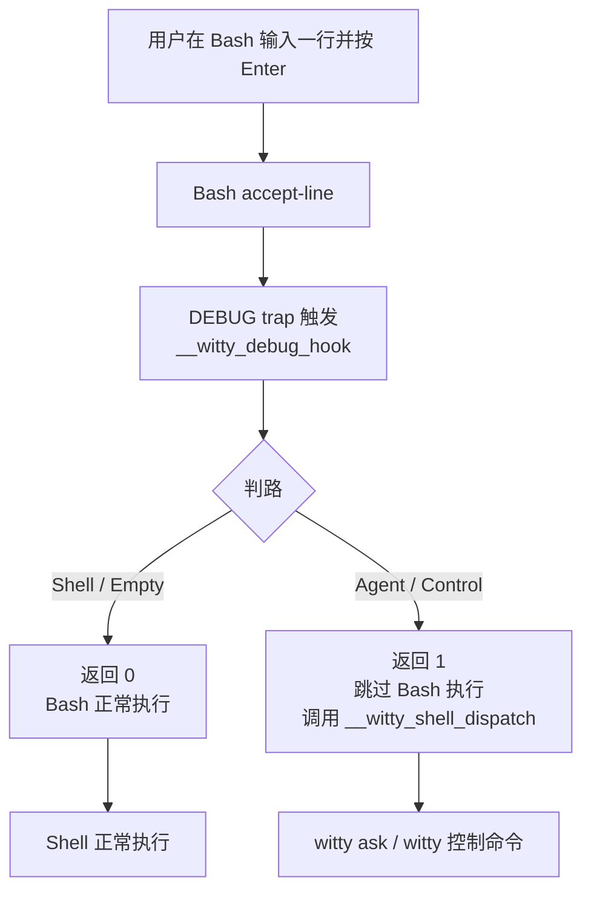

# 设计文档：Shell Adapter（Bash 接入层）

> **适用范围**：openEuler Bash 5.x 交互式终端

---

## 1. 背景

Shell Adapter 是 `witty` 中最靠近用户终端输入的一层。它的职责是把 Bash 中用户敲下的一整行输入，稳定地分流到以下三类路径之一：

1. **普通 shell 命令**：保持原样交给 Bash 执行
2. **控制命令**：转交给 `witty` 解释（如 `/session list`）
3. **自然语言请求**：转交给 `witty ask` 处理

这层的难点在于：

- 必须在 **shell 真正执行之前** 拿到整行原始输入；
- 不能只覆盖"未知命令"场景，还要覆盖 `systemctl 怎么看 nginx 日志` 这类**以真实命令开头**的自然语言；
- 不能明显破坏 Bash 的原生体验，包括历史、补全、交互式程序、管道、多行命令与常见 prompt 行为；
- 要给出**稳定、可解释**的路由规则。

---

## 2. 目标与非目标

### 2.1 目标

1. **在 Bash 执行前拿到完整输入行**
2. **支持已知命令开头的自然语言**，例如：
   - `systemctl 怎么看 nginx 日志`
   - `git 怎么只看最近一次提交`
3. **对 shell 路由尽量保持原生语义**
4. **与 `witty` Core 解耦**：Adapter 只负责接入与路由，不重复实现会话/渲染/权限
5. **支持显式逃生口**：用户可以稳定地强制走 Agent 或控制命令
6. **在 openEuler Bash 5.x 上可落地实现**，使用 Bash 自身提供的机制

### 2.2 非目标

本设计**不追求**：

- 100% 无歧义地判断自然语言与 shell 命令
- 支持 Bash 之外的所有 shell（如 zsh/fish）
- 重新实现一个完整 shell parser
- 在 Adapter 层承担 Markdown 渲染、SSE、权限交互等 `witty` Core 职责
- 让"多段自然语言、多行编辑"在普通 shell 模式下媲美专用 REPL

> Shell Adapter 的目标是"**可靠接入 + 可解释路由**"，而不是"理解一切输入"。

---

## 3. 设计决策

### 3.1 主方案

Shell Adapter 的方案为：

> **Bash `DEBUG` trap + `extdebug` + 分类器 + dispatch 函数**

利用 Bash 的 `DEBUG` trap 机制（配合 `shopt -s extdebug`），在每条命令**即将执行前**拦截，由分类器判断路由。当 `extdebug` 启用时，DEBUG trap 函数返回非零值会**跳过当前命令的执行**——这正是我们需要的：

- **shell 路由**：trap 返回 0，Bash 正常执行命令，**零侵入**
- **agent / control 路由**：trap 返回 1，跳过 Bash 执行，转而调用 `__witty_shell_dispatch` 执行 `witty ask` 或控制命令

相比之前的 Readline Hook（`bind -x` + `READLINE_LINE` 改写）方案，DEBUG trap 方案有根本性优势：

1. **不修改 Readline 行为**：不绑定 Enter 键、不修改 `READLINE_LINE`，完全避免 `rl_redisplay()` 导致的命令重复显示、空行换行等问题
2. **对 shell 路径零侵入**：shell 命令的执行路径与无 Adapter 时完全一致，包括 Readline 重绘、历史、提示符等
3. **实现更简洁**：不需要宏绑定、内部 key sequence、`accept-line` 包装等复杂机制

之所以不使用 `bind -x` + `READLINE_LINE` 改写方案，是因为 Readline 在 `bind -x` handler 返回后始终调用 `rl_redisplay()`，对带 ANSI 颜色码的 PS1 会计算错误宽度，导致命令重复显示、空行额外换行、dispatch 命令暴露等问题。这些问题在 Readline 层面无法从 Bash 侧绕开。

### 3.3 设计原则

1. **对 shell 路径零侵入或最小侵入**
2. **对 Agent 路径用"改写 + dispatch"而不是"立即执行"**
3. **分类逻辑确定性优先**，避免黑盒 NLP 分类器
4. **保留 escape hatch**，允许显式命令强制走 Agent / 控制路径
5. **在 Bash 能力边界内做事**，不让 Adapter 变成第二个 shell

---

## 4. 总体架构



### 4.1 模块划分

Shell Adapter 拆成 5 个小模块：

1. **Installer**
   - `witty init bash` 输出 Bash 集成脚本
   - 做环境探测、幂等安装、`extdebug` 与 DEBUG trap 注入

2. **Trap Layer**
   - 定义 `__witty_debug_hook` 函数
   - 启用 `shopt -s extdebug`
   - 设置 `trap '__witty_debug_hook' DEBUG`
   - 保存并恢复已有 DEBUG trap

3. **Classifier**
   - 基于 `READLINE_LINE` 的规则分类
   - 输出 `empty` / `shell` / `agent` / `control`

4. **Dispatcher**
   - 真正执行 `witty ask` / `witty session` / 其它控制动作
   - 维护 Shell 模式下需要保留的最小状态

5. **History / Safety Layer**
   - 隐藏内部 wrapper 命令
   - 保留用户原始输入到 history
   - 提供禁用、debug、fallback 能力

---

## 5. 关键实现：DEBUG trap + extdebug

利用 Bash 的 `DEBUG` trap 和 `extdebug` 选项，在每条命令执行前拦截并分类：

1. `shopt -s extdebug` 启用扩展调试模式
2. `trap '__witty_debug_hook' DEBUG` 注册 trap
3. trap 函数通过 `BASH_COMMAND` 获取即将执行的命令
4. 分类器判断路由：shell/empty 返回 0（正常执行），agent/control 返回 1（跳过执行并转交 dispatch）

`extdebug` 的关键语义：当 DEBUG trap 函数返回非零值时，**当前命令被跳过不执行**。这让我们可以在 trap 中安全地拦截 agent/control 路由的命令，转而执行 `__witty_shell_dispatch`。

DEBUG trap 函数遵循以下逻辑：

```bash
__witty_debug_hook() {
    local cmd="${BASH_COMMAND:-}"
    [ -z "$cmd" ] && return 0
    local route=""
    route="$(__witty_classify "$cmd")"
    case "$route" in
        empty|shell)
            return 0
            ;;
        agent|control)
            __witty_shell_dispatch "$route" -- "$cmd"
            return 1
            ;;
    esac
    return 0
}
```

- **shell 路径**：返回 0，Bash 正常执行命令，**零侵入**
- **agent/control 路径**：调用 `__witty_shell_dispatch` 后返回 1，跳过 Bash 对原始命令的执行

相比 Readline Hook 方案，此方案不修改 `READLINE_LINE`、不绑定 Enter 键、不触发 `rl_redisplay()`，从根本上避免了命令重复显示、空行额外换行、dispatch 命令暴露等问题。

> **⚠️ 历史方案说明**：早期实现使用 `bind -x` + `READLINE_LINE` 改写方案，在 Enter 预处理阶段改写命令行。但 Readline 在 `bind -x` handler 返回后始终调用 `rl_redisplay()`，对带 ANSI 颜色码的 PS1 会计算错误宽度，导致命令重复显示、空行额外换行、dispatch 命令暴露等问题。这些问题在 Readline 层面无法从 Bash 侧绕开，因此改用 DEBUG trap 方案。

---

## 6. 路由与分类器设计

### 6.1 决策顺序

Adapter 采用**确定性优先级路由**，遵循"Shell 优先、Agent 兜底"原则：

1. **空输入** → `empty`
2. **白名单 slash 命令** → `control` / `agent`
3. **显式 `witty ...` 命令** → `shell`
4. **强 shell 特征** → `shell`
5. **自然语言高置信度** → `agent`
6. **首个 token 为已知 shell 命令且无 NL 特征** → `shell`
7. **首个 token 通过命令存在性检查** → `shell`
8. **首个 token 未通过命令存在性检查且无强 shell 特征** → `agent`（兜底）

> **为什么默认 shell 而非 agent？** Shell Adapter 无法识别的输入，Shell 自身可能仍然可以执行（自定义脚本、新安装的工具、alias 等）。如果默认走 agent，这些合法命令会被误路由到 AI，导致命令无法执行。正确做法是：Adapter 无法识别时交给 Shell 尝试执行；Shell 也无法解析（`command not found`）时，再通过 `command_not_found_handle` 兜底转交 Agent（见 §6.6）。这样两层都无法处理的输入才最终走 Agent，既保证合法命令不被误拦截，又确保自然语言不会丢失。

### 6.2 白名单控制命令

仅拦截明确白名单，避免误伤路径：

- `/ask <prompt>`
- `/agent <name>`
- `/model <id>`
- `/session list`
- `/session continue <id>`
- `/new`
- `/help`

`/usr/bin/ls`、`/opt/tools/foo` 这类绝对路径**不能**当成控制命令；slash 命令判定基于**白名单前缀**，而不是"以 `/` 开头"。

### 6.3 强 shell 特征

以下任一命中时，应优先走 shell：

- 管道 / 重定向：`|` `>` `>>` `<` `<<`
- 链式执行：`&&` `||` `;`
- 命令替换：`$(...)` `` `...` ``
- 变量赋值开头：`FOO=bar cmd`
- 显式路径执行：`./x` `../x` `/usr/bin/x`
- 通配/展开意图明显：`*.log` `?` `{a,b}`
- shell 关键字与多行结构：`for` `while` `if` `case` `do` `then` `fi` `done` `esac`
- 行尾续行：反斜杠结尾

### 6.4 自然语言高置信度特征

以下任一命中且不含强 shell 特征时，可优先走 Agent：

- **中文 / CJK 字符**：输入中包含 CJK 字符（Unicode Han 范围）
- **问号**：输入中包含半角 `?` 或全角 `？`
- **中文自然语言触发词**：`怎么`、`如何`、`帮我`、`请`、`分析`、`解释`、`排查`、`总结`、`检查`、`看看`、`为什么`、`是什么`、`能不能`
- **英文自然语言触发词**：`how`、`how do`、`what`、`why`、`explain`、`tell me`、`show me`、`please`、`help me`、`can you`、`is there`、`what's`
- 整句明显是请求或问题，而不是命令调用
- 以真实命令开头，但后续 token 明显是问题句，如：
  - `systemctl 怎么看 nginx 日志`
  - `git 怎么只看最近一次提交`
  - `explain how to check memory`
  - `how do I restart nginx`

> **英文触发词的边界**：英文触发词必须以空格结尾或作为独立 token 匹配（如 `how` 而非 `how`），避免误匹配 `hower`、`whatever` 等正常命令参数。

### 6.5 命令存在性检查

当一行既没有强 shell 特征，也没有高置信度 NL 特征时，对首个 token 做命令存在性检查：

- `type -t -- <first-token>` 或 `command -v -- <first-token>`

规则：

- **存在命令 + 无 NL 特征** → `shell`
- **不存在命令 + 无强 shell 特征** → `agent`

> **性能考量**：命令存在性检查在每次 Enter 时执行，`type -t` 是 Bash 内建命令，开销极小（不 fork 子进程）。但为避免在极端场景下影响输入响应速度，建议将检查结果缓存到当前 session 的关联数组中（`__WITTY_CMD_CACHE`），首次查询后缓存，后续同一命令直接查表。

> **与 `command_not_found_handle` 的关系**：命令存在性检查在 Adapter 层（Enter Hook）执行，`command_not_found_handle` 在 Shell 层（命令执行后 `command not found` 时触发）。两者形成双层兜底：Adapter 检测到命令不存在时走 Agent；如果 Adapter 漏判（命令存在但实际执行失败），`command_not_found_handle` 仍可兜底。

### 6.6 `command_not_found_handle` 兜底

当 Shell Adapter 将输入路由到 shell，但 Shell 执行时发现命令不存在（`command not found`），`command_not_found_handle` 作为第二层兜底将输入转交给 Agent：

```bash
__witty_command_not_found_handle() {
    local cmd="$1"
    if __witty_should_enable 2>/dev/null; then
        command "$__WITTY_BINARY" ask -- "$*"
        return $?
    fi
    printf 'witty: command not found: %s\n' "$cmd" >&2
    return 127
}

# 保存用户已有的 handler，链式调用
if [ "$(type -t command_not_found_handle 2>/dev/null)" = "function" ]; then
    __witty_prev_command_not_found_handle=command_not_found_handle
fi
command_not_found_handle() { __witty_command_not_found_handle "$@"; }
```

> **注意**：`command_not_found_handle` 是 Bash 5.x 的可选特性，部分发行版可能未启用。Adapter 安装时应检测该能力是否可用，不可用时不影响主流程——Enter Hook 分类器已覆盖大部分场景。

### 6.7 Slash 命令参数校验

白名单 slash 命令的参数规则必须在 Bash 侧和 Go 侧保持一致。Bash 侧应在分类阶段就拒绝不合法的参数格式，避免无效输入传到 Go 侧才报错：

| 命令 | 参数要求 | Bash 侧匹配规则 |
| ---- | -------- | --------------- |
| `/ask` | **必须**带 prompt | 仅匹配 `/ask 〈非空〉`；裸 `/ask` 不匹配为 control |
| `/agent` | 可选参数 | `/agent` 和 `/agent 〈name〉` 均匹配 |
| `/model` | 可选参数 | `/model` 和 `/model 〈id〉` 均匹配 |
| `/session list` | 无参数 | 仅匹配 `/session list`；`/session list 〈extra〉` 不匹配 |
| `/session continue` | **必须**带 session id | 仅匹配 `/session continue 〈id〉` |
| `/new` | 无参数 | 仅匹配 `/new`；`/new 〈extra〉` 不匹配 |
| `/help` | 无参数 | 仅匹配 `/help`；`/help 〈extra〉` 不匹配 |
| `/exit`、`/quit`、`/q` | 无参数 | 仅匹配无参数版本；带参数的不匹配 |

> **不匹配时的行为**：如果 slash 命令的参数格式不合法（如 `/exit foo`），分类器不应将其识别为 control，而应按默认规则继续判断——通常走 shell 路由，Shell 会报 `command not found`，再由 `command_not_found_handle` 兜底到 Agent。

---

## 7. History、会话与用户体验

### 7.1 History 目标

历史记录保留用户**真正输入的内容**，而不是内部包装命令。

理想效果：

```bash
$ 检查系统内存
$ history | tail -1
检查系统内存
```

而不是：

```bash
__witty_shell_dispatch agent -- 检查系统内存
```

### 7.2 推荐策略

在 DEBUG trap 方案中，agent/control 路由的命令被 trap 返回 1 跳过，不会进入 Bash 的命令执行路径，因此**不会自动写入 history**。需要在 `__witty_shell_dispatch` 中显式把用户原始输入追加回 history：

```bash
__witty_shell_dispatch() {
    local route="$1"
    shift
    if [ "${1:-}" = "--" ]; then
        shift
    fi
    local raw="$*"

    builtin history -s -- "$raw"

    case "$route" in
        agent)
            command "$__WITTY_BINARY" ask -- "$raw"
            ;;
        control)
            command "$__WITTY_BINARY" shell-control -- "$raw"
            ;;
    esac
}
```

> **关键**：由于 agent/control 路由的命令被 `extdebug` 跳过，不会通过 Bash 正常执行路径写入 history。`history -s "$raw"` 在 dispatch 函数内写入原始输入，确保 history 中出现用户真正输入的内容。

### 7.3 会话连续性

Shell Adapter 自己不管理会话，只负责把请求转给 `witty`。会话策略仍由 `witty` Core 统一决定：

- 当前目录最近会话优先
- `/new` 新建会话
- `/session continue <id>` 切换会话

这保证：

- 在 shell 中直接输入自然语言后，进入 `witty` REPL 仍可接上上下文；
- Shell 快捷模式和 REPL 只是入口不同，不是两个系统。

### 7.4 Debug 模式

提供：

```bash
export WITTY_SHELL_DEBUG=1
```

打开后在 stderr 输出：

- 分类结果
- 改写前后命令
- 是否命中控制命令/强 shell 特征

---

## 8. 安装与兼容性设计

### 8.1 集成入口

#### 手动集成（开发/调试）

```bash
eval "$(witty init bash)"
```

`witty init bash` 负责输出：

- 必要的 Bash 函数
- DEBUG trap 与 extdebug
- 幂等安装保护
- 可选 fallback

#### 全局集成（RPM 安装）

通过 `/etc/profile.d/witty.sh` 实现对所有用户的默认集成：

```bash
# /etc/profile.d/witty.sh
# Witty shell integration — sourced by /etc/profile and /etc/bashrc
# To disable: add 'export WITTY_SHELL_ENABLE=0' to ~/.bashrc
if [ -n "${BASH_VERSION:-}" ] && [ -z "${__WITTY_SHELL_INIT_LOADED:-}" ]; then
    eval "$(witty init bash 2>/dev/null)" || true
fi
```

**设计原则**：

1. **不修改系统 bashrc**：RPM 仅安装/删除 `/etc/profile.d/witty.sh`，不 touch `/etc/bashrc`、`/etc/profile` 或用户 rc 文件
2. **默认对所有用户生效**：`/etc/profile.d/*.sh` 由 `/etc/profile`（登录 shell）和 `/etc/bashrc`（非登录交互 shell）自动 source
3. **用户可关闭**：在 `~/.bashrc` 中加 `export WITTY_SHELL_ENABLE=0`
4. **卸载即移除**：RPM 卸载时自动删除 `/etc/profile.d/witty.sh`，零残留
5. **优雅降级**：`2>/dev/null || true` 确保 witty 未安装时不报错

> **为什么用 `eval` 而不是 `source`**：`witty init bash` 输出的是完整脚本文本（通过 stdout），不是文件路径。`eval` 将其作为当前 shell 的一部分执行，确保 `DEBUG` trap 和 `extdebug` 在当前 shell 生效。`source` 需要文件路径，不适合从命令输出加载。

### 8.2 安装前提

仅在以下条件满足时安装：

- 当前 shell 为 Bash
- 交互式会话（`$-` 含 `i`）
- stdin/stdout 为 TTY

### 8.3 兼容性边界

| 场景 | 结论 |
| ---- | ---- |
| Bash 5.x + 交互式终端 | 支持 |
| Bash 非交互式脚本 | 不安装 |
| zsh / fish | 不在本文档范围 |
| 远程 SSH TTY | 支持 |
| 已有 DEBUG trap 的环境 | 保存并链式调用 |
| `bash --noediting` | 支持（不依赖 Readline 绑定） |

### 8.4 与现有增强脚本的关系

潜在冲突点：

1. **已有的 DEBUG trap**：保存已有 trap 并链式调用
2. **`extdebug` 选项**：安装时启用，卸载时恢复

应对：

- 安装时保存已有 DEBUG trap（`trap -p DEBUG`），卸载时恢复；
- 提供环境变量开关：

```bash
export WITTY_SHELL_ENABLE=0
```

用于一键关闭 Adapter。

### 8.5 Fallback 方案

当 DEBUG trap 无法安装时，可选降级到：

- 显式命令：`witty ask "..."`
- 可选 `command_not_found_handle` fallback

但 fallback 只是"有总比没有好"，不能对外宣称为"完整 Shell Adapter 能力"。

---

## 9. 失败处理与安全边界

### 9.1 `witty` 不可用时

如果用户输入被路由到 Agent / Control，但 `witty` CLI 或后端不可用：

- 输出清晰错误信息；
- 返回非零退出码；
- **不要**再回退成执行原始自然语言文本。

### 9.2 分类失败时

"分类失败"不是异常，而是正常情况的一部分。

处理原则（"Shell 优先、Agent 兜底"）：

- 有明确 shell 证据 → 走 shell
- 有明确自然语言证据 → 走 agent
- 两边都不强 → 走 shell（交给 Bash 尝试执行）
- Shell 执行失败（`command not found`）→ 由 `command_not_found_handle` 兜底到 agent

这样确保合法命令不被误拦截，自然语言也不会丢失。

### 9.3 安全边界

Shell Adapter 不应：

- 自动把自然语言翻译成 shell 并偷偷执行；
- 在本地直接 `eval` 用户原始自然语言；
- 越过 `witty` Core 的权限模型。

Adapter 的责任只是**转发**，不是本地执行智能体生成的命令。

---

## 10. 分阶段实施

### Phase 1：最小可用 Adapter

目标：验证"DEBUG trap + extdebug + dispatch"主链路。

- `witty init bash` 输出最小集成脚本
- 支持 `empty` / `shell` / `agent` 三路判定
- Agent 路由通过 DEBUG trap 返回 1 跳过执行，转交 `__witty_shell_dispatch`
- 基础 history 处理（dispatch 内 `history -s`）（见 §7）
- debug 输出（见 §7.4）
- `command_not_found_handle` 兜底（见 §6.6）
- 命令存在性检查 `type -t`（见 §6.5）

### Phase 2：控制命令与兼容性

- slash 命令白名单与 `control` 路径，含参数校验（见 §6.7）
- 已有 DEBUG trap 保存与链式调用
- `extdebug` 安装与卸载
- 全局集成：`/etc/profile.d/witty.sh`（见 §8.1），RPM 安装/卸载，用户 `WITTY_SHELL_ENABLE=0` 禁用

### Phase 3：增强与 fallback

- 更完整的强 shell 特征检测
- 更丰富的诊断信息与 doctor 输出
- 与 REPL 会话连续性的端到端验证（见 §7.3）
- 命令存在性检查结果缓存（`__WITTY_CMD_CACHE`）

---

## 11. 验收标准

以下场景应作为 P0 验收用例：

| 输入 | 期望路由 | 判定依据 |
| ---- | -------- | -------- |
| `检查系统内存` | Agent | CJK 字符 |
| `systemctl 怎么看 nginx 日志` | Agent | 中文触发词"怎么看" |
| `systemctl status nginx` | Shell | 已知命令 + 无 NL 特征 |
| `grep error /var/log/messages` | Shell | 已知命令 + 无 NL 特征 |
| `cat /etc/os-release \| grep NAME` | Shell | 管道 |
| `/session list` | Control | 白名单 slash 命令 |
| `/ask systemctl 怎么看 nginx 日志` | Agent | `/ask` 逃生口 |
| `/usr/bin/ls` | Shell | 显式路径 |
| `FOO=bar env` | Shell | 变量赋值 |
| `for i in 1; do` | Shell | Shell 关键字 |
| `explain how to check memory` | Agent | 英文触发词"explain" |
| `how do I restart nginx` | Agent | 英文触发词"how do" |
| `my_custom_script arg1 arg2` | Shell | 命令存在性检查通过 |
| `some_unknown_nonsense` | Agent | 命令存在性检查失败 + 无强 shell 特征 |
| `/exit foo` | Shell（→ command_not_found_handle → Agent） | `/exit` 不接受参数，降级 |
| `/ask` | Shell（→ command_not_found_handle → Agent） | `/ask` 必须带参数，裸 `/ask` 降级 |

此外还应验证：

1. **history 中保留原始输入**
2. **Agent 路由不把 wrapper 暴露给用户**
3. **Shell 路由的交互式命令行为正常**
4. **退出 `witty` 后能回到干净 prompt**
5. **禁用开关生效**

---

## 12. 已知风险

| 风险 | 应对 |
| ---- | ---- |
| DEBUG trap 冲突（用户或其他插件已设置 DEBUG trap） | 安装时保存已有 trap，卸载时恢复；可禁用能力 |
| 多行输入的自然语言体验不是主目标 | 长段 prompt 仍推荐使用 `witty` REPL |
| `extdebug` 对子 shell 和命令替换的影响 | `extdebug` 仅影响当前 shell 的 DEBUG trap 返回值语义，不影响子 shell |
| history 细节差异（不同 Bash 版本与 `HISTCONTROL` / `HISTIGNORE` 组合） | 以真实终端行为验证为准 |
| `BASH_COMMAND` 在复杂命令中的展开 | `BASH_COMMAND` 包含完整命令行，包括管道、重定向等；分类器需正确处理 |
| 英文自然语言触发词误匹配（如 `hower`、`whatever`） | 触发词以空格结尾或作为独立 token 匹配；`explain` 而非 `explain` |
| 命令存在性检查缓存过期（新安装的命令未命中缓存） | 缓存仅限当前 session，新 session 重新查询；可手动清除 `__WITTY_CMD_CACHE` |
| `command_not_found_handle` 与发行版已有 handler 冲突 | 保存已有 handler 并链式调用 |
