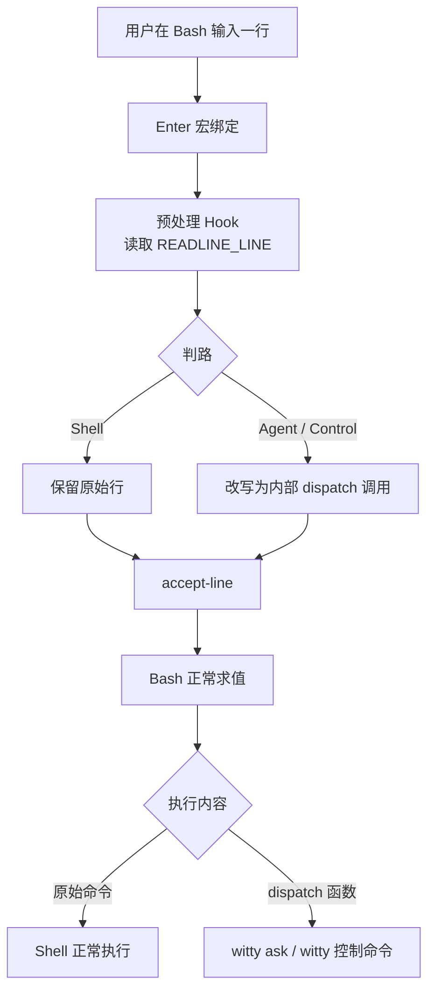

# 设计文档：Shell Adapter（Bash 接入层）

> **适用范围**：openEuler Bash 5.x 交互式终端

---

## 1. 背景

Shell Adapter 是 `witty` 中最靠近用户终端输入的一层。它的职责是把 Bash 中用户敲下的一整行输入，稳定地分流到以下三类路径之一：

1. **普通 shell 命令**：保持原样交给 Bash 执行
2. **控制命令**：转交给 `witty` 解释（如 `/session list`）
3. **自然语言请求**：转交给 `witty ask` 处理

这层的难点在于：

- 必须在 **shell 真正执行之前** 拿到整行原始输入；
- 不能只覆盖"未知命令"场景，还要覆盖 `systemctl 怎么看 nginx 日志` 这类**以真实命令开头**的自然语言；
- 不能明显破坏 Bash 的原生体验，包括历史、补全、交互式程序、管道、多行命令与常见 prompt 行为；
- 要给出**稳定、可解释**的路由规则。

---

## 2. 目标与非目标

### 2.1 目标

1. **在 Bash 执行前拿到完整输入行**
2. **支持已知命令开头的自然语言**，例如：
   - `systemctl 怎么看 nginx 日志`
   - `git 怎么只看最近一次提交`
3. **对 shell 路由尽量保持原生语义**
4. **与 `witty` Core 解耦**：Adapter 只负责接入与路由，不重复实现会话/渲染/权限
5. **支持显式逃生口**：用户可以稳定地强制走 Agent 或控制命令
6. **在 openEuler Bash 5.x 上可落地实现**，使用 Bash 自身提供的机制

### 2.2 非目标

本设计**不追求**：

- 100% 无歧义地判断自然语言与 shell 命令
- 支持 Bash 之外的所有 shell（如 zsh/fish）
- 重新实现一个完整 shell parser
- 在 Adapter 层承担 Markdown 渲染、SSE、权限交互等 `witty` Core 职责
- 让"多段自然语言、多行编辑"在普通 shell 模式下媲美专用 REPL

> Shell Adapter 的目标是"**可靠接入 + 可解释路由**"，而不是"理解一切输入"。

---

## 3. 设计决策

### 3.1 主方案

Shell Adapter 的方案为：

> **Bash Readline Hook + `accept-line` 包装 + `READLINE_LINE` 改写 + 内部 dispatch 函数**

在 Enter 预处理阶段判断路由；如需转 Agent / 控制命令，将 `READLINE_LINE` 改写为内部 dispatch 函数调用，然后仍由 Bash 的 `accept-line` 执行——shell 路由时原命令完全不变，Agent 路由也走正常 accept-line 路径，避免了在 `bind -x` handler 中直接跑长任务带来的 prompt、history 和 TTY 输出混乱，退出码等语义也由 Bash 自己处理。

之所以不在 Enter Hook 里直接调用 `witty ask`，是因为当前输入行尚未正式 accept，会导致 history 行为不自然、prompt 显示时机混乱、交互式输出和退出码传递难以保持一致。改写命令行再交给 `accept-line` 的方式更顺着 Bash 的工作方式。

### 3.3 设计原则

1. **对 shell 路径零侵入或最小侵入**
2. **对 Agent 路径用"改写 + dispatch"而不是"立即执行"**
3. **分类逻辑确定性优先**，避免黑盒 NLP 分类器
4. **保留 escape hatch**，允许显式命令强制走 Agent / 控制路径
5. **在 Bash 能力边界内做事**，不让 Adapter 变成第二个 shell

---

## 4. 总体架构



### 4.1 模块划分

Shell Adapter 拆成 5 个小模块：

1. **Installer**
   - `witty init bash` 输出 Bash 集成脚本
   - 做环境探测、幂等安装、key binding 注入

2. **Binding Layer**
   - 定义 Enter 宏绑定
   - 定义内部私有 key sequence
   - 将预处理 hook 串到 `accept-line` 前

3. **Classifier**
   - 基于 `READLINE_LINE` 的规则分类
   - 输出 `empty` / `shell` / `agent` / `control`

4. **Dispatcher**
   - 真正执行 `witty ask` / `witty session` / 其它控制动作
   - 维护 Shell 模式下需要保留的最小状态

5. **History / Safety Layer**
   - 隐藏内部 wrapper 命令
   - 保留用户原始输入到 history
   - 提供禁用、debug、fallback 能力

---

## 5. 关键实现：Enter 包装与行改写

采用两级绑定，不直接把 Enter 绑到 shell 函数：

1. 内部私有 key sequence 绑到预处理函数（`bind -x`）
2. 另一个内部私有 key sequence 绑到 `accept-line`
3. Enter 绑定为宏：先触发预处理 key sequence，再触发 `accept-line`

这保证了在 accept 前读到 `READLINE_LINE`，预处理函数有机会保留或改写整行，最终仍由 Bash 完成 accept 和执行——而不是在 `bind -x` handler 中直接执行 `witty ask`，后者难以无缝恢复默认回车行为。

预处理函数遵循以下逻辑：

```bash
__witty_pre_accept() {
    local raw="$READLINE_LINE"
    local route quoted

    route="$(__witty_classify "$raw")"

    case "$route" in
        empty|shell)
            return 0
            ;;
        control|agent)
            printf -v quoted '%q' "$raw"
            READLINE_LINE="__witty_shell_dispatch $route -- $quoted"
            READLINE_POINT=${#READLINE_LINE}
            return 0
            ;;
    esac
}
```

- **shell 路径**：完全不改原命令
- **agent/control 路径**：将原输入改写为 Bash 函数调用，`accept-line` 后 Bash 执行函数调用而非原文本

行改写把"应该执行什么"预先改好再交给 Bash，而非在 Readline 钩子里自己管理执行流，显著降低 prompt 混乱、history 不自然、退出码传播异常和 TTY 输出错位等风险。

---

## 6. 路由与分类器设计

### 6.1 决策顺序

Adapter 采用**确定性优先级路由**：

1. **空输入** → `empty`
2. **白名单 slash 命令** → `control` / `agent`
3. **显式 `witty ...` 命令** → `shell`
4. **强 shell 特征** → `shell`
5. **自然语言高置信度** → `agent`
6. **首个 token 为可执行命令且无 NL 特征** → `shell`
7. **其它无法判断** → 默认 `agent`

> "无法判断时默认 agent"符合产品目标——用户期望的是"自然语言直接触发"作为一级能力。

### 6.2 白名单控制命令

仅拦截明确白名单，避免误伤路径：

- `/ask <prompt>`
- `/agent <name>`
- `/model <id>`
- `/session list`
- `/session continue <id>`
- `/new`
- `/help`

`/usr/bin/ls`、`/opt/tools/foo` 这类绝对路径**不能**当成控制命令；slash 命令判定基于**白名单前缀**，而不是"以 `/` 开头"。

### 6.3 强 shell 特征

以下任一命中时，应优先走 shell：

- 管道 / 重定向：`|` `>` `>>` `<` `<<`
- 链式执行：`&&` `||` `;`
- 命令替换：`$(...)` `` `...` ``
- 变量赋值开头：`FOO=bar cmd`
- 显式路径执行：`./x` `../x` `/usr/bin/x`
- 通配/展开意图明显：`*.log` `?` `{a,b}`
- shell 关键字与多行结构：`for` `while` `if` `case` `do` `then` `fi` `done` `esac`
- 行尾续行：反斜杠结尾

### 6.4 自然语言高置信度特征

以下任一命中且不含强 shell 特征时，可优先走 Agent：

- 含中文/全角问号等明显自然语言符号
- 含自然语言触发词：`怎么`、`如何`、`帮我`、`请`、`分析`、`解释`、`排查`、`总结`、`检查`
- 整句明显是请求或问题，而不是命令调用
- 以真实命令开头，但后续 token 明显是问题句，如：
  - `systemctl 怎么看 nginx 日志`
  - `git 怎么只看最近一次提交`

### 6.5 命令存在性检查

当一行既没有强 shell 特征，也没有高置信度 NL 特征时，对首个 token 做命令存在性检查：

- `type -t -- <first-token>` 或 `command -v -- <first-token>`

规则：

- **存在命令 + 无 NL 特征** → `shell`
- **不存在命令 + 无强 shell 特征** → `agent`

---

## 7. History、会话与用户体验

### 7.1 History 目标

历史记录保留用户**真正输入的内容**，而不是内部包装命令。

理想效果：

```bash
$ 检查系统内存
$ history | tail -1
检查系统内存
```

而不是：

```bash
__witty_shell_dispatch agent -- 检查系统内存
```

### 7.2 推荐策略

1. 用 `HISTIGNORE` 忽略内部 wrapper 命令
2. 在 `__witty_shell_dispatch` 中显式把用户原始输入追加回 history

示意：

```bash
__witty_shell_dispatch() {
    local route="$1"
    shift 2
    local raw="$1"

    builtin history -s -- "$raw"

    case "$route" in
        agent)
            witty ask "$raw"
            ;;
        control)
            witty shell-control "$raw"
            ;;
    esac
}
```

### 7.3 会话连续性

Shell Adapter 自己不管理会话，只负责把请求转给 `witty`。会话策略仍由 `witty` Core 统一决定：

- 当前目录最近会话优先
- `/new` 新建会话
- `/session continue <id>` 切换会话

这保证：

- 在 shell 中直接输入自然语言后，进入 `witty` REPL 仍可接上上下文；
- Shell 快捷模式和 REPL 只是入口不同，不是两个系统。

### 7.4 Debug 模式

提供：

```bash
export WITTY_SHELL_DEBUG=1
```

打开后在 stderr 输出：

- 分类结果
- 改写前后命令
- 是否命中控制命令/强 shell 特征

---

## 8. 安装与兼容性设计

### 8.1 集成入口

```bash
eval "$(witty init bash)"
```

`witty init bash` 负责输出：

- 必要的 Bash 函数
- key bindings
- 幂等安装保护
- 可选 fallback

### 8.2 安装前提

仅在以下条件满足时安装：

- 当前 shell 为 Bash
- 交互式会话（`$-` 含 `i`）
- 启用了 Readline 编辑（非 `--noediting`）
- stdin/stdout 为 TTY

### 8.3 兼容性边界

| 场景 | 结论 |
| ---- | ---- |
| Bash 5.x + 交互式终端 | 支持 |
| Bash 非交互式脚本 | 不安装 |
| `bash --noediting` | 不支持 |
| zsh / fish | 不在本文档范围 |
| 远程 SSH TTY | 支持 |
| 重度自定义 Enter keybinding 的环境 | 需要兼容性验证 |

### 8.4 与现有增强脚本的关系

潜在冲突点：

1. **Enter 的自定义绑定**
2. **history / `HISTIGNORE` / prompt 集成脚本**

应对：

- 安装时做幂等检测；
- 尽量只覆盖 `emacs-standard` 和 `vi-insert` 的 Enter 绑定；
- 提供环境变量开关：

```bash
export WITTY_SHELL_ENABLE=0
```

用于一键关闭 Adapter。

### 8.5 Fallback 方案

当 Readline 包装无法安装时，可选降级到：

- 显式命令：`witty ask "..."`
- 可选 `command_not_found_handle` fallback

但 fallback 只是"有总比没有好"，不能对外宣称为"完整 Shell Adapter 能力"。

---

## 9. 失败处理与安全边界

### 9.1 `witty` 不可用时

如果用户输入被路由到 Agent / Control，但 `witty` CLI 或后端不可用：

- 输出清晰错误信息；
- 返回非零退出码；
- **不要**再回退成执行原始自然语言文本。

### 9.2 分类失败时

"分类失败"不是异常，而是正常情况的一部分。

处理原则：

- 有明确 shell 证据 → 走 shell
- 有明确自然语言证据 → 走 agent
- 两边都不强 → 默认 `agent`

### 9.3 安全边界

Shell Adapter 不应：

- 自动把自然语言翻译成 shell 并偷偷执行；
- 在本地直接 `eval` 用户原始自然语言；
- 越过 `witty` Core 的权限模型。

Adapter 的责任只是**转发**，不是本地执行智能体生成的命令。

---

## 10. 分阶段实施

### Phase 1：最小可用 Adapter

目标：验证"Enter 包装 + 行改写 + dispatch"主链路。

- `witty init bash` 输出最小集成脚本
- 支持 `empty` / `shell` / `agent` 三路判定
- Agent 路由改写为 `__witty_shell_dispatch agent -- <raw>`
- 基础 history 处理（见 §7）与 debug 输出（见 §7.4）

### Phase 2：控制命令与兼容性

- slash 命令白名单与 `control` 路径
- `emacs-standard` / `vi-insert` 双 keymap 验证
- `HISTIGNORE` 与原有 history 配置共存（见 §7.2）

### Phase 3：增强与 fallback

- `command_not_found_handle` 兜底（见 §8.5）
- 更完整的强 shell 特征检测
- 更丰富的诊断信息与 doctor 输出
- 与 REPL 会话连续性的端到端验证（见 §7.3）

---

## 11. 验收标准

以下场景应作为 P0 验收用例：

| 输入 | 期望路由 |
| ---- | -------- |
| `检查系统内存` | Agent |
| `systemctl 怎么看 nginx 日志` | Agent |
| `systemctl status nginx` | Shell |
| `grep error /var/log/messages` | Shell |
| `cat /etc/os-release \| grep NAME` | Shell |
| `/session list` | Control |
| `/ask systemctl 怎么看 nginx 日志` | Agent |
| `/usr/bin/ls` | Shell |
| `FOO=bar env` | Shell |
| `for i in 1; do` | Shell（进入多行继续输入） |

此外还应验证：

1. **history 中保留原始输入**
2. **Agent 路由不把 wrapper 暴露给用户**
3. **Shell 路由的交互式命令行为正常**
4. **退出 `witty` 后能回到干净 prompt**
5. **禁用开关生效**

---

## 12. 已知风险

| 风险 | 应对 |
| ---- | ---- |
| Enter 绑定冲突（用户或其他插件已改写 Enter 绑定） | 安装前检测、debug 日志、可禁用能力 |
| 多行输入的自然语言体验不是主目标 | 长段 prompt 仍推荐使用 `witty` REPL |
| `vi-command` 模式细节 | 优先支持 `emacs-standard` 和 `vi-insert`，分模式补充验证 |
| history 细节差异（不同 Bash 版本与 `HISTCONTROL` / `HISTIGNORE` 组合） | 以真实终端行为验证为准 |
