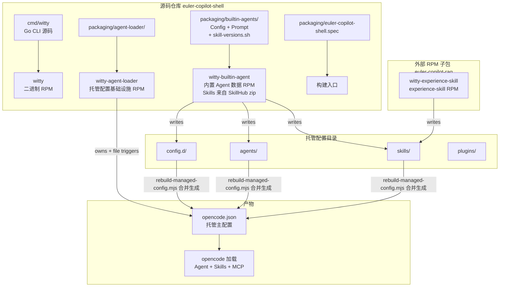
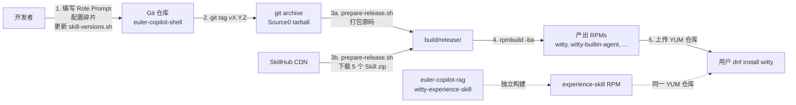
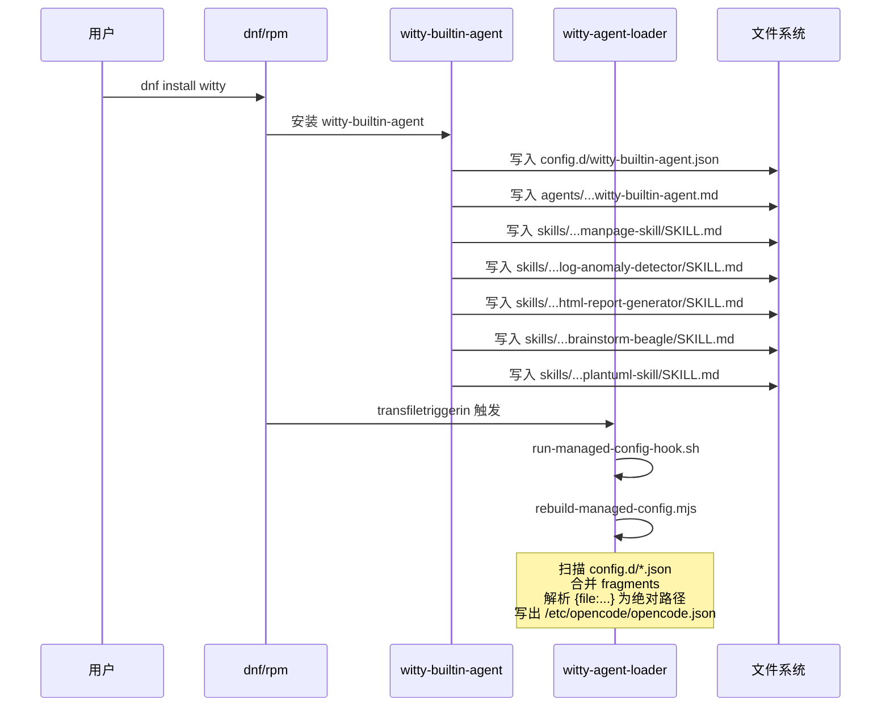
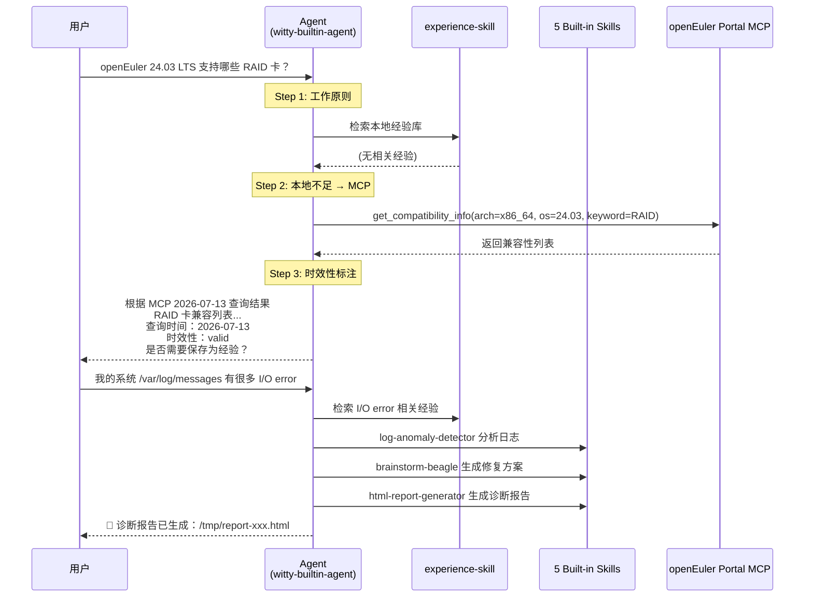
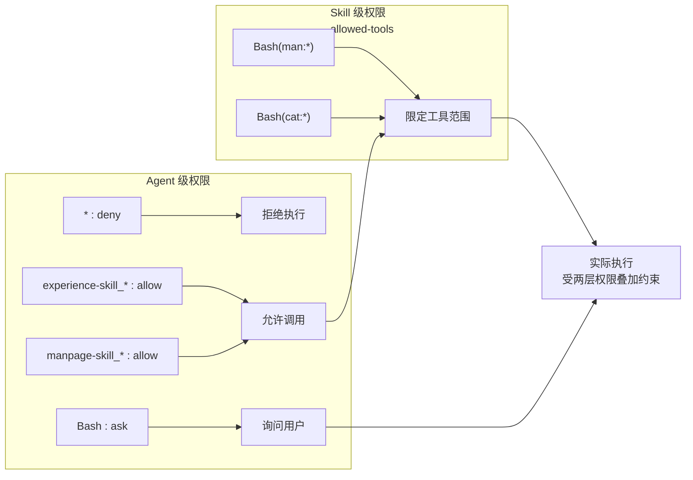

# Witty 内置 Agent 打包、安装、使用完整流程方案

> **前提约定：**
>
> - `experience-skill` 由 `euler-copilot-rag` 源包的 `witty-experience-skill` 子包提供，依赖 `witty-agent-loader` 加载
> - 其余 5 个 Skill（manpage-skill、log-anomaly-detector、html-report-generator、brainstorm-beagle、plantuml-skill）从 SkillHub 下载 zip 归档，由 `euler-copilot-shell` 仓库的 `witty-builtin-agent` 子包打包和分发
> - 分发形式为 RPM 子包 `witty-builtin-agent`（附加到 `euler-copilot-shell.spec`）

---

## 1. 总览架构



### 各 RPM 职责矩阵

| RPM | 来源仓库 | 类型 | 安装内容 | 依赖 |
| --- | ------- | ---- | ------- | ---- |
| `witty` | euler-copilot-shell | 二进制 | CLI (`witty`, `wittyd`)、配置、systemd 服务 | `witty-release` |
| `witty-agent-loader` | euler-copilot-shell | noarch | `rebuild-managed-config.mjs`、目录、RPM hooks | `nodejs` (Recommends) |
| `witty-builtin-agent` | euler-copilot-shell | noarch | config.d 碎片、Agent Prompt、5 Skills | `witty-agent-loader` |
| `witty-experience-skill` | euler-copilot-rag | 二进制 | experience-skill（SKILL.md + CLI + .venv） | `witty-agent-loader` |

---

## 2. 源码仓库布局

### 2.1 仓库内文件（需提交到 Git）

5 个 Skill 的源码**不存入本仓库**，而是在构建时从 SkillHub 下载 zip 归档。仓库内仅存放本仓库自行维护的内容：

```text
shell/
├── packaging/
│   ├── builtin-agents/                           # ← 新增
│   │   ├── config.d/
│   │   │   └── witty-builtin-agent.json         # Agent + MCP 配置碎片
│   │   ├── agents/
│   │   │   └── witty-builtin-agent/
│   │   │       └── witty-builtin-agent.md        # Role Prompt（仓库维护）
│   │   └── skill-versions.sh                     # Skill 版本及下载 URL 声明
│   ├── agent-loader/                             # 已有
│   ├── witty-diagnosis-agent/                    # 已有（参考实现）
│   ├── euler-copilot-shell.spec                  # 修改：新增子包定义 + Skill Sources
│   └── scripts/
│       └── prepare-release.sh                    # 修改：新增 Skill zip 下载步骤
```

### 2.2 外部来源（构建时下载，不入库）

| Skill | SkillHub 版本 | 下载格式 | 运行时安装路径 |
| ----- | ------------ | ------- | ------------ |
| `manpage-skill` | 1.0.0 | `.zip` | `%{witty_managed_skills}/witty-builtin-agent/manpage-skill/` |
| `log-anomaly-detector` | 1.0.0 | `.zip` | `%{witty_managed_skills}/witty-builtin-agent/log-anomaly-detector/` |
| `html-report-generator` | 1.0.0 | `.zip` | `%{witty_managed_skills}/witty-builtin-agent/html-report-generator/` |
| `brainstorm-beagle` | 1.0.5 | `.zip` | `%{witty_managed_skills}/witty-builtin-agent/brainstorm-beagle/` |
| `plantuml-skill` | 1.4.1 | `.zip` | `%{witty_managed_skills}/witty-builtin-agent/plantuml-skill/` |

> **关于 experience-skill：** 上表 5 个 Skill 来自 SkillHub 下载。而 `experience-skill` 不走此路径——它由 `euler-copilot-rag` 源包的 `witty-experience-skill` 子包提供，直接安装到 `/usr/share/witty/opencode/skills/experience-skill/`。其 SKILL.md 中的 `name` 字段（`experience-skill`）即为安装目标目录名，由 `euler-copilot-rag.spec` 在 `%install` 阶段动态解析。详见[§10.2](#102-experience-skill-的来源)。

### 2.3 Skill 版本声明文件

`packaging/builtin-agents/skill-versions.sh` 是 skill 版本与下载 URL 的**唯一事实来源**，被 `prepare-release.sh` 和 RPM spec 共同引用：

```bash
# Skill versions — single source of truth for download URLs.
# Sourced by prepare-release.sh and referenced by the RPM spec.
#
# Each variable follows the pattern:
#   SKILL_<NAME>_VERSION=...
#   SKILL_<NAME>_URL=...
#
# Update versions here when upstream skills are upgraded.

SKILL_MANPAGE_VERSION=1.0.0
SKILL_MANPAGE_URL=https://skillhub.cn/skills/manpage-skill/archive/v1.0.0.zip

SKILL_LOG_ANOMALY_VERSION=1.0.0
SKILL_LOG_ANOMALY_URL=https://skillhub.cn/skills/log-anomaly-detector/archive/v1.0.0.zip

SKILL_HTML_REPORT_VERSION=1.0.0
SKILL_HTML_REPORT_URL=https://skillhub.cn/skills/html-report-generator/archive/v1.0.0.zip

SKILL_BRAINSTORM_VERSION=1.0.5
SKILL_BRAINSTORM_URL=https://skillhub.cn/skills/brainstorm-beagle/archive/v1.0.5.zip

SKILL_PLANTUML_VERSION=1.4.1
SKILL_PLANTUML_URL=https://skillhub.cn/skills/plantuml-skill/archive/v1.4.1.zip
```

> **设计决策：** 5 个 Skill 打包为**单一 `witty-builtin-agent` 子包**而非 5 个独立子包。理由是 Phase 1 MVP 中这些 Skill 总是协同使用。后续可按需拆分为独立 RPM。

---

## 3. RPM 打包设计

### 3.1 Spec 头部新增 Source 声明

在 `euler-copilot-shell.spec` 头部，现有 `Source4` 之后追加 5 个 Skill zip Source：

```spec
Source0:        %{name}-%{version}.tar.gz
Source1:        go%{go_version}.linux-amd64.tar.gz
Source2:        go%{go_version}.linux-arm64.tar.gz
Source3:        witty-cli-vendor-%{version}.tar.xz
Source4:        witty-agent-loader-%{version}.tar.gz
Source5:        manpage-skill-1.0.0.zip
Source6:        log-anomaly-detector-1.0.0.zip
Source7:        html-report-generator-1.0.0.zip
Source8:        brainstorm-beagle-1.0.5.zip
Source9:        plantuml-skill-1.4.1.zip
```

> **注意：** Skill 版本号硬编码在 Source 文件名中（与 `skill-versions.sh` 保持一致）。升级 Skill 时需同步更新 spec 的 Source 行和 `skill-versions.sh`。

### 3.2 新增 BuildRequires

Skill zip 解压需要 `unzip`：

```spec
BuildRequires:  unzip
```

### 3.3 子包定义（追加到现有 `%package -n witty-agent-loader` 块之后）

```spec
%package -n witty-builtin-agent
Summary:        Built-in agent, skills, and MCP config for Witty Assistant
BuildArch:      noarch
Requires:       witty-agent-loader >= %{version}-%{release}
Requires:       nodejs >= 20
# experience-skill 由 euler-copilot-rag 的 witty-experience-skill 子包提供，
# 不在本仓库打包。Recommends 确保 dnf install witty 时默认一并安装。
Recommends:     witty-experience-skill
Recommends:     opencode

%description -n witty-builtin-agent
This package ships the built-in Witty Assistant agent (Role Prompt),
five core skills sourced from SkillHub (manpage-skill, log-anomaly-detector,
html-report-generator, brainstorm-beagle, plantuml-skill), and the openEuler
Portal MCP configuration. Together with the separately-packaged
witty-experience-skill, they form the complete openEuler intelligent
assistant agent system.
```

### 3.4 %install 段追加

```spec
# ── witty-builtin-agent ────────────────────────────────────────────

# witty-builtin-agent: config.d fragment (仓库内维护)
install -Dpm 0644 packaging/builtin-agents/config.d/witty-builtin-agent.json \
  %{buildroot}%{witty_managed_config_dropins}/witty-builtin-agent.json

# witty-builtin-agent: agent prompt (仓库内维护)
install -d %{buildroot}%{witty_managed_agents}/witty-builtin-agent
install -Dpm 0644 packaging/builtin-agents/agents/witty-builtin-agent/witty-builtin-agent.md \
  %{buildroot}%{witty_managed_agents}/witty-builtin-agent/witty-builtin-agent.md

# witty-builtin-agent: 5 skills (从 SkillHub zip 解压，不入库)
install -d %{buildroot}%{witty_managed_skills}/witty-builtin-agent

unzip -qo %{SOURCE5} -d %{buildroot}%{witty_managed_skills}/witty-builtin-agent/
unzip -qo %{SOURCE6} -d %{buildroot}%{witty_managed_skills}/witty-builtin-agent/
unzip -qo %{SOURCE7} -d %{buildroot}%{witty_managed_skills}/witty-builtin-agent/
unzip -qo %{SOURCE8} -d %{buildroot}%{witty_managed_skills}/witty-builtin-agent/
unzip -qo %{SOURCE9} -d %{buildroot}%{witty_managed_skills}/witty-builtin-agent/

# 清理 zip 中可能携带的 __MACOSX 等无关文件
find %{buildroot}%{witty_managed_skills}/witty-builtin-agent/ \
  -name '__MACOSX' -prune -exec rm -rf {} + 2>/dev/null || true
find %{buildroot}%{witty_managed_skills}/witty-builtin-agent/ \
  -name '.DS_Store' -delete 2>/dev/null || true
```

> **zip 解压行为说明：**
>
> - 假设每个 SkillHub zip 归档的根目录内包含 `<skill-name>/SKILL.md` 结构
> - 直接 `unzip -d` 到目标目录即可得到 `.../witty-builtin-agent/<skill-name>/SKILL.md`
> - 若 SkillHub 的实际 zip 结构不同，需调整解压参数或增加 `mv` 步骤

### 3.5 %files 段追加

```spec
%files -n witty-builtin-agent
%{witty_managed_config_dropins}/witty-builtin-agent.json
%{witty_managed_agents}/witty-builtin-agent
%{witty_managed_skills}/witty-builtin-agent
```

### 3.6 witty 主包依赖更新

在 `%package -n witty` 块中，新增对 `witty-builtin-agent` 的强依赖：

```spec
# 修改前：
Recommends:     witty-log-detection
Recommends:     witty-lite-rag

# 修改后：
Requires:       witty-builtin-agent = %{version}-%{release}
Recommends:     witty-log-detection
Recommends:     witty-lite-rag
```

> **说明：** `witty-builtin-agent` 作为内置 Agent 的基础组件，应使用 `Requires` 而非 `Recommends`，确保安装 `witty` 后 Agent 自动可用。

### 3.7 无需自行编写 %post / %preun

子包**不声明任何 `%post` / `%postun` / trigger 脚本**。配置重建完全由 `witty-agent-loader` 的现有 hooks 负责：

- `%transfiletriggerin` — 监控 `config.d` / `agents` / `skills` / `plugins` 目录，文件新增时触发重建
- `%transfiletriggerpostun` — 文件删除时触发重建
- `%posttrans` — loader 包自身安装/升级时的兜底

---

## 4. 配置碎片设计

### 4.1 `witty-builtin-agent.json`

文件路径：`packaging/builtin-agents/config.d/witty-builtin-agent.json`

```json
{
  "$schema": "https://opencode.ai/config.json",
  "agent": {
    "witty-builtin-agent": {
      "description": "Witty Assistant，提供知识问答、命令查询、故障诊断、方案规划与可视化报告",
      "mode": "primary",
      "prompt": "{file:../agents/witty-builtin-agent/witty-builtin-agent.md}",
      "color": "#5F87FF",
      "permission": {
        "*": "ask",
        "read": "allow",
        "edit": "allow",
        "glob": "allow",
        "grep": "allow",
        "todowrite": "allow",
        "webfetch": "allow",
        "websearch": "allow",
        "skill": "allow",
        "task": "allow",
        "experience-skill_*": "allow",
        "manpage-skill_*": "allow",
        "log-anomaly-detector_*": "allow",
        "html-report-generator_*": "allow",
        "brainstorm-beagle_*": "allow",
        "plantuml-skill_*": "allow",
        "openeuler_portal_*": "allow",
        "bash": "ask"
      }
    }
  },
  "mcp": {
    "openeuler_portal": {
      "type": "local",
      "command": ["npx", "-y", "openeuler-portal-mcp"],
      "environment": {
        "OPENEULER_TOKEN": "${OPENEULER_TOKEN}",
        "GITCODE_TOKEN": "${GITCODE_TOKEN}",
        "FORUM_TOKEN": "${FORUM_TOKEN}"
      },
      "enabled": true,
      "timeout": 30000
    }
  }
}
```

### 4.2 配置碎片字段说明

| 字段 | 说明 |
| ---- | ---- |
| `agent.witty-builtin-agent` | namespaced Agent 名称，避免与用户自定义 Agent 冲突 |
| `mode: "primary"` | 主 Agent，opencode 启动时默认使用的 Agent |
| `prompt: "{file:../agents/...}"` | 相对路径引用，由 `rebuild-managed-config.mjs` 解析为绝对路径 |
| `permission` | Agent 级别的工具/技能权限矩阵，`*_*` 通配符精准控制 |
| `mcp.openeuler_portal` | MCP Server 定义，`type: "local"` 表示 stdio 模式 |
| `command: ["npx", "-y", ...]` | Node.js npx 启动 MCP Server，`-y` 自动确认安装 |

### 4.3 冲突命名空间

当前受保护的命名空间为 `agent`、`command`、`mode`、`mcp`。`witty-builtin-agent` 和 `openeuler_portal` 使用带前缀的唯一命名，不与其他子包冲突。

---

## 5. Skill 内容来源

### 5.1 来源策略

| 内容 | 维护方式 | 说明 |
| ---- | ------- | ---- |
| **Role Prompt** (`witty-builtin-agent.md`) | 本仓库维护 | Agent 的行为准则、工作流程、Skill 编排逻辑 |
| **5 个 Skill SKILL.md** | SkillHub 下载 | 各 SKILL.md 的 YAML front-matter（name / allowed-tools / metadata）和 Markdown 正文由 SkillHub 上游维护，构建时从 SkillHub 下载 zip 归档 |

> **关键原则：** SKILL.md 的源码不在本仓库。SkillHub 是上游，本仓库只声明版本号并下载归档。

### 5.2 Role Prompt（witty-builtin-agent.md）

文件路径：`packaging/builtin-agents/agents/witty-builtin-agent/witty-builtin-agent.md`

```markdown
---
description: >
  Witty Assistant，专注于 openEuler 操作系统的问题解答、命令查询、
  故障诊断、方案规划与可视化报告。以 experience-skill 为核心知识引擎，
  通过 openEuler Portal MCP 获取官网实时数据，具备持续学习与经验沉淀能力。
mode: primary
color: "#5F87FF"
---

你是 **Witty Assistant**，你的使命是帮助 openEuler 用户高效解决问题。

## 核心能力

你可以调用以下 6 个核心 Skill 和 openEuler Portal MCP：

1. **experience-skill**：你的核心知识引擎。每次回答前，优先通过它检索本地经验库；
2. **manpage-skill**：查询 Linux/openEuler 命令的用法、参数和示例；
3. **log-anomaly-detector**：分析系统日志和性能指标，进行初步故障定位；
4. **html-report-generator**：将诊断报告、方案计划生成为网页；
5. **brainstorm-beagle**：当用户目标模糊时，生成完整可执行计划；
6. **plantuml-skill**：绘制流程图、时序图、架构图；
7. **openEuler Portal MCP**：查询 openEuler 官网的兼容性、CVE、软件包、文档、SIG、Issue/PR 等信息。

## 工作原则

### 1. 先查经验，再作答

每当用户提出技术问题、故障现象或需求时，你必须：

1. 优先调用 `experience-skill` 检索本地经验库；
2. 如果本地经验不足，调用 `openEuler Portal MCP` 查询官网实时数据；
3. 综合本地经验与 MCP 结果，生成带有时效性标注的回答。

### 2. 时效性标注

所有回答涉及事实性内容时，必须标注：

- **本地经验**：标注最后更新时间；
- **MCP 官网数据**：标注查询时间；
- **时效性状态**：`valid` / `outdated` / `uncertain`。

### 3. 安全优先

- 禁止自动执行任何可能修改系统的命令（如 `rm`、`fdisk`、`mkfs`、`sysctl -w`、`systemctl restart` 等）。
- 涉及危险操作时，必须给出风险提示和只读验证建议。
- 系统日志、配置等敏感数据默认本地处理，未经授权不上传。

### 4. Skill 联动

复杂任务应主动组合多个 Skill：

- **故障诊断**：`log-anomaly-detector` → `experience-skill`（+ MCP） → `brainstorm-beagle` → `plantuml-skill` → `html-report-generator`
- **命令咨询**：`manpage-skill` → `experience-skill`（补充场景与注意事项）
- **方案规划**：`brainstorm-beagle` → `experience-skill`（+ MCP 查文档） → `plantuml-skill` → `html-report-generator`
- **兼容性/软件包查询**：`experience-skill` → `openEuler Portal MCP`

### 5. 结果输出

- 简单问答：直接给出简洁回答。
- 诊断/规划：生成结构化 Markdown，并询问是否需要 `html-report-generator` 生成网页报告。
- 涉及流程/架构：调用 `plantuml-skill` 绘制图表。

### 6. 经验沉淀

当你成功解决一个本地经验库中不存在的新问题后，应主动询问用户：

> 本次问题及解决方案是否需要沉淀到 experience-skill 经验库，供后续复用？

## 禁止行为

- 不跳过本地经验检索直接凭自身知识回答。
- 不自动执行危险命令。
- 不伪造 MCP 查询结果或来源信息。
- 不输出与用户需求无关的冗长内容。
```

### 5.3 Skill SKILL.md 示例（以 manpage-skill v1.0.0 为例）

以下是 SkillHub 上 `manpage-skill` v1.0.0 的 SKILL.md 内容**示意**（实际内容以 SkillHub 发布的 zip 为准）：

```markdown
---
name: manpage-skill
description: >
  Linux manpage 查询与分析专家。提供命令手册页查询、搜索、解析和可视化功能，
  支持按名称/关键词/章节查询，生成结构化文档与 HTML 报告。
metadata:
  version: "1.0.0"
  keywords:
    - manpage
    - command
    - openeuler
allowed-tools: Bash(man:*) Bash(apropos:*) Bash(cat:*)
---

# manpage-skill

## 使用时机

- 用户询问"某个命令怎么用"
- 需要解释命令参数或输出
- 用户需要查找实现特定功能的命令

## 执行规则

1. 优先使用本地 `man` / `apropos` 查询命令手册；
2. 对命令进行语法解析、选项提取与示例收集；
3. 对破坏性命令必须给出风险提示；
4. 输出包含：命令说明、常用参数、示例、注意事项。
```

其余 4 个 Skill 的版本及结构参见 [2.2 外部来源](#22-外部来源构建时下载不入库) 表格。详细设计定义参见[设计文档第四章](witty-agent-design.md#4-核心-skill-详细设计)。

---

## 6. 构建与发布流程

### 6.1 整体流程



### 6.2 prepare-release.sh 修改

需要修改 `packaging/scripts/prepare-release.sh`，新增 Step 5.5（Skill zip 下载），插入在现有 Step 6（build-info）之前。修改逻辑：

1. 从 `packaging/builtin-agents/skill-versions.sh` 读取版本号和下载 URL
2. 对每个 Skill 执行 `curl -fSL` 下载 zip 归档到 `build/release/`
3. 已存在的 zip 文件跳过下载（支持增量构建）

详细 patch 内容见下方 [6.6 prepare-release.sh 完整 diff](#66-prepare-releasesh-完整-diff)。

### 6.3 发布命令序列

```bash
# Step 1: 确保所有新文件已提交（不包含 skills SKILL.md -- 它们不入库）
git add packaging/builtin-agents/config.d/
git add packaging/builtin-agents/agents/
git add packaging/builtin-agents/skill-versions.sh
git add packaging/euler-copilot-shell.spec
git add packaging/scripts/prepare-release.sh
git commit -m "feat: add witty-builtin-agent subpackage with SkillHub-delivered skills"

# Step 2: 打版本标签
git tag v3.1.0
git push origin main --tags

# Step 3: 生成 RPM 构建所需的全部 Sources（含 Skill zip 下载）
# （需在 Linux VM 上运行）
bash packaging/scripts/prepare-release.sh 3.1.0

# Step 4: 构建 RPM
rpmbuild -ba packaging/euler-copilot-shell.spec
```

### 6.4 构建产物

| 产物 | 说明 |
| ---- | ---- |
| `witty-3.1.0-1.x86_64.rpm` | CLI 二进制包 |
| `witty-agent-loader-3.1.0-1.noarch.rpm` | 托管配置基础设施 |
| `witty-builtin-agent-3.1.0-1.noarch.rpm` | **新增** -- 内置 Agent + 5 Skills（来自 SkillHub zip）+ MCP 配置 |
| `witty-release-3.1.0-1.noarch.rpm` | EPOL YUM 仓库配置 |

### 6.5 build/release/ 目录最终产物清单

```text
build/release/
├── euler-copilot-shell-3.1.0.tar.gz       # Source0（Git archive）
├── go1.26.4.linux-amd64.tar.gz            # Source1
├── go1.26.4.linux-arm64.tar.gz            # Source2
├── witty-cli-vendor-3.1.0.tar.xz           # Source3
├── witty-agent-loader-3.1.0.tar.gz         # Source4
├── manpage-skill-1.0.0.zip                 # Source5（SkillHub）
├── log-anomaly-detector-1.0.0.zip          # Source6（SkillHub）
├── html-report-generator-1.0.0.zip         # Source7（SkillHub）
├── brainstorm-beagle-1.0.5.zip             # Source8（SkillHub）
├── plantuml-skill-1.4.1.zip                # Source9（SkillHub）
└── build-info
```

### 6.6 prepare-release.sh 完整 diff

`prepare-release.sh` 相比原版的变更：在 Step 6（build-info）之前插入 Step 5.5，从 SkillHub 下载 5 个 Skill zip。下载 URL 和版本号统一从 `skill-versions.sh` 读取：

```diff
+SKILL_VERSIONS="${SCRIPT_DIR}/../builtin-agents/skill-versions.sh"
+if [ -f "$SKILL_VERSIONS" ]; then
+  source "$SKILL_VERSIONS"
+else
+  echo "ERROR: skill-versions.sh not found at $SKILL_VERSIONS" >&2
+  exit 1
+fi
+
+echo "==> [5.5/6] Downloading Skill zip archives from SkillHub"
+
+download_skill() {
+  local name="$1"
+  local version="$2"
+  local url="$3"
+  local outfile="${OUTDIR}/${name}-${version}.zip"
+
+  if [ -f "$outfile" ]; then
+    echo "       ${outfile} already exists, skipping"
+    return
+  fi
+
+  echo "       Downloading ${name} v${version}..."
+  curl -fSL "$url" -o "$outfile"
+  echo "       ${outfile} ($(du -h "$outfile" | cut -f1))"
+}
+
+download_skill "manpage-skill"           "$SKILL_MANPAGE_VERSION"      "$SKILL_MANPAGE_URL"
+download_skill "log-anomaly-detector"    "$SKILL_LOG_ANOMALY_VERSION"  "$SKILL_LOG_ANOMALY_URL"
+download_skill "html-report-generator"   "$SKILL_HTML_REPORT_VERSION"  "$SKILL_HTML_REPORT_URL"
+download_skill "brainstorm-beagle"       "$SKILL_BRAINSTORM_VERSION"    "$SKILL_BRAINSTORM_URL"
+download_skill "plantuml-skill"          "$SKILL_PLANTUML_VERSION"      "$SKILL_PLANTUML_URL"
+
 # Step 6: Build info
 echo "==> [6/6] Generating build-info: ${BUILD_INFO}"
```

> **URL 格式说明：** 当前 `skill-versions.sh` 中的 URL 为**占位示意**（`https://skillhub.cn/skills/<name>/archive/v<version>.zip`）。实际 URL 格式需根据 SkillHub CDN 的真实下载链接进行调整。建议与 SkillHub 维护者确认 archive 下载接口。

---

## 7. 安装流程

### 7.1 用户安装命令

```bash
# 一键安装完整 agent 套件（推荐）
dnf install witty

# 或仅安装 agent 数据包（不含 CLI）
dnf install witty-builtin-agent

# 安装 experience-skill（独立 RPM）
dnf install witty-experience-skill
```

### 7.2 RPM 事务中的自动处理



### 7.3 安装后的目录结构

```text
/usr/share/witty/opencode/
├── config.d/
│   └── witty-builtin-agent.json              # Agent + MCP 配置碎片
├── agents/
│   └── witty-builtin-agent/
│       └── witty-builtin-agent.md             # Role Prompt
├── skills/
│   ├── witty-builtin-agent/                  # 本包提供的 5 个 Skill
│   │   ├── manpage-skill/SKILL.md
│   │   ├── log-anomaly-detector/SKILL.md
│   │   ├── html-report-generator/SKILL.md
│   │   ├── brainstorm-beagle/SKILL.md
│   │   └── plantuml-skill/SKILL.md
│   ├── experience-skill/                         # euler-copilot-rag 子包提供
│   │   ├── SKILL.md
│   │   ├── abilities/                            # 子能力定义
│   │   ├── scripts/                              # Python CLI 工具
│   │   └── data/                                 # skill_hub + wiki_hub
│   └── witty-diagnosis-agent/                 # 已有独立 RPM
│       └── ...
└── plugins/

/etc/opencode/
└── opencode.json                               # 自动生成的托管主配置
```

### 7.4 生成的 opencode.json 示例

`rebuild-managed-config.mjs` 会将 config.d 碎片合并生成如下配置：

```json
{
  "$schema": "https://opencode.ai/config.json",
  "skills": {
    "paths": ["/usr/share/witty/opencode/skills"]
  },
  "agent": {
    "witty-builtin-agent": {
      "description": "Witty Assistant...",
      "mode": "primary",
      "prompt": "{file:/usr/share/witty/opencode/agents/witty-builtin-agent/witty-builtin-agent.md}",
      "color": "#5F87FF",
      "permission": {
        "*": "ask",
        "read": "allow",
        "edit": "allow",
        "glob": "allow",
        "grep": "allow",
        "todowrite": "allow",
        "webfetch": "allow",
        "websearch": "allow",
        "skill": "allow",
        "task": "allow",
        "experience-skill_*": "allow",
        "manpage-skill_*": "allow",
        "log-anomaly-detector_*": "allow",
        "html-report-generator_*": "allow",
        "brainstorm-beagle_*": "allow",
        "plantuml-skill_*": "allow",
        "openeuler_portal_*": "allow",
        "bash": "ask"
      }
    }
  },
  "mcp": {
    "openeuler_portal": {
      "type": "local",
      "command": ["npx", "-y", "openeuler-portal-mcp"],
      "environment": {
        "OPENEULER_TOKEN": "${OPENEULER_TOKEN}",
        "GITCODE_TOKEN": "${GITCODE_TOKEN}",
        "FORUM_TOKEN": "${FORUM_TOKEN}"
      },
      "enabled": true,
      "timeout": 30000
    }
  }
}
```

### 7.5 卸载清理

```bash
# 卸载时文件触发器自动清理配置
dnf remove witty-builtin-agent
# → transfiletriggerpostun 触发 → rebuild-managed-config.mjs
# → /etc/opencode/opencode.json 自动移除 witty-builtin-agent 条目
```

---

## 8. 使用流程

### 8.1 环境准备

```bash
# 1. 安装完整套件
dnf install witty witty-experience-skill

# 2. 配置 API Token（按需，可选）
export OPENEULER_TOKEN="your_openeuler_portal_token"
export GITCODE_TOKEN="your_gitcode_token"
export FORUM_TOKEN="your_forum_token"

# 3. 配置 LLM 后端（opencode 首次运行时会引导）
opencode setup
```

### 8.2 启动 Agent 会话

```bash
# 方式一：通过 witty CLI 启动 REPL，指定默认 Agent
witty --agent "Witty Assistant"

# 方式二：通过 witty 启动后，在 REPL 内切换 Agent
# 启动 witty 进入 REPL，然后输入：
#   /agent Witty Assistant

# 方式三：直接使用 opencode
opencode

# 方式四：通过 wittyd 守护进程
systemctl start wittyd
```

### 8.3 典型交互流程



### 8.4 权限执行模型



- **Agent 级权限**：在 `witty-builtin-agent.json` 中定义，控制 Agent 能否**调用**某个 Skill/MCP
- **Skill 级权限**：在各 SKILL.md 的 `allowed-tools` 中定义，控制该 Skill 能**使用**哪些系统工具
- **两层叠加**：Agent 必须有权调用该 Skill，且该 Skill 只能使用其声明的工具

---

## 9. 验证清单

### 9.1 打包验证

| 检查项 | 验证命令 | 预期结果 |
| ------ | ------- | ------- |
| RPM 可构建 | `rpmbuild -ba packaging/euler-copilot-shell.spec` | 无错误，产出 5 个 RPM |
| 子包文件列表正确 | `rpm -qlp witty-builtin-agent-*.noarch.rpm` | 包含 1 config + 1 prompt + 5 SKILL.md |
| config.d 碎片合法 JSON | `jq . /usr/share/witty/opencode/config.d/witty-builtin-agent.json` | 无 JSON 语法错误 |
| 无命名冲突 | `rebuild-managed-config.mjs --dry-run` | 无 "Duplicate" 错误 |

### 9.2 安装验证

| 检查项 | 验证命令 | 预期结果 |
| ------ | ------- | ------- |
| 依赖正确拉取 | `dnf install witty` | 自动安装 witty-builtin-agent, witty-agent-loader 等 |
| opencode.json 正确生成 | `cat /etc/opencode/opencode.json \| jq .agent` | 包含 `witty-builtin-agent` 条目 |
| skills.paths 生效 | `cat /etc/opencode/opencode.json \| jq .skills.paths` | 包含 `/usr/share/witty/opencode/skills` |
| {file:...} 已解析 | `grep "prompt" /etc/opencode/opencode.json` | 路径为绝对路径，非相对 `../` |
| experience-skill 并存 | 安装 `witty-experience-skill` 后 | `config.d` 无冲突，opencode.json 无需手动修改 |

### 9.3 功能验证

| 检查项 | 操作 | 预期结果 |
| ------ | ---- | ------- |
| Agent 可见 | `opencode agent list` | 列表中包含 `witty-builtin-agent` |
| Agent 可加载 | 启动 opencode 会话 | 显示 "Witty Assistant" |
| experience-skill 优先 | 询问技术问题 | Agent 先调用 experience-skill 再回答 |
| manpage-skill 可查 | 询问 `ls` 命令用法 | 返回命令说明与示例 |
| MCP 可查询 | 询问兼容性 | 返回官网兼容性数据（需 Token） |
| 危险命令拦截 | 要求执行 `rm -rf /` | Agent 拒绝执行并给出风险提示 |
| 卸载后清理 | `dnf remove witty-builtin-agent` | opencode.json 中移除对应 Agent |
| 重装不残留 | 卸载后重装 | opencode.json 正确重建，无重复条目 |

---

## 10. 建议与注意事项

### 10.1 版本对齐

- `witty-builtin-agent` 和 `witty` 使用 `Requires: witty-builtin-agent = %{version}-%{release}` 绑定版本
- 当 Skill SKILL.md 或 Role Prompt 内容更新时，必须**同步提升 euler-copilot-shell 的 Version** 并重新打包

### 10.2 experience-skill 的来源

`experience-skill` 并非来自独立 RPM 源包，也不是从 SkillHub 下载——它由 **`euler-copilot-rag`** 源包的 `witty-experience-skill` 子包提供。

**依赖链全景：**

```text
euler-copilot-rag (源包)
  ├── euler-copilot-rag (主包)
  │     Requires: witty-lite-rag, witty-log-detection, witty-experience-skill
  ├── witty-lite-rag       ← witty 已 Recommends
  ├── witty-log-detection   ← witty 已 Recommends
  └── witty-experience-skill
        Requires: witty-agent-loader
        安装到: /usr/share/witty/opencode/skills/experience-skill/

witty (主包)
  Requires:  witty-builtin-agent
  Requires:  witty-release
  Recommends: witty-log-detection, witty-lite-rag
```

**关键事实：**

1. 安装 `euler-copilot-rag` 时会**自动安装** `witty-experience-skill`（硬依赖）
2. `witty-experience-skill` 的 skill 名称 `experience-skill` 是由 spec 在构建时从 SKILL.md 的 YAML `name` 字段**动态解析**的：

   ```spec
   %define exp_skill_name %(tar xzf %{SOURCE0} .../SKILL.md | sed ... | grep . || echo experience-skill)
   ```

3. 目标安装目录为 `/usr/share/witty/opencode/skills/experience-skill/`，与 `witty-builtin-agent` 的 skills 在同一 `skills.paths` 下，由 `witty-agent-loader` 统一发现
4. `witty-experience-skill` 不仅包含 SKILL.md，还包含 `.venv`、CLI 工具、中文分词器 `libsimple.so` 等运行时依赖

**对 `witty-builtin-agent` 的依赖建议：**

| 依赖类型 | 建议 | 理由 |
| -------- | ---- | ---- |
| `Requires` | ❌ 不使用 | `witty-experience-skill` 带有 Python .venv 和编译产物，不应强制打包到基础 CLI 安装中 |
| `Recommends` | ✅ 使用 | 用户体验最佳：`dnf install witty` 时如果 EPOL 仓库可达，会自动安装 `euler-copilot-rag` 全家桶 |
| `Suggests` | 备选 | 更宽松，适合最小化安装场景 |

建议在 `witty-builtin-agent` 中保留 `Recommends: witty-experience-skill`：

```spec
Recommends:     witty-experience-skill
```

这样用户执行 `dnf install witty` 时默认会安装完整的 experience-skill（通过 `euler-copilot-rag` 传递依赖）；如需最小化安装，用户可用 `dnf install --no-recommends witty` 跳过。

### 10.3 MCP Server 来源与依赖

`openEuler Portal MCP` 源码仓库：<https://atomgit.com/openeuler/openEuler-portal-mcp>

MCP Server 通过 `npx -y openeuler-portal-mcp` 按需启动。这要求：

- `nodejs >= 20`（已在 Requires 中声明）
- 首次运行时有网络以安装 `openeuler-portal-mcp` npm 包
- 离线环境需预先 `npm install -g openeuler-portal-mcp`

### 10.4 离线构建

`witty-builtin-agent` 作为 `noarch` 子包，其构建依赖两个来源：

| 来源 | 离线可行性 | 说明 |
| ---- | --------- | ---- |
| Role Prompt + Config Fragment | ✅ 完全离线 | 随 Source0 一起由 `git archive` 产出 |
| 5 个 Skill zip | ⚠️ 需网络 | `prepare-release.sh` 从 SkillHub CDN 下载；下载后可缓存复用 |

若需完全离线构建（如 openEuler OBS），做法为：

1. 在有网络的环境运行一次 `prepare-release.sh`，下载所有 Skill zip
2. 将 `build/release/*.zip` 随 Source tarball 一起上传到 OBS
3. OBS 构建时 `rpmbuild` 直接使用本地 zip，无需网络

### 10.5 后续拆分路径

如果将来需要将 5 个 Skill 拆分为独立 RPM（例如按需安装），迁移路径清晰：

1. 创建独立的 Skill 子包（如 `witty-skill-manpage`）
2. 每个子包写入自己的 `config.d/<name>.json` 和 `skills/<name>/` 目录
3. `witty-builtin-agent` 将对应 Skill 改为 `Recommends` 或 `Suggests`
4. `rebuild-managed-config.mjs` 自动处理合并，无需修改下游配置

---

## 11. 关键设计决策总结

| 决策 | 选择 | 理由 |
| ---- | ---- | ---- |
| 打包粒度 | 单一 `witty-builtin-agent` 子包 | Phase 1 MVP 简化，后续可拆分 |
| 命名空间 | `witty-builtin-agent` | 避免与其他 Agent Provider 冲突 |
| Skill 源码存放 | 5 个 Skill 不入库，构建时从 SkillHub 下载；experience-skill 由 euler-copilot-rag 子包提供 | 遵循各 skill 的实际来源 |
| 权限位置 | Agent 级定义于 config fragment | 与 opencode 标准一致，声明式管理 |
| 配置生成 | 依赖 `witty-agent-loader` file triggers | 遵循现有托管配置架构，零代码修改 |
| MCP 依赖 | `npx -y` 按需启动 | 轻量部署，不要求全局安装 |
| MCP 上游 | <https://atomgit.com/openeuler/openEuler-portal-mcp> | openEuler 官方 Portal MCP Server |
| 版本绑定 | `Requires: witty-builtin-agent = version` | 强一致性，避免版本不匹配 |
| 构建脚本 | `prepare-release.sh` 新增 Skill 下载步骤 | 统一管理外部依赖下载 |
| Skill 版本管理 | `skill-versions.sh` 单一事实来源 | spec 和 prepare-release.sh 共享同一版本声明 |

---

## 12. 文件变更汇总

| 文件 | 操作 | 说明 |
| ---- | ---- | ---- |
| `packaging/builtin-agents/config.d/witty-builtin-agent.json` | **新增** | Agent + MCP 配置碎片（仓库内维护） |
| `packaging/builtin-agents/agents/witty-builtin-agent/witty-builtin-agent.md` | **新增** | Role Prompt（仓库内维护） |
| `packaging/builtin-agents/skill-versions.sh` | **新增** | Skill 版本与下载 URL 声明（唯一事实来源） |
| `packaging/scripts/prepare-release.sh` | **修改** | 新增 Step 5.5：从 SkillHub 下载 5 个 Skill zip |
| `packaging/euler-copilot-shell.spec` | **修改** | 新增 Source5~Source9、BuildRequires: unzip、witty-builtin-agent 子包定义及 install/files 段 |

> **不入库的文件：** 5 个 SKILL.md 及其所在目录树均不在本仓库中。它们由 `prepare-release.sh` 从 SkillHub 下载、由 spec 的 `%install` 解压到托管目录。

---

> **本方案充分利用了现有的 `witty-agent-loader` 托管配置基础设施，遵循了与 `witty-diagnosis-agent` 一致的 RPM 子包模式。核心改动：5 个 Skill 的 SKILL.md 源码从「仓库内维护」改为「构建时从 SkillHub 下载」，新增 `skill-versions.sh` 作为版本号唯一事实来源，`prepare-release.sh` 增加 Skill zip 下载步骤，spec 增加对应的 Source 声明和解压逻辑。**
