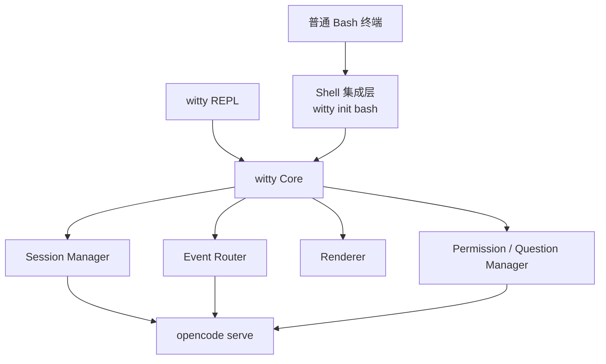
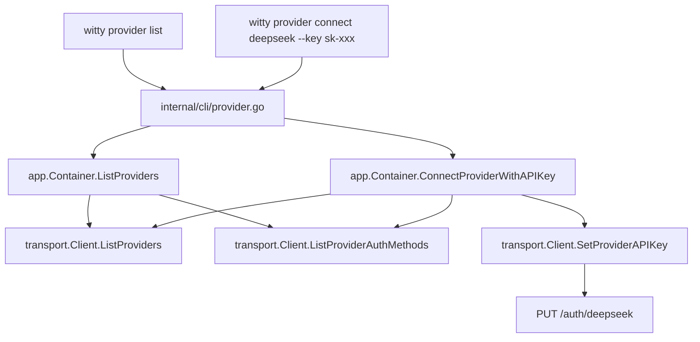

# 设计文档：`witty` — 终端 AI 助手

> **适用范围**：openEuler Bash 终端

---

## 1. 产品定位

`witty` 是 openEuler 终端场景下的 AI 助手前端程序。它提供两种使用方式：

- **Shell 直输**：在普通 Bash 提示符下直接输入自然语言，即可触发 Agent
- **REPL 交互**：运行 `witty` 进入完整交互式 CLI

两种方式共享同一套会话、渲染、权限与展示核心，差别仅在入口形式。

### 1.1 执行底座

`witty` 的所有后端交互统一建立在 `opencode serve` 之上：

- 会话操作走 HTTP API
- 流式事件走 SSE
- 权限 / Question 回复走 API
- Agent / MCP / Session 元信息走 API

### 1.2 Shell 直输是一级能力

"终端直接输入自然语言触发 Agent"是 witty 的基础必要能力，具体需求见 [§2 核心需求](#2-核心需求p0)，实现机制见 [shell-adapter.md](shell-adapter.md)。

### 1.3 产品形态

```bash
witty                  # 启动 REPL / 恢复当前默认会话
witty ask "..."        # 单次请求，流式输出
witty session list     # 列出会话
witty continue <id>    # 继续指定会话
witty provider list    # 列出支持 API Key 的 AI provider
witty provider connect <provider> --key <key>  # 连接 provider
witty init bash        # 输出 Bash 集成脚本
witty doctor           # 检查 server / config / auth 状态
```

- **Shell 直输自然语言** → 实际调用的是 `witty ask`
- **完整 CLI / REPL** → 启动 `witty`，内部调用同一套核心

---

## 2. 核心需求（P0）

1. **终端直接输入自然语言触发 Agent**
2. **完整 CLI / REPL**
3. **统一用户体验**（两种入口输出风格一致、会话连续、控制命令一致）
4. **工具 / Agent / Skill / SubAgent 调用展示**
5. **Markdown 流式渲染**（Phase 1 为块边界渲染，Phase 2 再增强即时回显）
6. **会话继续与恢复**
7. **权限 / Question 阻塞式交互**

---

## 3. 架构设计

### 3.1 核心思想

> **以 Shell 直接入口为用户表层，以 Server API / SSE 为实现底座，在 `witty` 内完成会话、渲染、权限和展示。**

三层结构：

- **Shell 入口层**：承接普通终端提示符下的直接输入，由 Shell Adapter 负责
- **核心执行层**：采用 OpenCode Server API / SSE
- **UI 与会话层**：在 `witty` 内实现

### 3.2 整体架构



### 3.3 产品边界

- **Shell Adapter**：Bash 接入层，负责在 shell 执行前获取用户输入并路由
- **`witty` Core**：前端内核（Session Manager / Event Router / Renderer / Permission / Question Manager）
- **OpenCode Server**：执行后端

---

## 4. Shell 自然语言触发设计

Shell 直输自然语言是 witty 的一级能力。实现上通过 Bash Readline Hook 在 Enter 时拦截 `READLINE_LINE`，包装 `accept-line` 完成预处理与行改写，由 Shell Adapter 按确定性优先级路由到 shell / agent / control 三路之一。完整实现细节、Bash 集成机制、分类规则与逃生口设计见 [shell-adapter.md](shell-adapter.md)。

### 4.1 路由决策概要

Adapter 采用"Shell 优先、Agent 兜底"原则——Adapter 无法识别的输入交给 Shell 尝试执行，Shell 也无法解析时再由 `command_not_found_handle` 兜底到 Agent。详细规则见 [shell-adapter.md §6](shell-adapter.md#6-路由与分类器设计)。

| 优先级 | 条件 | 路由 |
| --- | --- | --- |
| 1 | 空输入 | 直接回车 |
| 2 | 白名单 slash 命令（`/ask`、`/session list` 等） | control / agent |
| 3 | 显式 `witty ...` 命令 | shell（不拦截） |
| 4 | 强 shell 特征（管道、重定向、变量赋值等） | shell |
| 5 | 自然语言高置信度（中文、英文触发词、问句等） | agent |
| 6 | 首个 token 为已知 shell 命令且无 NL 特征 | shell |
| 7 | 首个 token 通过命令存在性检查（`type -t`） | shell |
| 8 | 首个 token 未通过命令存在性检查且无强 shell 特征 | agent（兜底） |
| 9 | Shell 执行时 `command not found` | `command_not_found_handle` → agent（第二层兜底） |

### 4.2 典型路由示例

| 输入 | 路由 | 判定依据 |
| ---- | ---- | -------- |
| `检查系统内存` | Agent | CJK 字符 |
| `systemctl 怎么看 nginx 日志` | Agent | 中文触发词 |
| `systemctl status nginx` | Shell | 已知命令 + 无 NL 特征 |
| `grep error /var/log/messages` | Shell | 已知命令 + 无 NL 特征 |
| `cat /etc/os-release \| grep NAME` | Shell | 管道 |
| `/agent ops` | 控制命令 | 白名单 slash 命令 |
| `/ask systemctl 怎么看 nginx 日志` | Agent | `/ask` 逃生口 |
| `/usr/bin/ls` | Shell | 显式路径 |
| `FOO=bar env` | Shell | 变量赋值 |
| `for i in 1; do` | Shell | Shell 关键字 |
| `explain how to check memory` | Agent | 英文触发词 |
| `how do I restart nginx` | Agent | 英文触发词 |
| `my_custom_script arg1` | Shell | 命令存在性检查通过 |
| `some_unknown_thing` | Agent | 命令存在性检查失败 |

> 详细的"强 shell 特征"判定列表、自然语言高置信度触发词、命令存在性检查规则、以及 `/ask` 逃生口机制见 [shell-adapter.md §6](shell-adapter.md#6-路由与分类器设计)。

---

## 5. 用户体验设计

### 5.1 用户只感知一个产品

无论通过 Shell 快捷模式还是 REPL，用户感知到的是一致的输出风格、连续的会话和统一的控制命令。

### 5.2 两种入口

| 入口 | 用户动作 | 实际实现 |
| ---- | -------- | -------- |
| **快捷模式** | 在普通 shell 提示符直接输入自然语言 | Shell Adapter 调用 `witty ask` |
| **完整模式** | 运行 `witty` | 启动 REPL，内部调用同一核心 |

`witty ask` 使用与 REPL 完全相同的 Session、Event Router、Renderer、Tool Presenter 与 Permission Handler。区别仅在于 `ask` 在收到本轮回答结束后退出，而 REPL 继续等待下一轮输入——REPL 即在同一套 `ask` 执行管线外再包一层输入循环。

### 5.3 输出风格

不论快捷模式还是 REPL，以下展示规则一致：

- Markdown 文本渲染风格一致
- 工具调用展示风格一致
- Agent / SubAgent 展示风格一致
- 权限请求展示风格一致
- 错误展示风格一致
- 会话标题与上下文恢复规则一致

> **快捷模式输出，应当看起来像"REPL 中完成了一轮对话"，而不是另一个简化版客户端。**

### 5.4 控制命令

REPL 与 Shell 快捷模式支持同一组控制命令（在 shell 中由 Adapter 识别）：

| 命令 | 作用 |
| ---- | ---- |
| `/agent <name>` | 切换默认 Agent |
| `/model <id>` | 切换默认模型 |
| `/session list` | 列出历史会话 |
| `/session continue <id>` | 切换到指定会话 |
| `/new` | 新建会话 |
| `/help` | 显示帮助 |
| `/ask <prompt>` | 强制将当前输入作为 Agent 请求 |

说明：

- 在 **REPL** 中，这些命令由 `witty` 自己解释
- 在 **Shell 快捷模式** 中，这些命令由 Shell Adapter 识别后转发给 `witty`
- 若用户输入的是普通 shell 绝对路径，如 `/usr/bin/ls`，不应误判为 slash 命令；仅对**白名单命令**进行拦截
- slash 命令的参数格式在 Bash 侧和 Go 侧必须一致校验（如 `/exit` 不接受参数、`/ask` 必须带 prompt），详见 [shell-adapter.md §6.7](shell-adapter.md#67-slash-命令参数校验)

---

## 6. 核心模块设计

### 6.1 Session Manager

职责：

- 解析当前应该使用哪个 session
- 调用 `POST /session` 创建会话
- 调用 `GET /session` 列出会话
- 管理默认会话恢复策略
- 支持 `/session continue <id>`、`/new`

### 6.2 Transport Client

职责：

- 与 `opencode serve` 建立 HTTP 连接
- 调用消息发送接口
- 调用权限回复接口
- 查询 Agent、MCP、Session 状态

### 6.3 Event Router

职责：

- 建立 SSE 订阅
- 按 `sessionID` 过滤事件
- 以 `message.part.*` 为主路径归一化事件，并兼容 `session.next.*`
- 分发给 Renderer / Presenter / Permission / Question Handler

`GET /event` 是**事件总线式**流，不是天然只属于一个 session 的流。客户端必须：

- 订阅 SSE
- 根据 `sessionID` 过滤本轮关心的事件
- 以 `message.part.delta` / `message.part.updated` 作为主要事件来源
- 明确识别 `session.idle` 作为一轮结束信号之一

### 6.4 Renderer

职责：

- 处理归一化后的正文增量文本
- Phase 1 在段落 / 列表 / 代码块等 Markdown 块边界处渲染
- Phase 2 再增加即时回显 + 原地替换
- 输出统一 ANSI 样式

### 6.5 Tool / Agent / Skill / SubAgent Presenter

职责：

- 展示工具调用开始 / 成功 / 失败
- 展示 step 开始 / 结束
- 展示 Agent 与 SubAgent 边界
- 展示 Skill / MCP / Bash 等不同工具类型

基于以下事件族（以 `message.part.*` 为主，`session.next.*` 为兼容路径）：

- `message.part.updated`（`type=step-start` / `step-finish`）
- `message.part.updated`（`type=tool`, `state.status=running/completed/error`）
- `session.next.agent.switched`
- `session.next.step.*` / `session.next.tool.*`
- `session.idle`

### 6.6 Permission / Question Manager

职责：

- 监听 `permission.asked` 与 `question.asked`
- 在终端中发起授权确认或问题选项选择
- 调用权限 / Question 回复接口
- 管理 `once` / `always` / `reject` 与 Question `label` 选择

接口约定：

```text
POST /permission/{requestID}/reply
POST /question/{requestID}/reply
POST /question/{requestID}/reject
```

> `POST /session/{sessionID}/permissions/{permissionID}` 在 OpenAPI 中已标注为 deprecated，新实现使用全局权限回复接口。`question/{requestID}/reply` 的 `answers` 传的是每题所选 `label` 数组，而不是额外的 `value` 字段。

---

## 7. OpenCode Server API 约定

### 7.1 以 `/doc` 为唯一事实来源

实施前与升级后都必须以：

```text
http://<host>:<port>/doc
```

暴露的 OpenAPI 规范为准，不手写猜测 API 模型。抓取原始 JSON 时显式发送 `Accept: application/json`。

### 7.2 核心端点

- `GET /global/health`
- `GET /doc`
- `GET /session`
- `POST /session`
- `GET /session/{sessionID}/message`
- `POST /session/{sessionID}/message`
- `POST /session/{sessionID}/prompt_async`
- `GET /event?directory=<cwd>`（SSE 事件流，所有会话共享；需客户端按 sessionID 过滤）
- `GET /agent`
- `GET /provider`
- `GET /provider/auth`
- `GET /mcp`
- `POST /permission/{requestID}/reply`
- `POST /question/{requestID}/reply`
- `POST /question/{requestID}/reject`

> 端点足以支撑核心闭环，具体请求体与事件 schema 以 `/doc` 和 vendored OpenAPI 为准。

### 7.3 客户端生成策略

为降低版本漂移风险：

1. 用 `Accept: application/json` 从 `/doc` 拉取原始 OpenAPI，并 vendoring 到仓库
2. 优先手写 HTTP/SSE transport；`oapi-codegen` v3（`oapi-codegen-exp`）已验证可用，可生成 `types/models`（89K 行）
3. 在 `witty` 内再包一层稳定适配 / 归一化层

这样可以把“上游 schema 变化”与“本地 UI 逻辑”隔离开。

---

## 8. Markdown 流式渲染策略

### 8.1 渲染原则

Markdown 渲染是核心体验能力，所有入口共用同一个增量渲染器，统一支持标题、列表、代码块、引用、粗体、链接。MVP / Phase 1 只要求在完整 Markdown block 形成时刷新，不要求逐字 raw echo；Phase 2 再增强即时回显。

### 8.2 策略：Phase 1 块级缓冲 + 边界渲染，Phase 2 即时回显增强

1. 接收归一化后的正文 delta
2. 追加到缓冲区
3. 检查是否形成完整 block
4. Phase 1：完整 block 即渲染输出，不完整内容继续等待
5. Phase 2：在此基础上增加 raw echo，并在块完成后原地替换

这样可以避免：

- 代码块未闭合时频繁重绘
- 列表中途断裂
- 不同入口的渲染边界不一致

---

## 9. 会话设计

### 9.1 会话语义

快捷模式与 REPL 共享同一会话集合，会话由 Session Manager（见 [§6.1](#61-session-manager)）统一管理。

### 9.2 默认行为

默认会话按当前目录解析，策略由 Session Manager 实现：

1. 当前目录已有最近会话 → 继续该会话
2. 当前目录无最近会话 → 创建新会话
3. 用户显式 `/new` 或 `--new` → 创建新会话

对外命令语义：

- `witty`：恢复当前目录最近会话；若无则新建
- `witty ask`：使用当前目录最近会话；若无则新建
- `/session list`：列出当前目录范围内会话
- `/session continue <id>`：切换到指定会话
- `/new`：新建会话

因此用户在 Shell 快捷模式问过问题后，执行 `witty` 能自然接上上下文。

### 9.3 关闭终端后的恢复

会话状态在 `opencode serve` 端维护，因此：

- 用户关闭终端
- 下次回到同一目录
- 再执行 `witty` 或触发自然语言快捷模式

都应能继续同一段上下文。

---

## 10. Provider 管理

### 10.1 背景与动机

`witty` 的所有后端交互建立在 `opencode serve` 之上。当用户需要使用非默认 AI provider（如 DeepSeek、zhipu 等），需要在 opencode server 端完成 provider 认证配置。

opencode TUI 中连接的 provider 与 `opencode serve --port 4096` 进程的状态是独立的，因此需要一种方式让用户能在不离开终端的前提下完成 provider 连接。

### 10.2 命令设计

```bash
witty provider list              # 列出支持 API Key 认证的 provider，标注连接状态
witty provider list --connected  # 仅列出已连接且支持 API Key 的 provider
witty provider connect <provider> --key <api-key>  # 用 provider id 或 name 连接 provider
```

### 10.3 底层 API

Provider 管理复用 opencode server 的现有端点：

| 端点 | 方法 | 用途 |
| ---- | ---- | ---- |
| `/provider` | GET | 列出所有 provider（含 connected 状态、默认模型） |
| `/provider/auth` | GET | 列出各 provider 可用认证方式 |
| `/auth/{providerID}` | PUT | 设置 provider API Key 凭据 |
| `/auth/{providerID}` | DELETE | 移除 provider 认证凭据（后续迭代使用） |

首版 `witty provider connect` 为 API key-only。CLI 执行流程：

1. 先调 `GET /provider`，按 provider `id/name` 解析用户输入。
2. 再调 `GET /provider/auth`，只暴露支持 `type=api` 的 provider。
3. 若 provider 存在但不支持 `type=api`，返回明确错误：`当前 Provider 暂不支持 API Key 认证方式`。
4. 最后调 `PUT /auth/{providerID}`，请求体固定为：

```json
{ "type": "api", "key": "sk-your-api-key" }
```

### 10.4 实现策略

Provider 管理逻辑较薄，不需要独立的 `internal/provider` 业务模块，直接在现有层面扩展：

1. **Transport 层**：在 `Client` 接口新增 `ListProviders`、`ListProviderAuthMethods`、`SetProviderAPIKey` 方法
2. **App 层**：在 `Container` 接口新增 `ListProviders`、`ConnectProviderWithAPIKey` 方法
3. **CLI 层**：新增 `internal/cli/provider.go`，包含 `provider list` 和 `provider connect` 子命令



### 10.5 首版范围（P1-9B）

- `witty provider list` — 仅列出支持 API Key 认证的 provider，标注是否 connected
- `witty provider list --connected` — 仅列出 connected 且支持 API Key 认证的 provider
- `witty provider connect <provider> --key <api-key>` — 支持 provider `id/name` 解析；provider 存在但不支持 `type=api` 时返回明确错误

**延后到后续迭代**：

- `witty provider disconnect <provider>` — 断开 provider（`DELETE /auth/{providerID}`）
- OAuth 流程支持 — 首版不支持，需浏览器交互
- Provider 默认模型设置 — 属于 opencode config 层（`PATCH /config`）

---

## 11. 开发路线图

### Phase 1：核心 MVP

范围：

- `witty ask`
- `witty provider list` / `witty provider connect`
- HTTP Client
- SSE Event Router（以 `message.part.*` 为主路径）
- 基础 Renderer（Phase 1：块边界渲染）
- 基础 Session Manager
- 基础 Permission / Question Manager
- `witty init bash`
- Bash Readline Hook（Shell Adapter）

验收标准：

- 在普通 Bash 提示符直接输入自然语言可触发 Agent
- `systemctl 怎么看 nginx 日志` 这类输入可正确路由到 Agent
- `systemctl status nginx` 仍正常走 shell
- `witty ask` 与 Shell 快捷模式输出一致
- `witty ask` 能按 Markdown 块边界持续输出

### Phase 2：REPL 与控制命令

范围：

- `witty` REPL
- `/agent` `/model` `/session` `/new` `/help` `/ask`
- 会话恢复与切换

验收标准：

- `witty ask` 与 REPL 单轮输出一致
- 快捷模式与 REPL 共用同一 session 集合

### Phase 3：展示与流式增强

范围：

- Tool / Agent / Skill / SubAgent Presenter
- Permission / Question 交互打磨
- Phase 2 Markdown 渲染器（即时回显 + 原地替换）
- 错误重试与断线恢复

### Phase 4：产品化

范围：

- systemd 服务接入
- 配置文件与日志
- 主题与配色
- 诊断命令 `witty doctor`
- 包管理 / 发布流程
