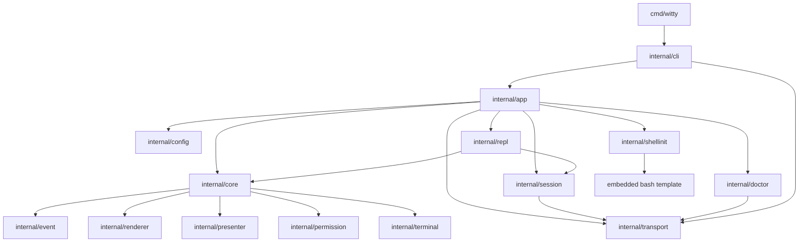
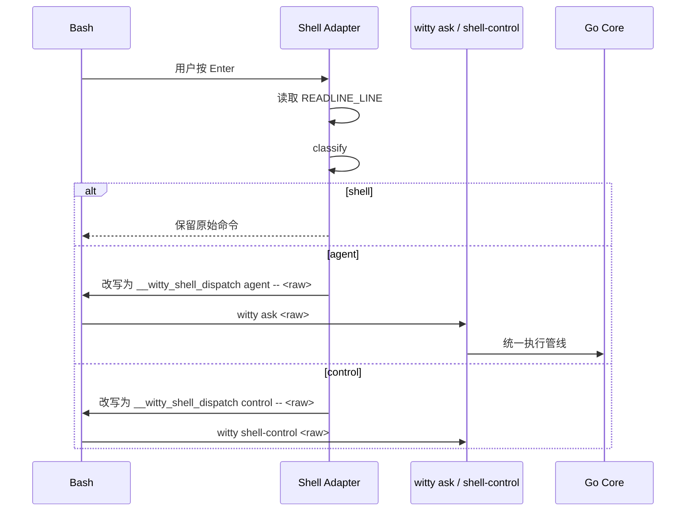
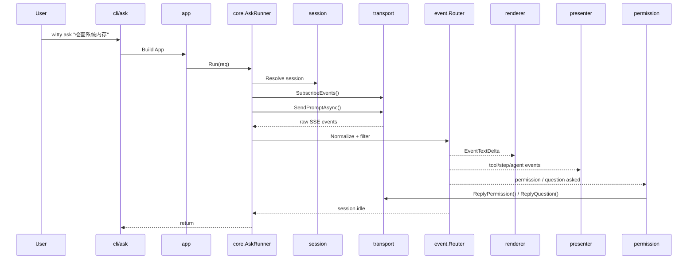
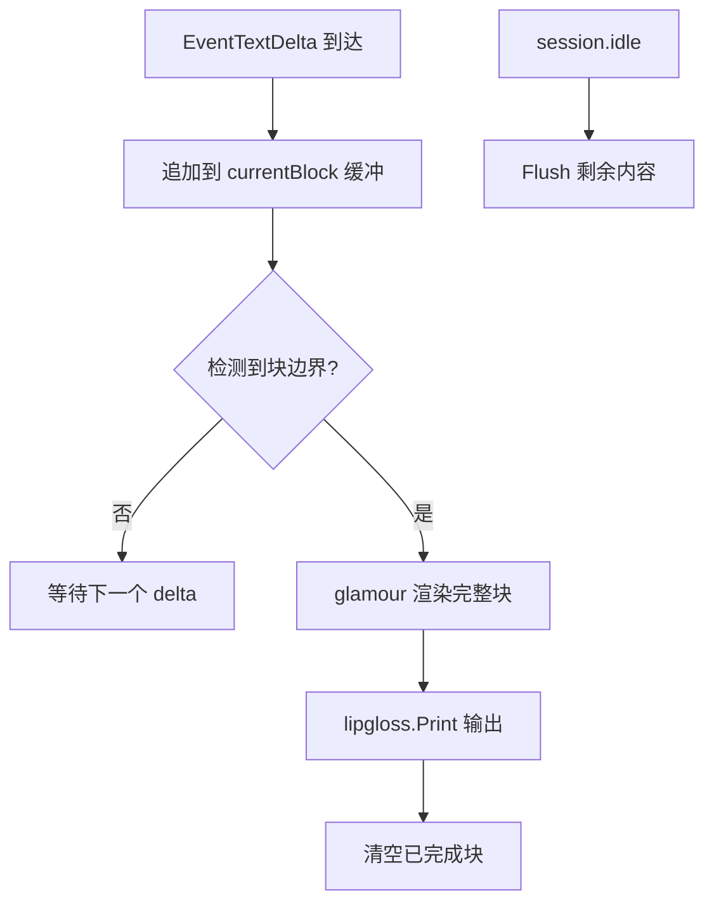
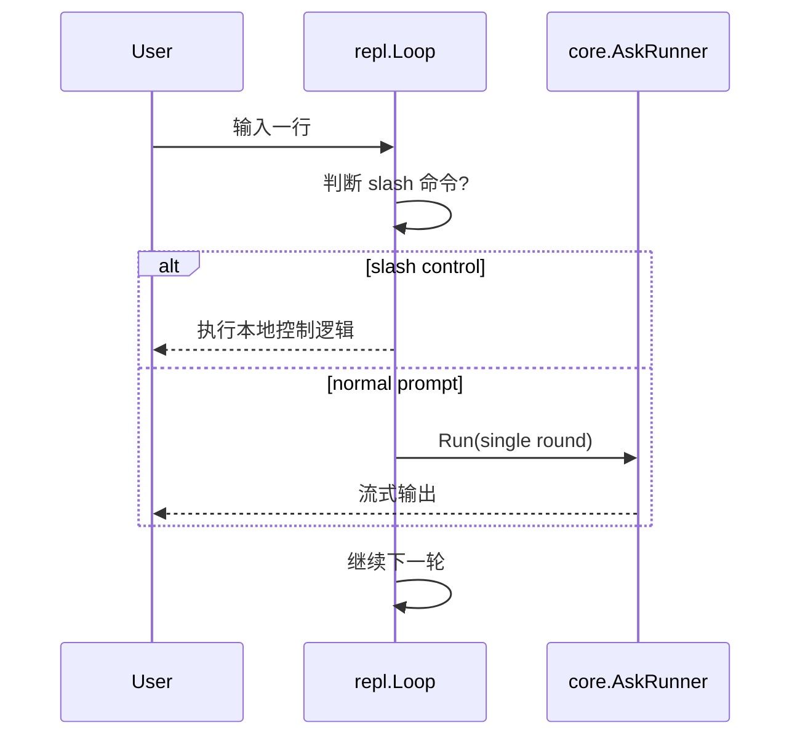

# `witty` 技术栈与模块级 Implementation Plan

> 关联设计文档：
>
> - [`../design/witty-overview.md`](../design/witty-overview.md)
> - [`../design/shell-adapter.md`](../design/shell-adapter.md)
>
> 配套技术参考（从本文衍生，含完整实现代码）：
>
> - [`./streaming-renderer.md`](./streaming-renderer.md) — 流式 Markdown 渲染器实现细节
> - [`./sse-client.md`](./sse-client.md) — SSE 客户端解析与并发模型

## 1. 文档目标

本文档将前述设计进一步细化为可落地的模块级实施方案，回答以下问题：

1. 该项目推荐使用什么技术栈，以及为什么。
2. 代码仓库建议如何组织，哪些模块负责哪些职责。
3. `witty ask`、REPL、Shell 直输、`witty init bash` 分别如何落到实现上。
4. Phase 1 ~ Phase 4 分别应交付什么，以及如何验证。

本文档面向研发实现，不替代设计文档；当实现细节与设计发生冲突时，以设计文档中的产品边界为上位约束，并以 `opencode serve` 暴露的 `/doc` OpenAPI 为接口事实来源。

---

## 2. 推荐技术栈

## 2.1 语言与运行时

- **主语言：Go 1.26+**
- **Shell 接入层：Bash 5.x**
- **目标平台：openEuler 交互式 Bash 终端**

### 选择 Go 的原因

1. 适合构建 **单二进制 CLI**，便于 openEuler 分发、RPM 打包和运维部署。
2. 标准库足以支撑 **HTTP / SSE / TTY / context cancel / structured logging**。
3. 实现 `ask`、REPL、`doctor`、session 管理这类终端前端逻辑的开发效率较高。
4. 纯 Go 依赖生态成熟，可尽量避免 CGO，提高发布稳定性。

### 为什么 Shell Adapter 保持 Bash 原生实现

Shell Adapter 依赖 Bash 的 `bind -x`、`READLINE_LINE`、`READLINE_POINT`、`accept-line` 包装和 `history -s` 等 Readline 语义，由 `witty init bash` 输出为 Bash 初始化脚本。详见 [`../design/shell-adapter.md`](../design/shell-adapter.md)。

## 2.2 关键依赖建议

> **版本原则**：依赖版本以当前稳定版本为准，但必须满足项目 Go 基线。按 2026-06 实测，`charm.land/glamour/v2` 需要 Go `1.25.8`，`charm.land/lipgloss/v2` 需要 Go `1.25.0`，因此本文统一以 Go `1.26+` 作为实现基线。import path 以下表为准，旧路径（如 `github.com/charmbracelet/*`、`github.com/deepmap/oapi-codegen`）已废弃。

| 层 | 推荐方案 | 版本 / Import Path | 说明 |
| --- | --- | --- | --- |
| CLI | `cobra` | `github.com/spf13/cobra` v1.10+ | 多子命令结构，支持 hidden command、man page 生成 |
| HTTP Client | Go `net/http` | 标准库 | 标准库足够；SSE 连接需专用 `http.Client`（无响应超时，见 §5.9） |
| OpenAPI 模型生成（可选） | `oapi-codegen` v3 | `github.com/oapi-codegen/oapi-codegen-exp` | **已验证**可消费 opencode 3.1.0 spec 生成 `types/models`（89K 行代码）；v2 因 `exclusiveMinimum` 字段类型不兼容而**不可用**；不要依赖 generated client 处理 `/event`，HTTP transport 与 SSE 都手写 |
| SSE 解析 | 手写 `bufio.Reader` 解析器 | 标准库，无额外依赖 | `ClientWithResponses` 会 buffer 整个响应体，对 SSE **无效**；必须手写；见 [`sse-client.md`](./sse-client.md) |
| Markdown 渲染 | `glamour` v2 | `charm.land/glamour/v2` | **批量渲染器**，不支持流式增量；配合块级缓冲使用；详见 [`streaming-renderer.md`](./streaming-renderer.md) |
| 终端样式 | `lipgloss` v2 | `charm.land/lipgloss/v2` | tool/panel/status/permission 结构化输出；`lipgloss.Print()` 自动颜色降采样 |
| 终端检测 | `golang.org/x/term` | `golang.org/x/term` latest | TTY 检测 (`IsTerminal`)、终端宽度 (`GetSize`)、SIGWINCH |
| ANSI 工具 | `muesli/termenv` | `github.com/muesli/termenv` v0.16+ | 非 TUI 场景的光标控制、颜色 profile 检测 |
| 配置加载 | `koanf` v2 | `github.com/knadh/koanf/v2` | 三层合并：默认值 → TOML 文件 → 环境变量；key 大小写敏感（优于 viper） |
| 日志 | `log/slog` | 标准库（Go 1.21+） | 结构化日志；非 TTY 时降级至 `io.Discard`；详见 §5.2 日志策略 |
| Shell 脚本质量 | `shellcheck` + `shfmt` | 系统工具 | 校验 `witty init bash` 输出模板 |
| CJK 字符宽度 | `go-runewidth` | `github.com/mattn/go-runewidth` | Phase 2 渲染器行数追踪时用于计算 CJK 字符实际终端宽度 |
| PTY 集成测试 | `go-expect` | `github.com/Netflix/go-expect` | 验证 Bash readline 行为；PTY 上发送按键、断言输出；TERM=xterm-256color |
| 发布 | `goreleaser` v2 + `nfpm` v2 | `github.com/goreleaser/goreleaser` | RPM 打包通过 nFPM 原生支持；设置 `goamd64: [v1]` 保证 openEuler 全平台兼容 |

## 2.3 工程原则

1. **优先单二进制**：`witty` 主程序尽量不依赖额外 runtime。
2. **尽量 `CGO_ENABLED=0`**：降低目标环境差异风险；goreleaser 层配置 `goamd64: [v1]` 保证旧系列 CPU 兼容。
3. **Shell 分类在 Bash 完成，AI 执行在 Go Core 完成**：职责边界清晰。
4. **以 `/doc` 为 API 唯一事实来源**：不手写猜测版 schema；已确认 opencode 的 `/doc` 输出是 OpenAPI **3.1.0**。抓取原始 spec 时显式发送 `Accept: application/json`。oapi-codegen **v2 不可用**（`exclusiveMinimum` 字段类型不兼容 3.1），**v3（`oapi-codegen-exp`）已验证可用**，生成 89K 行 types/models 代码。
5. **P0/P1 不做全屏 TUI**：先完成稳定的行式 REPL 与快捷模式闭环。
6. **流式输出是一级能力**：Phase 1 至少做到“按 Markdown 块边界持续输出”，不能等到整轮回答结束；Phase 2 再升级为“即时回显 + 块级替换”。

---

## 3. 建议目录结构

```text
shell/
  cmd/
    witty/
      main.go

  internal/
    app/
      app.go
      wiring.go

    cli/
      root.go
      ask.go
      repl.go
      session.go
      init.go
      doctor.go
      hidden_shell_control.go

    config/
      config.go
      loader.go
      env.go

    version/
      version.go

    terminal/
      io.go
      tty.go
      width.go
      prompt.go

    shellinit/
      bash.go
      templates/
        witty.bash.tmpl

    shellbridge/
      control.go
      history.go

    core/
      ask_runner.go
      conversation.go
      errors.go

    session/
      resolver.go
      service.go
      state.go

    transport/
      generated/
      client.go
      session_api.go
      permission_api.go
      event_stream.go
      errors.go

    event/
      types.go
      normalize.go
      router.go
      filter.go

    renderer/
      markdown.go
      buffer.go
      flush_policy.go

    presenter/
      text.go
      tool.go
      step.go
      agent.go
      permission.go
      error.go

    permission/
      manager.go
      prompt.go
      decision.go

    repl/
      loop.go
      commands.go
      state.go

    doctor/
      doctor.go
      checks.go
      report.go

  api/
    opencode/
      openapi.json

  scripts/
    update-openapi.sh

  test/
    golden/
    pty/
    integration/

  packaging/
    rpm/

  docs/
    design/
    development/
```

### 目录组织说明

- `cmd/witty`：程序入口，只负责启动，不承载业务逻辑。
- `internal/*`：按职责切分实现模块，避免把所有逻辑堆进 `main.go` 或 Cobra command 中。
- `api/opencode/openapi.json`：版本化保存当前对接的 OpenAPI schema。
- `scripts/update-openapi.sh`：用 `Accept: application/json` 拉取 `/doc` 原始 spec，更新 vendored schema，并按需重新生成 `types/models`。
- `test/pty`：专门放 Shell Adapter 与 REPL 的终端端到端测试。

---

## 4. 模块依赖总图



> `internal/cli/provider.go` 直接依赖 `app.Container`（通过 `ListProviders`、`ConnectProviderWithAPIKey`），
> Container 进而调用 `transport.Client` 的 `ListProviders`、`ListProviderAuthMethods`、`SetProviderAPIKey`。
> 不需要新增独立的 `internal/provider` 业务模块。

---

## 5. 模块级 Implementation Plan

## 5.1 `cmd/witty`

作为唯一程序入口，设置版本信息、构建信息、默认 `context.Context`，调用 `internal/cli` 构造命令树并执行。不写业务逻辑，不直接访问 `/event`、session、render、permission。

**完成标准**：程序启动路径稳定，`witty --help`、`witty version` 可工作。

---

## 5.2 `internal/app`

### 职责

作为组合根（composition root），负责：

- 加载配置
- 初始化日志
- 构造 transport client
- 构造 session/core/repl/doctor 等服务
- 为 Cobra commands 提供统一依赖注入入口

### 核心建议

定义一个 `App` 或 `Container`，由它统一持有主要 service：

```go
type App struct {
    Config      config.Config
    Logger      *slog.Logger
    Sessions    *session.Service
    Transport   *transport.Client
    AskRunner   *core.AskRunner
    REPL        *repl.Loop
    Doctor      *doctor.Service
    ShellInit   *shellinit.Service
}
```

**日志初始化策略**：使用 `log/slog` 标准库，在 `app` 层集中配置：

- 默认写入 `os.Stderr`，级别 `INFO`
- `--debug` flag 或 `WITTY_DEBUG=1` 时切换到 `DEBUG`
- **当 stderr 不是 TTY（管道输出）且未开启 debug 时，将 writer 替换为 `io.Discard`**：防止日志噪流污染 `witty list | jq .` 等管道用法
- `--debug` 模式下，去除时间戳（CLI 中属于噪风），保留 level/msg/自定义字段

### 完成标准

- 子命令不自行 new 各类 client/service。
- 所有运行时对象都从 `app` 层统一装配。
- `app.Container` 接口新增 `ListProviders`、`ConnectProviderWithAPIKey` 方法，供 `internal/cli/provider.go` 调用。

---

## 5.3 `internal/cli`

### 职责

定义对外命令面：

- `witty`
- `witty ask`
- `witty session list`
- `witty continue <id>` 或 `witty session continue <id>`
- `witty init bash`
- `witty doctor`
- 隐藏命令：`witty shell-control`

### 建议子命令设计

| 命令 | 作用 | 说明 |
| --- | --- | --- |
| `witty` | 启动 REPL 或恢复默认会话 | 默认入口 |
| `witty ask <prompt>` | 单轮请求 | Shell 快捷模式最终调用的核心命令 |
| `witty session list` | 列出会话 | 支持当前目录过滤 |
| `witty session continue <id>` | 切换会话 | 可写入本地状态 |
| `witty new` 或 `/new` | 显式新会话 | 可选公开命令 |
| `witty provider list` | 列出支持 API Key 的 AI provider | 标注 connected 状态 |
| `witty provider connect <provider>` | 连接 provider | 支持 provider id/name 解析与 `--key` 传入 API key |
| `witty init bash` | 输出 Bash 初始化脚本 | 用于 `eval "$(witty init bash)"` |
| `witty doctor` | 自检 server / config / auth / tty | 产品化阶段关键命令 |
| `witty shell-control` | 处理 slash 控制命令 | hidden，仅供 Shell Adapter 调用 |

### 实现约束

- `cli` 只做参数解析、help、flag 校验和调用 service。
- slash 命令真正的语义解析优先放在 `repl` / `shellbridge` 层，不要重复在每个 Cobra command 中实现。

---

## 5.4 `internal/config`

### 职责

统一加载配置来源：

1. 默认值
2. 配置文件（建议 `~/.config/witty/config.toml`）
3. 环境变量
4. 命令行 flag 覆盖

### 配置建议字段

```toml
server_url = "http://127.0.0.1:4096"
default_agent = "build"
default_model = ""
debug = false
theme = "auto"  # "auto" | "dark" | "light"
                # "auto" 通过 lipgloss.HasDarkBackground(os.Stdin, os.Stdout) 自动检测

[repl]
auto_resume = true

[shell]
enabled = true

[doctor]
timeout_seconds = 5
```

> **`theme = "auto"` 的实现**：`glamour.WithAutoStyle()` 已在 glamour v2 中移除。自动主题需在应用启动时调用一次 `lipgloss.HasDarkBackground(os.Stdin, os.Stdout)` 获得终端背景色，再将结果（`"dark"` 或 `"light"`）传入 `glamour.WithStylePath()`；若使用顶层 API，也可传给 `glamour.Render(markdown, styleName)`。

### 需要覆盖的环境变量

- `WITTY_SERVER_URL`
- `WITTY_DEBUG`
- `WITTY_CONFIG`
- `WITTY_SHELL_ENABLE`
- `WITTY_SHELL_DEBUG`

### 完成标准

- 所有模块读取配置都通过统一 `config.Config`，不要各自读环境变量。

---

## 5.5 `internal/terminal`

### 职责

封装终端相关通用能力：

- 判断 stdin/stdout/stderr 是否 TTY
- 获取终端宽度
- 输出 writer 抽象
- 统一 stderr / stdout 写入策略
- 权限提示和 REPL 输入共用的 prompt 工具

### 价值

这是 `renderer`、`presenter`、`permission`、`doctor` 的共同基础。如果没有这一层，TTY 检测与宽度计算会散落在多个模块中。

---

## 5.6 `internal/shellinit`

### 职责

实现 `witty init bash`：

- 通过 `go:embed` 嵌入 Bash 模板
- 根据版本/路径/环境开关渲染脚本
- 输出完整、幂等的 Bash 集成片段

### 模板内容应包含

1. 安装前提检查：Bash / 交互式 / TTY / Readline
2. 幂等保护
3. `__witty_pre_accept`
4. `__witty_classify`
5. `__witty_shell_dispatch`
6. Enter 包装与 key binding
7. `WITTY_SHELL_ENABLE` / `WITTY_SHELL_DEBUG`
8. history 处理

### 重要约束

- 分类规则应尽量留在 Bash 模板中，与设计文档保持一致。
- Go 侧不负责在运行时“远程控制”Readline。
- 输出脚本必须可被 `shellcheck` / `shfmt` 检查。

### 测试建议

- 对 `witty init bash` 输出做 golden test。
- 用 PTY 测试实际 `eval "$(witty init bash)"` 后的行为。

---

## 5.7 `internal/shellbridge`

### 职责

为 Shell Adapter 提供 Go 侧桥接逻辑，典型包括：

- `witty shell-control <raw>`：解析 `/session list`、`/new`、`/help` 等
- 统一 shell 模式下的控制命令输出
- 管理少量 shell 直输场景所需的兼容逻辑

### 为什么单独拆模块

Shell Adapter 的“分类与改写”在 Bash，但被改写后的命令最终会进入 `witty`。将这些仅供 Bash 调用的逻辑单独放在 `shellbridge`，可以避免污染 REPL/CLI 的通用实现。

### 建议边界

- `shellbridge` 可以复用 `repl` 的 slash command parser。
- `shellbridge` 不直接操作 `READLINE_LINE` 或 Bash history；这些仍由 Bash 模板处理。

**Shell 直输路由流**：



---

## 5.8 `internal/session`

### 职责

统一会话解析与管理：

- 解析“当前应使用哪个 session”
- 创建新会话
- 列出会话
- 显式 continue / new
- 管理当前目录会话恢复策略

### 关键场景

1. `witty ask`：使用当前目录最近会话；若无则新建。
2. `witty`：进入 REPL 时恢复当前目录最近会话；若无则新建。
3. `/new`：强制新建会话。
4. `/session continue <id>`：切到指定会话。

### 建议接口

```go
type Resolver interface {
    Resolve(ctx context.Context, cwd string, forceNew bool) (SessionContext, error)
    Continue(ctx context.Context, id string) (SessionContext, error)
    List(ctx context.Context, scope Scope) ([]SessionSummary, error)
}
```

### 本地状态建议

如果服务端接口不足以表达“当前目录显式选中的 session”，可在本地状态文件中维护极小映射，例如：

- `cwd -> pinned sessionID`

但要保持本地状态最小化，不能让本地数据库成为主事实来源。

---

## 5.9 `internal/transport`

对 `opencode serve` 的 HTTP API + SSE 进行稳定封装。

**内部组织**：

- `transport/generated`：存放 `oapi-codegen` v3（`github.com/oapi-codegen/oapi-codegen-exp`）生成的 types/models，不直接被高层模块广泛依赖，升级 schema 时允许整体替换。
- `transport/client.go`：封装基础 client、认证、base URL、超时，对外暴露 `Client` 接口。
- `transport/event_stream.go`：SSE 连接管理，使用手写 `bufio.Reader` 解析器（**不能使用** `ClientWithResponses`），需要专用 `http.Client`（无响应超时，但保留连接建立超时）。详见 [`sse-client.md`](./sse-client.md)。

### 建议接口

```go
type Client interface {
    Health(ctx context.Context) error
    CreateSession(ctx context.Context, req CreateSessionRequest) (SessionContext, error)
    ListSessions(ctx context.Context, filter SessionFilter) ([]SessionSummary, error)
    SendPromptAsync(ctx context.Context, sessionID string, req PromptRequest) error
    ReplyPermission(ctx context.Context, requestID string, decision PermissionDecision) error
    ReplyQuestion(ctx context.Context, requestID string, answers [][]string) error
    RejectQuestion(ctx context.Context, requestID string) error
    SubscribeEvents(ctx context.Context) (<-chan RawEvent, <-chan error)
    ListProviders(ctx context.Context, directory string) (ProviderList, error)
    ListProviderAuthMethods(ctx context.Context, directory string) (ProviderAuthMethods, error)
    SetProviderAPIKey(ctx context.Context, providerID string, apiKey string) error
}
```

> **Provider 相关方法说明**：
>
> - `ListProviders` 调用 `GET /provider`，返回 `all`（全部 provider）、`connected`（已连接列表）、`default`（默认模型）三个字段。
> - `ListProviderAuthMethods` 调用 `GET /provider/auth`，返回各 provider 可用认证方式；CLI 首版只暴露支持 `type=api` 的 provider。
> - `SetProviderAPIKey` 调用 `PUT /auth/{providerID}`，请求体固定为 `{"type": "api", "key": "..."}`。
> - `witty provider connect <provider>` 先用 `GET /provider` 按 `id/name` 解析输入；若 provider 存在但 `GET /provider/auth` 不包含 `type=api`，返回明确错误：`当前 Provider 暂不支持 API Key 认证方式`。

> **SubscribeEvents 实现注意**：
>
> - `/event` 端点接受 `directory` query param（`GET /event?directory=<cwd>`），可在服务端做初步过滤；但 SSE 流仍是所有会话共享，**客户端仍需按 sessionID 做二次过滤**。
> - `prompt_async` 端点在服务端接受请求后**立即返回 HTTP 204**，不阻塞等待 AI 响应；实际的流式响应通过 `/event` SSE 流获得。

**Provider 相关类型**（`transport/types.go`）：`ProviderList`（All + Connected + Default）对应 `/provider` 响应；`ProviderAuthMethods` 对应 `/provider/auth` 响应。首版不暴露通用 `AuthRequest`，由 `SetProviderAPIKey` 在 transport 内部固定构造 API key 请求体。

### 实现约束

- 所有请求超时都要可配置。
- 错误要保留 HTTP status / endpoint / request id 等上下文。
- 不把生成代码直接暴露给 UI 层。

---

## 5.10 `internal/event`

### 职责

把来自 `/event` 的总线事件转换成内部稳定事件模型：

1. 解析 raw SSE event
2. 按 `sessionID` 过滤
3. 归一化成内部 `AppEvent`
4. 派发给不同消费者

### 内部事件建议

```go
type AppEventKind string

const (
    EventTextDelta         AppEventKind = "text.delta"
    EventReasoningDelta    AppEventKind = "reasoning.delta"  // 推理思考 delta，区分 text vs reasoning
    EventStepStarted       AppEventKind = "step.started"
    EventStepEnded         AppEventKind = "step.ended"
    EventToolCalled        AppEventKind = "tool.called"
    EventToolSucceeded     AppEventKind = "tool.succeeded"
    EventToolFailed        AppEventKind = "tool.failed"
    EventPermissionAsked   AppEventKind = "permission.asked"
    EventQuestionAsked     AppEventKind = "question.asked"   // 问题请求（含 questions 数组）
    EventSessionIdle       AppEventKind = "session.idle"
    EventUnknown           AppEventKind = "unknown"
)
```

### 归一化层的有状态设计说明

实际的服务端流式事件是 `message.part.delta`（不是 `session.next.text.delta`），该事件仅携带 `{partID, field, delta}`，**不**直接携带 part 的类型（text vs reasoning）。要区分两者，`event.Router` 必须维护一个 `partID → partType` 的内存映射，从先到达的 `message.part.updated` 事件中提取并存储。对应关系如下：

| 服务端事件 | AppEventKind | 说明 |
| - | - | - |
| `message.part.delta`（partType=text） | EventTextDelta | 主文本流式 delta |
| `message.part.delta`（partType=reasoning） | EventReasoningDelta | 推理思考 delta（Phase 1 可忽略） |
| `message.part.updated`（type=step-start） | EventStepStarted | 步骤开始 |
| `message.part.updated`（type=step-finish） | EventStepEnded | 步骤结束（含 tokens/cost） |
| `message.part.updated`（type=tool, state.status=running） | EventToolCalled | 工具调用开始（输入位于 `state.input`） |
| `message.part.updated`（type=tool, state.status=completed） | EventToolSucceeded | 工具调用成功（输出位于 `state.output`） |
| `message.part.updated`（type=tool, state.status=error） | EventToolFailed | 工具调用失败（错误位于 `state.error`） |
| `permission.asked` | EventPermissionAsked | 权限请求 |
| `question.asked` | EventQuestionAsked | 问题请求（含 questions 数组） |
| `session.idle` | EventSessionIdle | 本轮结束唯一可靠信号 |

> 注：`session.next.text.delta`、`session.next.tool.called` 等事件类型在 Schema 中存在（ACP 协议），在 `/event` 流中也可能出现，实现时应兼容处理但以 `message.part.*` 为主路径。

### 关键原则

- `event` 模块负责“理解服务端事件”。
- `presenter` 模块负责“决定如何展示这些事件”。
- 不要把服务端字段名直接散布到整个代码库。

---

## 5.11 `internal/core`

### 职责

实现统一执行管线，是整个产品的业务核心：

- 解析本轮要使用的 session
- 发起 prompt
- 订阅并处理 SSE
- 驱动 renderer / presenter / permission
- 以 `session.idle` 或等价结束条件结束本轮

### 关键结论

- **`witty ask` = 执行一轮 `core` 管线后退出**
- **REPL = 在相同 `core` 管线外层包一个输入循环**

### 建议对象模型

```go
type AskRequest struct {
    Prompt   string
    CWD      string
    ForceNew bool
    Mode     AskMode // ask / repl / shell-shortcut
}

type AskRunner struct {
    Sessions   session.Resolver
    Transport  transport.Client
    Router     *event.Router
    Renderer   *renderer.MarkdownRenderer // TODO: 待复杂度上升后替换为 renderer.TextRenderer 接口（见 §5.12）
    Presenter  *presenter.Presenter
    Permission *permission.Manager
}
```

### 核心执行步骤

1. Resolve session
2. Subscribe events
3. Send prompt async
4. Loop consume events
5. `EventTextDelta` -> renderer
6. tool/step/agent -> presenter
7. permission/question -> permission manager
8. idle -> flush / return

**`witty ask` 执行流**：



### 完成标准

- `ask` 和 REPL 单轮输出一致。
- 快捷模式与 REPL 共享同一核心代码路径。

---

## 5.12 `internal/renderer`

### 职责

将归一化后的 `EventTextDelta` 增量文本渲染为带样式的 Markdown 输出。

- Phase 1（MVP）：按 Markdown 块边界触发渲染，不做即时 raw echo
- Phase 2：在 Phase 1 基础上增加“即时回显 + ANSI 擦除替换”
- 流程结束时（`session.idle`），刷新剩余缓冲
- 在非 TTY（管道输出）场景下降级为写入原始 Markdown

### 核心约束：glamour 是批量渲染器

无论使用顶层 `glamour.Render(markdown, styleName)` 还是 `TermRenderer.Render(markdown)`，输入都必须是**完整 Markdown 块**。它不支持直接消费流式 delta；块边界识别必须由 `renderer` 自己完成。

### Phase 1：块边界渲染（MVP）



**关键性质**：用户不会等到整轮回答结束才看到内容；但 Phase 1 的刷新粒度是“块”，不是“每个字符 / 每个 delta”。即时回显属于 Phase 2 增强能力。

### 子组件

#### `renderer.go`

- `MarkdownRenderer` 结构体，实现 `TextRenderer` 接口
- 持有终端宽度、TTY 标志、glamour TermRenderer 实例
- `WriteDelta(text string) error`：归一化文本增量输入入口
- `Flush() error`：流程结束时强制渲染剩余内容

#### `buffer.go`

- `BlockBuffer`：维护未完成块的文字缓冲
- `BlockBoundaryDetector`：块边界判断（空行、围栏关闭、ATX 标题）
- 状态：`inFence bool`，`fenceChar rune`，`fenceLen int`

#### `flush_policy.go`

- Phase 1：块边界触发渲染
- Phase 2：即时回显 + ANSI 擦除替换
- 块边界规则详见 [`streaming-renderer.md §8`](./streaming-renderer.md#8-%E5%9D%97%E8%BE%B9%E7%95%8C%E6%A3%80%E6%B5%8B)

#### `markdown.go`

- 封装 glamour `TermRenderer` / style 初始化逻辑
- 处理 glamour v2 常见陷阱：每次 `Render()` 自动添加文档头部 `\n`，非首个块需 `strings.TrimLeft(rendered, "\n")`
- 根据 `theme` 配置选择样式：`"dark"`、`"light"` 或自动检测（`lipgloss.HasDarkBackground(os.Stdin, os.Stdout)`），并通过 `glamour.WithStylePath()` 构建 renderer
- 每次 `Render()` 后用 `lipgloss.Print()` 输出（自动颜色降采样）

#### `terminal.go`

- TTY 检测：`term.IsTerminal(int(os.Stdout.Fd()))`
- 终端宽度：`term.GetSize(int(os.Stdout.Fd()))`
- SIGWINCH 监听：动态更新宽度，重建 glamour TermRenderer（`WithWordWrap(newWidth)`）
- Phase 2 装备：`TrackRows(text string, termWidth int) int`、`EraseLines(out io.Writer, n int)`

### 实现约束

- `WriteDelta` / `Flush` 应是同步操作，不启动内部 goroutine。
- Phase 1 不做逐字符重绘，也不做 raw echo。
- Phase 2 通过实验开关（如 `WITTY_RENDERER_PHASE=2`）启用，默认保留 Phase 1 降级路径。
- 所有入口复用同一渲染器实例（`ask`、REPL、Shell 快捷模式）。
- 详细实现代码见 [`streaming-renderer.md`](./streaming-renderer.md)。

---

## 5.13 `internal/presenter`

### 职责

渲染结构化事件，不直接处理 Markdown 主文本：

- step 开始/结束
- tool 调用/成功/失败
- agent / sub-agent 边界
- skill / MCP / bash 等工具类型标签
- 错误说明与状态信息

### 展示目标

不论是在 `witty ask`、REPL 还是 Shell 快捷模式里，工具/步骤/权限相关展示都保持一致。

### 样式建议

- 用 `lipgloss` 定义状态色与边框样式
- 对长日志或大块文本做折叠/缩进，而不是铺满整屏
- 明确区分“主回答正文”和“工具执行轨迹”

---

## 5.14 `internal/permission`

### 职责

处理运行中的权限 / 问题请求：

- 监听 `permission.asked` / `question.asked`
- 在当前 TTY 上发起确认或问题选择
- 收集 `once` / `always` / `reject` 或问题答案
- 调用对应的 `reply` / `reject` 接口

### 关键要求

- 快捷模式和 REPL 都必须支持权限 / Question 交互。
- 交互发生时，不能破坏当前终端输出结构。
- 错误和超时要有清晰回显。

### 建议接口

```go
type Manager struct {
    Transport transport.Client
    Prompt    PromptUI
}
```

### Question 问题处理

除 `permission.asked` 之外，opencode 还有独立的问题交互机制，`permission.Manager` 需同时处理 `question.asked` 事件：

- **Question API**：
  - `GET /question` — 列出当前待回答的问题
  - `POST /question/{requestID}/reply` — 回答，body: `{"answers": [[string]]}`（每个内层数组都是该题所选 `label` 列表）
  - `POST /question/{requestID}/reject` — 拒绝回答
- **QuestionInfo 结构**：`{question: string, header: string, options: [{label, description}], multiple: bool, custom: bool}`
- 收到 `question.asked` 事件后，在 TTY 上向用户展示问题与选项，收集选择后调用 reply；支持 `multiple: true` 时多选；回复时不要读取不存在的 `value` 字段，而是回传所选 `label`。

### 测试重点

- 权限请求在非 TTY 场景下的降级行为
- 用户输入非法值时的重试提示
- 权限回复失败时的错误展示
- `question.asked` 单选/多选/自定义输入的 TTY 展示与回复

---

## 5.15 `internal/repl`

### 职责

实现行式 REPL：

- 读取用户输入
- 识别 slash 控制命令
- 将普通输入转给 `core.AskRunner`
- 维护本进程级的 REPL 状态

### 建议职责边界

- `repl` 负责循环和命令分发。
- 本轮对话执行仍交给 `core`。
- 控制命令解析可复用到 `shellbridge`。

**REPL 执行流**：



### REPL 首版能力

1. 基础输入循环
2. `/help`
3. `/session list`
4. `/session continue <id>`
5. `/new`
6. `/agent <name>`
7. `/model <id>`
8. `/ask <prompt>`

### 不建议首版就做

- 全屏面板式 UI
- 复杂键盘快捷键系统
- 多窗口/多面板布局

---

## 5.16 `internal/doctor`

实现 `witty doctor`，检查 server 可达性、`/doc` 可读性、配置有效性、TTY 状态、shell 集成安装情况、以及 OpenAPI client/schema 版本提示。在产品化阶段为用户和运维提供统一诊断入口，减少"shell 失效 / server 不通 / auth 不对 / schema 变更"类问题的排障成本。

---

## 5.17 `internal/version`

统一暴露语义化版本、git commit、build date、schema version（可选）。该模块简单，但有利于 `doctor`、日志和问题定位。

---

## 7. Shell Adapter 的实施细化

## 7.1 Bash 侧负责的事情

应由模板输出的 Bash 脚本负责：

- Enter 包装
- 分类器
- shell / agent / control 路由决策
- `READLINE_LINE` 改写
- history 保真
- 环境变量开关
- debug 输出

## 7.2 Go 侧负责的事情

- `witty ask`
- `witty shell-control`
- `witty doctor`
- `witty init bash`

## 7.3 明确禁止的实现方式

1. 不在 Bash Hook 中直接跑长时间的 Agent 调用。
2. 不把自然语言翻译成本地 shell 再偷偷执行。
3. 不在 Go 中试图接管 Bash 的交互式输入循环。
4. 不把 wrapper 命令暴露到 history 里。

## 7.4 Bash 模板的开发建议

模板中至少拆出以下函数：

- `__witty_should_enable`
- `__witty_classify`
- `__witty_pre_accept`
- `__witty_shell_dispatch`
- `__witty_debug`
- `__witty_install_bindings`

这样便于：

- 逐函数单测/快照验证
- ShellCheck 提示更清晰
- 未来添加 fallback 或兼容层时局部演进

**重要：模板分隔符必须用 `[[ ]]` 而非 `{{ }}`**。默认的 `{{ }}` 分隔符与 Bash 变量语法 `${}` 第2-3字符相同，且与 Bash 模板内内嵌的花括号展开 (`{a,b}`) 容易产生歧义：

```go
// 正确：在 Go 层设置自定义分隔符
tmpl, err := template.New("witty_init").
    Delims("[[", "]]").
    ParseFS(TemplateFS, "templates/witty_init.bash.tmpl")
```

```bash
# witty_init.bash.tmpl 示例：[[ ]] 分隔符不影响 Bash 变量语法
export WITTY_VERSION="[[ .Version ]]"
export PATH="${PATH}:[[ .BinaryPath ]]"  # Bash ${} 不受影响
```

Go `text/template` 模板的嵌入建议：

```go
// internal/shellinit/embed.go
//go:embed templates
var TemplateFS embed.FS  // 嵌入整个目录（递归）

// 'templates' vs 'templates/*' 的区别：
//   templates   → 嵌入所有文件不包含 ._ 开头的文件
//   all:templates → 包含隐藏文件（不必要）
```

---

## 8. 接口与类型边界建议

## 8.1 为什么先定义接口

该项目跨越：

- Shell 集成
- HTTP API
- SSE 流
- Markdown 渲染
- TTY 权限 / Question 交互

如果在第一阶段就把所有依赖写死到具体实现，后续替换渲染器、更新 OpenAPI schema、补充测试 double 都会非常困难。

但也要避免“接口过度抽象”。建议只给边界稳定、适合 mock 的模块定义接口：

- session
- transport
- permission prompt

而像 `renderer.MarkdownRenderer` 这种局部实现，可以先保留具体类型，待复杂度上升后再抽象。

---

## 8.2 API 速查（opencode v1.15.13 实测）

- **OpenAPI 版本**：3.1.0；抓取原始 spec 时显式使用 `curl -H "Accept: application/json" http://127.0.0.1:4096/doc`（约 283KB）
- **代码生成建议**：默认策略是 vendored spec + 手写 HTTP/SSE transport；`oapi-codegen` v3（`oapi-codegen-exp`）**已验证兼容** opencode 3.1.0 spec，可生成 `types/models`（89K 行），不生成完整 client。

**关键端点速查**：

| HTTP 方法 & 路径 | 说明 |
| - | - |
| `GET /global/health` | 健康检查（无鉴权时直接返回 200） |
| `POST /session` | 创建会话；可带 `title?`、`agent?`、`model?`、`metadata?`、`permission?`、`workspaceID?`，其中 `model` 形如 `{id, providerID, variant?}`；返回 Session（id 以 `ses_` 开头；OpenAPI schema 中的实际 pattern 为 `^ses`，不含显式下划线要求，但 opencode 生成时始终带 `ses_` 前缀） |
| `GET /session?directory=<cwd>` | 列出会话，支持 `directory` 参数过滤 |
| `POST /session/{sessionID}/prompt_async` | 异步发送消息，立即返回 **204**；body 至少包含 `parts`，常见最小形态为 `{parts: [{type:"text", text:"..."}]}` |
| `POST /session/{sessionID}/abort` | 中止当前会话 |
| `GET /event?directory=<cwd>` | SSE 事件流，所有会话共享；需客户端按 sessionID 过滤 |
| `POST /permission/{requestID}/reply` | 权限回复，body: `{reply: "once" / "always" / "reject"}` |
| `POST /question/{requestID}/reply` | 问题回答，body: `{answers: [[string]]}`（每题回传所选 `label` 数组） |
| `POST /question/{requestID}/reject` | 拒绝问题 |
| `GET /agent` | 列出可用 agent |
| `GET /provider` | 列出可用 provider |
| `GET /provider/auth` | 列出各 provider 支持的认证方式 |
| `PUT /auth/{providerID}` | 为指定 provider 写入 API Key 凭据（首版固定发送 `{type:"api", key:"..."}`） |

**安全注意**：`opencode serve --port 4096` 默认无认证（`OPENCODE_SERVER_PASSWORD` 未设置时服务端会打印警告）；如设置了 password，所有请求头需携带对应认证信息。

---

## 9. 分阶段实施计划

> 详细 Phase 规划见 [`../design/witty-overview.md` §11](../design/witty-overview.md#11-分阶段实施计划)。下表为实施视角的关键里程碑汇总。

| Phase | 核心交付 | 关键验收 |
| --- | --- | --- |
| 0：工程脚手架 | Go module、`cmd/witty`、Cobra 命令树、slog、config 加载、vendored OpenAPI spec | `witty --help` / `witty version` / `witty init bash` 占位模板 |
| 1：核心 MVP | transport、session、event 归一化、AskRunner、Phase 1 渲染器、permission/question 处理、Bash Adapter | `witty ask` + Shell 直输闭环，按 Markdown 块边界持续输出 |
| 2：REPL 与控制命令 | REPL 循环、slash 命令、`shell-control`、会话管理 | REPL 与 ask 单轮输出一致，shell 模式 control 路径可用 |
| 3：展示与流式增强 | presenter、Phase 2 渲染器（即时回显+ANSI 擦除）、错误重试/重连 | tool/step/agent/permission/question 展示完整，Phase 2 渲染可开关 |
| 4：产品化与运维 | `witty doctor`、配置/日志完善、RPM 打包、兼容性诊断 | 可发布产物，doctor 可定位常见接入问题 |

---

## 10. 测试策略

| 测试类型 | 覆盖模块 | 工具 |
| --- | --- | --- |
| 单元测试 | `session`、`event`、`renderer`、`repl`、`shellbridge` | `go test` |
| Golden Tests | `witty init bash` 输出、Markdown ANSI 渲染、tool/permission/error presenter 输出 | 快照比对 |
| PTY 集成测试 | Shell Adapter 绑定、history 保真、路由正确性、permission/question TTY 交互 | `go-expect`（`TERM=xterm-256color`） |

**PTY 测试关键设置**：启动 bash 时必须设置 `TERM=xterm-256color`，否则 bash 不启用 readline：

```go
cmd := exec.Command("/bin/bash", "--norc", "--noprofile")
cmd.Env = append(os.Environ(), "TERM=xterm-256color")

c, _ := expect.NewConsole(expect.WithDefaultTimeout(5 * time.Second))
cmd.Stdin, cmd.Stdout, cmd.Stderr = c.Tty(), c.Tty(), c.Tty()
cmd.Start()

c.ExpectString("$")
c.SendLine(`eval "$(witty init bash)"`)
c.ExpectString("$")
c.Send("\u68c0\u67e5\u7cfb\u7edf\u5185\u5b58\n")   // 应路由到 agent
```

**接口回归测试**（每次更新 `/doc` 后执行）：更新 vendored spec → 重新生成 `types/models` → transport 编译检查 → 事件 schema 测试 → 最小 ask E2E 测试。

---

## 11. 发布与运维实施建议

## 11.1 构建

```yaml
# .goreleaser.yaml 核心配置
builds:
  - main: ./cmd/witty
    goos: [linux]
    goarch: [amd64, arm64]
    goamd64: [v1]        # 确保 openEuler 全平台兼容（包括旧型服务器）
    env: [CGO_ENABLED=0]
    ldflags:
      - "-s -w"
      - "-X main.version={{.Version}}"
      - "-X main.commit={{.Commit}}"
      - "-X main.date={{.Date}}"
```

- 构建时注入 version / commit / build date

## 11.2 打包

通过 goreleaser + nFPM 生成 RPM（openEuler 主要分发格式）：

```yaml
# .goreleaser.yaml nfpms 段
nfpms:
  - package_name: witty
    vendor: "Your Org"
    homepage: "https://github.com/yourorg/witty"
    maintainer: "Your Name <you@example.com>"
    description: "witty — openEuler 终端 AI 助手"
    license: Apache-2.0
    formats: [rpm]
    rpm:
      compression: zstd   # openEuler 22.03+ 支持 zstd
      summary: "witty AI CLI"
    contents:
      # 二进制
      - src:  dist/witty_linux_{{ .Arch }}/witty
        dst:  /usr/bin/witty
        file_info: {mode: 0755}
      # Bash 补全（双路径兼容旧系统）
      - src:  dist/completions/witty.bash
        dst:  /usr/share/bash-completion/completions/witty
        file_info: {mode: 0644}
      - src:  dist/completions/witty.bash
        dst:  /etc/bash_completion.d/witty
        file_info: {mode: 0644}
      # 系统级默认配置（noreplace 防止升级覆盖用户修改）
      - src:  packaging/config.toml.default
        dst:  /etc/witty/config.toml
        type: config|noreplace
        file_info: {mode: 0644}
      # config 目录所有权
      - dst:  /etc/witty
        type: dir
        file_info: {mode: 0755}
```

> **用户个人配置** (`~/.config/witty/config.toml`)：不应在 RPM 打包时处理。由 `witty` 首次运行时自动创建并写入默认配置。

产物应保留：

- 二进制产物
- RPM 包 (amd64 / arm64)
- shell 安装说明
- 示例配置文件

## 11.3 运维检查点

参见 §5.16 `internal/doctor` 的检查清单及 §8.2 API 速查中的端点列表。

---

## 12. 风险与防线

| 风险 | 描述 | 防线 |
| --- | --- | --- |
| Shell 分类有歧义 | 自然语言与 shell 命令无法 100% 无歧义 | 白名单 slash 命令 + 强 shell 特征优先 + `/ask` 逃生口 |
| SSE schema 变化 | `/event` 字段可能漂移 | 固化 OpenAPI + 手写 transport + `event` 归一化层 |
| **OpenAPI 3.1** | **spec 版本与代码生成工具兼容性** | **已确认为 3.1.0；oapi-codegen v2 不兼容，v3（`oapi-codegen-exp`）已验证可用；默认策略 vendored spec + 手写 transport + v3 生成 types/models** |
| Bash Hook 冲突 | 用户已有 Enter 自定义绑定 | `doctor` 检查 + debug 日志 + 环境变量关闭开关 |
| **glamour 批量渲染约束** | **glamour 不支持增量输入** | **Phase 1 使用块边界渲染；Phase 2 再启用即时回显 + ANSI 擦除替换；见 streaming-renderer.md** |
| 渲染体验不稳定 | block 边界跨 delta | Phase 1 保持块级刷新；Phase 2 明确作为增强能力隔离推进 |
| 权限 / 问题交互打断输出 | TTY 输入与流式文本冲突 | 统一由 `permission.Manager` 接管当前 prompt，并处理 `question.asked` |
| 本地状态过重 | 过早引入 DB 或大量缓存 | 只保留最小配置与少量状态文件 |

---

## 13. 首个迭代建议（两周粒度）

如果马上开工，建议首个迭代只做以下内容：

### Sprint 1

1. 初始化 Go module 和命令树
2. **用 `curl -H "Accept: application/json" http://127.0.0.1:4096/doc` 固化当前 OpenAPI 3.1.0 spec**
3. 落地 `config`、`app`、`transport` 基础骨架
4. 更新 vendored spec，并按需生成 `types/models`（不依赖 generated client）
5. 完成 `witty ask` 的最小闭环（包含 Phase 1 渲染器和基础 permission/question 处理）
6. 完成 `witty init bash` 最小模板
7. 跑通 3 个核心验收：
   - `检查系统内存` → Agent（快捷模式）
   - `systemctl status nginx` → Shell
   - `witty ask` 能按 Markdown 块边界持续输出（不是等到回答完整）

### Sprint 2

1. 补 REPL
2. 补 `/session list`、`/new`、`/help`
3. 补 `shell-control`
4. 补 history / debug / PTY 测试
5. 收敛模块接口，避免后续返工

---

## 14. 最终落地原则

1. **一个 `witty`，两个入口，共用一个 Core。**
2. **Shell Adapter 只负责接入与路由，不负责 AI 执行。**
3. **`witty ask` 是最小执行单元，REPL 只是其外层循环。**
4. **所有上游 API 变化先进入 `transport` / `event` 层，再影响 UI。**
5. **先做稳定可解释的终端产品，再考虑复杂 TUI 和高级交互。**

这套模块划分可以直接支撑设计文档中的 P0 ~ P4 路线，同时避免在早期把 Shell、REPL、Renderer、Transport 等职责缠在一起，便于后续演进和测试。
