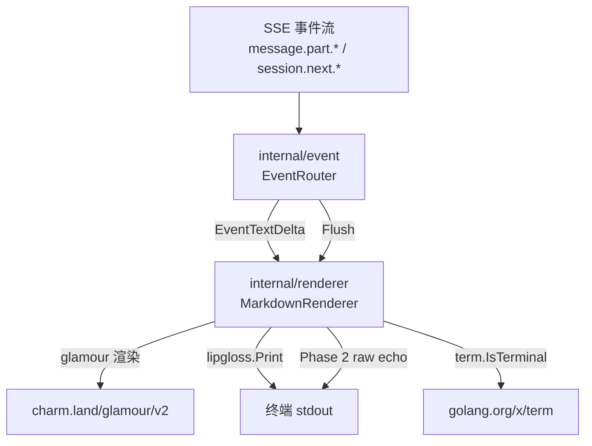
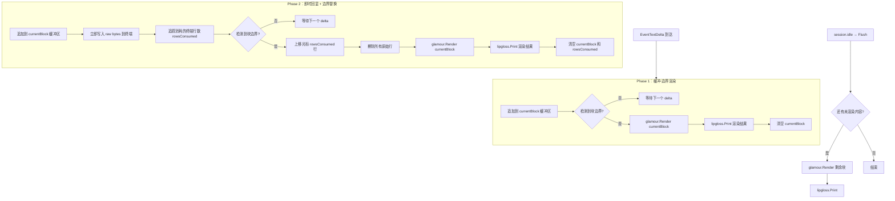
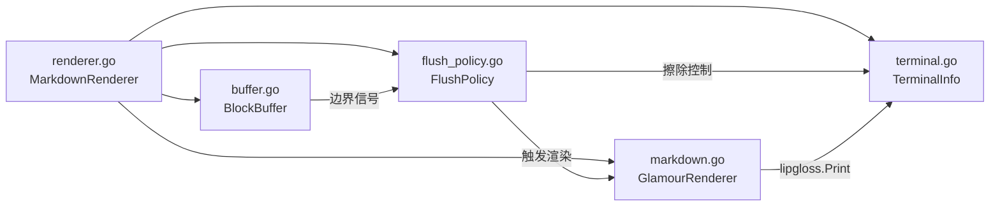
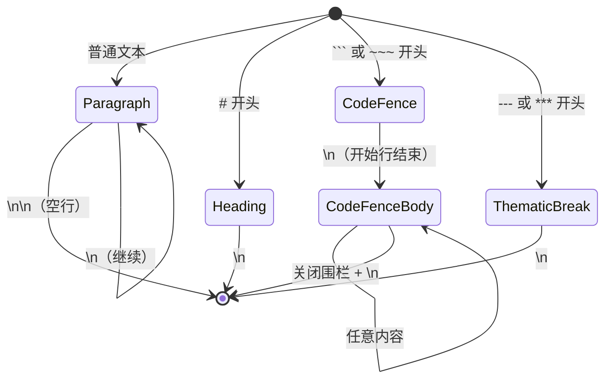
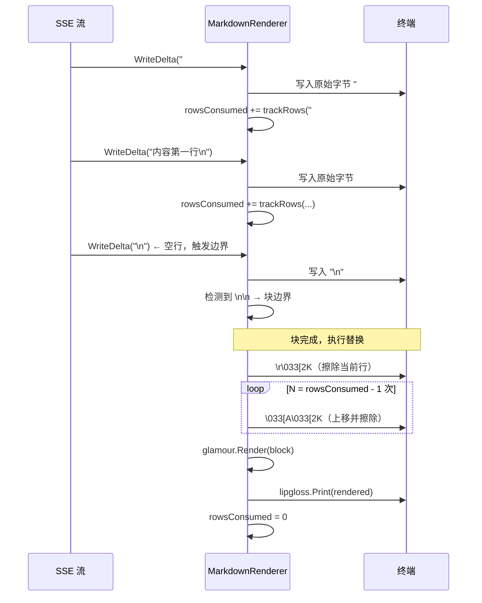

# `internal/renderer` 流式 Markdown 渲染器技术参考

> **适用版本**：witty MVP（Phase 1）及 Phase 2 增强
> **目标读者**：参与 witty 开发的 Go 工程师
> **最后更新**：2026-06

---

## 目录

1. [模块概述](#1-模块概述)
2. [核心约束：glamour 是批量渲染器](#2-核心约束glamour-是批量渲染器)
3. [流式策略总览](#3-流式策略总览)
4. [TextRenderer 接口](#4-textrenderer-接口)
5. [文件结构](#5-文件结构)
6. [Phase 1 实现：缓冲-边界渲染](#6-phase-1-实现缓冲-边界渲染)
7. [块边界检测](#7-块边界检测)
8. [Phase 2 实现：即时回显 + 边界替换](#8-phase-2-实现即时回显--边界替换)
9. [终端行数追踪与宽度管理](#9-终端行数追踪与宽度管理)
10. [ANSI 擦除序列](#10-ansi-擦除序列)
11. [glamour v2 使用细节](#11-glamour-v2-使用细节)
12. [测试策略](#12-测试策略)
13. [常见问题与陷阱](#13-常见问题与陷阱)

---

## 1. 模块概述

`internal/renderer` 负责将 AI 的**流式文本增量**（来自 `internal/event` 归一化后的 `EventTextDelta`）渲染为带样式的 Markdown 输出，显示在 openEuler Bash 终端（LINE-MODE，非全屏 TUI）中。

### 上下游关系



### 关键依赖

| 依赖 | 版本 | 用途 |
| ---- | ---- | ---- |
| `charm.land/glamour/v2` | v2.x | Markdown → ANSI 渲染 |
| `charm.land/lipgloss/v2` | v2.x | 样式输出、颜色降采样 |
| `golang.org/x/term` | latest | TTY 检测、终端宽度 |
| `github.com/mattn/go-runewidth` | v0.x | CJK 字符宽度（Phase 2） |

---

## 2. 核心约束：glamour 是批量渲染器

glamour 内部基于 [goldmark](https://github.com/yuin/goldmark) 构建完整 AST，无法增量渲染：

```go
// glamour 的实际工作方式（简化）
func (tr *TermRenderer) Render(in string) (string, error) {
    // 1. goldmark 解析 in → AST（需要完整文档）
    // 2. 遍历 AST，应用样式
    // 3. 返回 ANSI 字符串
    // 每次调用都是独立的全量处理，无状态积累
}
```

**不可行的方案**：

```go
// ❌ 错误：逐 delta 传入，glamour 无法正确解析不完整的 markdown
for delta := range stream {
    rendered, _ := tr.Render(delta) // goldmark AST 不完整，输出乱码
    fmt.Print(rendered)
}

// ❌ 错误：累积全文再渲染，用户等待时间过长
var buf strings.Builder
for delta := range stream {
    buf.WriteString(delta)
}
rendered, _ := tr.Render(buf.String()) // 流结束才显示，体验差
```

**正确方向**：在**块边界处**积累完整块，批量调用 `glamour.Render`。glamour v2 没有流式 API，没有任何配置选项可以让它"增量"工作。

---

## 3. 流式策略总览

本模块分两阶段实现：

- **Phase 1（MVP）**：缓冲到块边界后批量渲染——简单可靠，但块内有延迟
- **Phase 2（增强）**：即时回显原始文本 + 块边界处用渲染结果原地替换——消除感知延迟

### Phase 1 vs Phase 2 对比

| 维度 | Phase 1（MVP） | Phase 2（完整） |
| ---- | ------------- | -------------- |
| 实现复杂度 | ~80 行 | ~250 行 |
| 用户感知延迟 | 等到块边界（最长一个段落） | 立即看到原始文本 |
| 光标操作 | 无 | 需要上移+擦除 |
| 行数追踪 | 不需要 | 需要，含软换行 |
| CJK 支持 | 自动 | 需要 go-runewidth |
| 推荐阶段 | Phase 1 交付 | Phase 3 增强 |

### 整体流程图



---

## 4. TextRenderer 接口

渲染器对外暴露的接口定义在 `internal/renderer/renderer.go`，由 `internal/core` 的 `AskRunner` 调用：

```go
// internal/renderer/renderer.go

package renderer

// TextRenderer 是流式文本渲染器的核心接口。
// WriteDelta 对应每个归一化后的 EventTextDelta；
// Flush 对应 session.idle 事件（流结束）。
type TextRenderer interface {
    WriteDelta(text string) error
    Flush() error
}
```

**调用约定**：

- `WriteDelta` 可能被高频调用（每个 SSE chunk 一次），必须是非阻塞的低开销操作
- `Flush` 保证在流结束后被调用一次，必须将缓冲区中所有未渲染内容输出
- 任何一次调用出错后，调用方可以选择继续调用 `Flush` 以确保内容不丢失
- 实现不需要是并发安全的（调用方串行调用）

---

## 5. 文件结构

```text
internal/renderer/
├── renderer.go       — MarkdownRenderer struct，实现 TextRenderer 接口
├── buffer.go         — 块边界检测与缓冲区管理
├── flush_policy.go   — 渲染触发策略（Phase 1：边界触发；Phase 2：echo+replace）
├── markdown.go       — glamour TermRenderer 封装，处理 margin 修剪
└── terminal.go       — TTY 检测、宽度获取、SIGWINCH 监听、ANSI 擦除序列
```

各文件职责边界：



---

## 6. Phase 1 实现：缓冲-边界渲染

Phase 1 的核心逻辑：缓冲每个 delta，在块边界处调用 glamour 批量渲染输出。

### renderer.go

```go
package renderer

import (
    "os"
    "strings"

    "charm.land/glamour/v2"
    "charm.land/lipgloss/v2"
    "golang.org/x/term"
)

// MarkdownRenderer 实现 TextRenderer 接口（Phase 1）。
type MarkdownRenderer struct {
    buf      *BlockBuffer
    glamour  *GlamourRenderer
    term     *TerminalInfo
    isFirst  bool // 用于控制首块前缀换行的修剪
}

func New() (*MarkdownRenderer, error) {
    ti := NewTerminalInfo()
    gr, err := NewGlamourRenderer(ti)
    if err != nil {
        return nil, err
    }
    return &MarkdownRenderer{
        buf:     NewBlockBuffer(),
        glamour: gr,
        term:    ti,
        isFirst: true,
    }, nil
}

func (r *MarkdownRenderer) WriteDelta(text string) error {
    // 非 TTY：直接写入原始文本，不缓冲不渲染
    if !r.term.IsTTY {
        _, err := os.Stdout.WriteString(text)
        return err
    }

    r.buf.Append(text)
    for {
        block, ok := r.buf.NextCompleteBlock()
        if !ok {
            break
        }
        if err := r.renderBlock(block); err != nil {
            return err
        }
    }
    return nil
}

func (r *MarkdownRenderer) Flush() error {
    // 非 TTY 模式下所有内容已在 WriteDelta 中实时输出
    if !r.term.IsTTY {
        return nil
    }
    remaining := r.buf.Remaining()
    if strings.TrimSpace(remaining) == "" {
        return nil
    }
    return r.renderBlock(remaining)
}

func (r *MarkdownRenderer) renderBlock(block string) error {
    rendered, err := r.glamour.Render(block, r.isFirst)
    if err != nil {
        // 降级：直接输出原始文本，不中断流程
        lipgloss.Print(block)
        return nil
    }
    r.isFirst = false
    lipgloss.Print(rendered)
    return nil
}
```

> **非 TTY 行为**：当 stdout 不是 TTY 时（如重定向到文件、管道到 `grep`），跳过所有缓冲和渲染逻辑，直接 `os.Stdout.WriteString()` 输出原始文本。此时 glamour 不初始化，lipgloss 也不使用。

### buffer.go

```go
package renderer

import "strings"

// BlockBuffer 积累文本增量并检测块边界。
type BlockBuffer struct {
    raw          strings.Builder
    inCodeFence  bool   // 是否在 ``` 或 ~~~ 围栏内
    fenceMarker  string // 当前围栏标记（``` 或 ~~~）
}

func NewBlockBuffer() *BlockBuffer {
    return &BlockBuffer{}
}

// Append 追加新的文本增量。
func (b *BlockBuffer) Append(text string) {
    b.raw.WriteString(text)
}

// NextCompleteBlock 从缓冲区头部提取一个完整块。
// 如果当前缓冲区内尚无完整块，返回 ("", false)。
func (b *BlockBuffer) NextCompleteBlock() (string, bool) {
    content := b.raw.String()
    end, newStart := b.findBlockBoundary(content)
    if end < 0 {
        return "", false
    }
    block := content[:end]
    // 重置缓冲区，保留边界之后的内容
    b.raw.Reset()
    b.raw.WriteString(content[newStart:])
    return block, true
}

// Remaining 返回缓冲区中所有剩余内容（用于 Flush）。
func (b *BlockBuffer) Remaining() string {
    return b.raw.String()
}

// findBlockBoundary 在 content 中查找块结束位置。
// 返回 (块结束位置, 下一块开始位置)，未找到返回 (-1, -1)。
//
// 状态机规则：
//   - 围栏外：\n\n（空行）→ 段落结束；# 开头 → ATX 标题（单行）；--- / *** → 分隔线（单行）
//   - 围栏内：仅匹配关闭围栏（``` 或 ~~~），其余内容全部跳过
func (b *BlockBuffer) findBlockBoundary(content string) (int, int) {
    i := 0
    for i < len(content) {
        // 检测围栏代码块
        if !b.inCodeFence {
            if marker, ok := codeFenceStart(content, i); ok {
                b.inCodeFence = true
                b.fenceMarker = marker
                // 跳过本行
                nl := strings.Index(content[i:], "\n")
                if nl < 0 {
                    return -1, -1
                }
                i += nl + 1
                continue
            }
        } else {
            // 在围栏内，等待关闭围栏
            if isClosingFence(content, i, b.fenceMarker) {
                nl := strings.Index(content[i:], "\n")
                if nl < 0 {
                    return -1, -1 // 围栏尚未关闭
                }
                end := i + nl + 1
                b.inCodeFence = false
                b.fenceMarker = ""
                return end, end
            }
            nl := strings.Index(content[i:], "\n")
            if nl < 0 {
                return -1, -1
            }
            i += nl + 1
            continue
        }

        // 检测段落边界：\n\n（空行）
        if idx := strings.Index(content[i:], "\n\n"); idx >= 0 {
            end := i + idx + 1     // 包含第一个 \n
            next := i + idx + 2    // 跳过空行
            return end, next
        }

        // 检测 ATX 标题：# 开头，单行结束于 \n
        if isATXHeading(content, i) {
            nl := strings.Index(content[i:], "\n")
            if nl < 0 {
                return -1, -1
            }
            end := i + nl + 1
            return end, end
        }

        // 检测主题分隔线：--- 或 *** 开头
        if isThematicBreak(content, i) {
            nl := strings.Index(content[i:], "\n")
            if nl < 0 {
                return -1, -1
            }
            end := i + nl + 1
            return end, end
        }

        break
    }
    return -1, -1
}

// --- 辅助函数 ---

func codeFenceStart(s string, i int) (marker string, ok bool) {
    // 检查行首是否为 ``` 或 ~~~
    if i > 0 && s[i-1] != '\n' {
        return "", false
    }
    if strings.HasPrefix(s[i:], "```") {
        return "```", true
    }
    if strings.HasPrefix(s[i:], "~~~") {
        return "~~~", true
    }
    return "", false
}

func isClosingFence(s string, i int, marker string) bool {
    if i > 0 && s[i-1] != '\n' {
        return false
    }
    return strings.HasPrefix(s[i:], marker)
}

func isATXHeading(s string, i int) bool {
    if i > 0 && s[i-1] != '\n' {
        return false
    }
    return len(s) > i && s[i] == '#'
}

func isThematicBreak(s string, i int) bool {
    if i > 0 && s[i-1] != '\n' {
        return false
    }
    line := s[i:]
    return strings.HasPrefix(line, "---") || strings.HasPrefix(line, "***")
}
```

---

## 7. 块边界检测

块边界检测是渲染时机的核心逻辑，覆盖以下 Markdown 结构的状态机：



**检测规则速查**：

| 块类型 | 开始条件 | 结束条件 |
| ------ | ------- | ------- |
| 段落 | 非特殊前缀的文本行 | `\n\n`（空行） |
| 围栏代码块 | 三个反引号或 ~~~ 行首 | 对应的关闭围栏 + 换行（必须配对，不能嵌套） |
| ATX 标题 | `#`、`##`... 行首 | `\n`（单行，不需要空行） |
| 主题分隔线 | `---` 或 `***` 行首 | `\n`（注意与 YAML front matter 区分） |
| 列表 / 引用块 | `-` / `*` / `1.` / `>` 行首 | `\n\n`（与段落相同） |

### 围栏代码块的特殊处理

围栏代码块内的空行**不**触发段落边界，`\n\n` 只是代码内容的一部分。在 `inCodeFence` 状态下，仅 `isClosingFence()` 返回 `true` 时才结束块，其余内容全部跳过。

### 流结束（Flush）的处理

当 `session.idle` 事件触发 `Flush()` 时，缓冲区中可能有不完整的块（例如 AI 响应以段落结尾但没有尾随空行）。`Flush` 必须强制渲染剩余内容：

```go
func (r *MarkdownRenderer) Flush() error {
    remaining := r.buf.Remaining()
    if strings.TrimSpace(remaining) == "" {
        return nil
    }
    // 强制渲染，不等待块边界
    return r.renderBlock(remaining)
}
```

---

## 8. Phase 2 实现：即时回显 + 边界替换

Phase 2 在 Phase 1 基础上增加"即时回显"能力：每个 delta 到达时立即写入终端，块完成后用 glamour 渲染结果原地替换。

### 核心数据流



### terminal.go（Phase 2 新增部分）

```go
package renderer

import (
    "fmt"
    "os"
    "os/signal"
    "strings"
    "syscall"

    "github.com/mattn/go-runewidth"
    "golang.org/x/term"
)

// TerminalInfo 封装终端状态。
type TerminalInfo struct {
    IsTTY bool
    Width int
}

func NewTerminalInfo() *TerminalInfo {
    ti := &TerminalInfo{Width: 80}
    ti.IsTTY = term.IsTerminal(int(os.Stdout.Fd()))
    if ti.IsTTY {
        if w, _, err := term.GetSize(int(os.Stdout.Fd())); err == nil && w > 0 {
            ti.Width = w
        }
    }
    return ti
}

// WatchResize 监听 SIGWINCH 信号，动态更新终端宽度。
// 调用方应在 goroutine 中运行此函数，传入 context 控制生命周期。
func (ti *TerminalInfo) WatchResize() {
    ch := make(chan os.Signal, 1)
    signal.Notify(ch, syscall.SIGWINCH)
    for range ch {
        if w, _, err := term.GetSize(int(os.Stdout.Fd())); err == nil && w > 0 {
            ti.Width = w
        }
    }
}

// EraseLines 擦除终端上方 n 行（含当前行）。
// 用于 Phase 2 的替换操作。
func EraseLines(n int) {
    if n <= 0 {
        return
    }
    // 擦除当前行
    fmt.Print("\r\033[2K")
    // 逐行上移并擦除
    for i := 1; i < n; i++ {
        fmt.Print("\033[A\033[2K")
    }
}

// TrackRows 计算字符串 text 在终端宽度 termWidth 下占用的行数。
// 处理 \n 显式换行和软换行（行宽超出终端宽度时自动换行）。
// 使用 go-runewidth 正确处理 CJK 全角字符（宽度为 2）。
func TrackRows(text string, termWidth int) int {
    if termWidth <= 0 {
        termWidth = 80
    }
    rows := 1
    col := 0
    for _, r := range text {
        if r == '\n' {
            rows++
            col = 0
            continue
        }
        w := runewidth.RuneWidth(r)
        col += w
        if col >= termWidth {
            rows++
            col = col - termWidth // 超出部分进入下一行
        }
    }
    // 如果最后一个字符恰好在行末，不额外计行
    return rows
}

// WriteRaw 向终端写入原始字节（Phase 2 回显使用）。
func WriteRaw(text string) {
    fmt.Print(text)
}

// StripANSI 移除字符串中的 ANSI 转义序列（用于行数计算）。
func StripANSI(s string) string {
    var b strings.Builder
    i := 0
    for i < len(s) {
        if s[i] == '\033' && i+1 < len(s) && s[i+1] == '[' {
            // 跳过 CSI 序列：\033[ ... 字母
            i += 2
            for i < len(s) && (s[i] < 0x40 || s[i] > 0x7E) {
                i++
            }
            if i < len(s) {
                i++ // 跳过终止字母
            }
            continue
        }
        b.WriteByte(s[i])
        i++
    }
    return b.String()
}
```

---

## 9. 终端行数追踪与宽度管理

仅 Phase 2 需要行数追踪，用于计算擦除时需要上移多少行。

### 软换行原理

当一行文本的视觉宽度超过终端宽度时，终端会自动将其折叠到下一行（软换行）。行数追踪必须模拟此行为：

```text
终端宽度 = 40 列
文本 = "这是一段很长的中文文字，超过了四十列的终端宽度限制"

"这是一段很长的中文文字，超过了" → 前 16 个 CJK 字符 = 32 列
"四十列"                         → 3 个 CJK 字符 = 6 列，累计 38 列
"的终端宽度限制"                  → 下一行（38+4 > 40，"的"触发软换行）
```

### TrackRows 实现

```go
// TrackRows 实现（完整版，处理 ANSI 转义序列）
func TrackRows(text string, termWidth int) int {
    // 1. 先去除 ANSI 转义序列（原始 echo 时不会有，但 Phase 2 的 glamour 输出会有）
    plain := StripANSI(text)

    rows := 1
    col := 0
    for _, r := range plain {
        switch r {
        case '\n':
            rows++
            col = 0
        case '\r':
            col = 0 // 回车不增加行
        default:
            w := runewidth.RuneWidth(r)
            if w == 0 {
                continue // 组合字符，不占宽度
            }
            col += w
            // 注意：当 col == termWidth 时，下一个字符才开始新行
            // 当 col > termWidth 时（宽字符跨边界），立即换行
            for col >= termWidth {
                rows++
                col -= termWidth
            }
        }
    }
    return rows
}
```

**边界情况**：

- **全角字符跨边界**：CJK 字符宽度为 2，当列位置 = `termWidth - 1` 时，一个 CJK 字符会跨越两行。终端通常在下一行显示该字符，`col` 需要置为 2（字符宽度）而非 0。
- **Tab 字符**：Markdown 代码块中可能出现 `\t`，通常展开为 4 或 8 列，建议统一展开为 4 列处理。
- **零宽字符**：如 Unicode 组合标记，`go-runewidth` 返回 0，跳过不计。

### 终端宽度获取与 SIGWINCH 监听

**初始宽度获取**：通过 `golang.org/x/term` 的 `term.GetSize()`（底层 `ioctl TIOCGWINSZ`）获取。若失败或返回 0，使用安全默认值 80：

```go
func NewTerminalInfo() *TerminalInfo {
    ti := &TerminalInfo{Width: 80} // 安全默认值
    ti.IsTTY = term.IsTerminal(int(os.Stdout.Fd()))

    if ti.IsTTY {
        if w, _, err := term.GetSize(int(os.Stdout.Fd())); err == nil && w > 0 {
            ti.Width = w
        }
    }
    return ti
}
```

**SIGWINCH 监听（Phase 2）**：当用户调整终端窗口大小时，需要同步更新宽度。`SIGWINCH` 在 macOS 和 Linux 均支持（Windows 不支持，witty 当前仅针对 openEuler/Linux）：

```go
import (
    "context"
    "os"
    "os/signal"
    "syscall"

    "golang.org/x/term"
)

// WatchResize 在后台 goroutine 中监听终端宽度变化。
// ctx 用于优雅停止；onResize 回调在宽度变化时被调用。
func WatchResize(ctx context.Context, fd int, onResize func(newWidth int)) {
    ch := make(chan os.Signal, 1)
    signal.Notify(ch, syscall.SIGWINCH)
    go func() {
        defer signal.Stop(ch)
        for {
            select {
            case <-ctx.Done():
                return
            case <-ch:
                if w, _, err := term.GetSize(fd); err == nil && w > 0 {
                    onResize(w)
                }
            }
        }
    }()
}
```

宽度变更时需同步重建 glamour `TermRenderer`（见 [§11 宽度重建](#宽度重建)）。

---

## 10. ANSI 擦除序列

Phase 2 使用以下 ANSI 转义序列进行光标控制：

| 序列 | 含义 |
| ---- | ---- |
| `\r` | 光标移到行首（列 0） |
| `\033[2K` | 擦除整行（光标位置不变） |
| `\033[A` | 光标上移一行 |
| `\033[{n}A` | 光标上移 n 行 |

### EraseLines 完整实现

```go
// EraseLines 擦除当前行及其上方共 n 行。
// 执行后光标位于被擦除区域最顶行的行首。
func EraseLines(n int) {
    if n <= 0 {
        return
    }
    // 擦除当前行（不需要上移）
    os.Stdout.WriteString("\r\033[2K")
    // 上移并擦除剩余行
    for i := 1; i < n; i++ {
        os.Stdout.WriteString("\033[A\033[2K")
    }
}
```

**注意**：`\033[2K` 只擦除当前行，不改变光标位置。结合 `\r` 确保从行首开始擦除，避免残留字符。

### 替换操作的完整流程

```go
// Phase 2 中的块完成处理
func (r *MarkdownRenderer) onBlockComplete(block string) error {
    // 1. 擦除已回显的原始行
    EraseLines(r.rowsConsumed)

    // 2. 重置行计数
    r.rowsConsumed = 0

    // 3. 渲染并输出
    rendered, err := r.glamour.Render(block, r.isFirst)
    if err != nil {
        lipgloss.Print(block + "\n")
        return nil
    }
    r.isFirst = false
    lipgloss.Print(rendered)
    return nil
}
```

---

## 11. glamour v2 使用细节

### 初始化

```go
package renderer

import (
    "os"
    "strings"

    "charm.land/glamour/v2"
    "charm.land/lipgloss/v2"
)

// GlamourRenderer 封装 glamour TermRenderer，处理样式选择和边距修剪。
type GlamourRenderer struct {
    tr    *glamour.TermRenderer
    width int
}

func NewGlamourRenderer(ti *TerminalInfo) (*GlamourRenderer, error) {
    if !ti.IsTTY {
        return &GlamourRenderer{width: ti.Width}, nil // 非 TTY 不初始化 glamour
    }

    // 根据终端背景色选择主题名
    styleName := "light"
    if lipgloss.HasDarkBackground(os.Stdin, os.Stdout) {
        styleName = "dark"
    }

    tr, err := glamour.NewTermRenderer(
        glamour.WithStylePath(styleName),
        glamour.WithWordWrap(ti.Width),
        glamour.WithEmoji(),
    )
    if err != nil {
        return nil, err
    }

    return &GlamourRenderer{tr: tr, width: ti.Width}, nil
}
```

### 关键陷阱：leading `\n` 修剪

glamour 的每次 `Render()` 调用都会在输出开头添加一个 `\n`（文档起始边距）。如果不处理，多个块之间会产生多余的空行。

**修剪策略**：

- **第一个块**：保留 leading `\n`（作为输出前的间距，视觉上更好看）
- **后续块**：用 `strings.TrimLeft(rendered, "\n")` 去除

```go
// Render 渲染单个 Markdown 块。
// isFirstBlock 控制是否保留 glamour 添加的 leading \n。
func (gr *GlamourRenderer) Render(block string, isFirstBlock bool) (string, error) {
    if gr.tr == nil {
        // 非 TTY 模式：直接返回原始文本
        return block + "\n", nil
    }

    rendered, err := gr.tr.Render(block)
    if err != nil {
        return "", err
    }

    if !isFirstBlock {
        rendered = strings.TrimLeft(rendered, "\n")
    }

    return rendered, nil
}
```

### 主题选择与用户配置

```go
// 优先级：用户配置 > 终端自动检测
func resolveStyleName(cfg *config.Config, ti *TerminalInfo) string {
    theme := cfg.Theme // "dark" | "light" | "auto"（默认 "auto"）

    switch theme {
    case "dark", "light":
        return theme
    default: // "auto"
        if lipgloss.HasDarkBackground(os.Stdin, os.Stdout) {
            return "dark"
        }
        return "light"
    }
}
```

> `lipgloss.HasDarkBackground` 应在程序启动时调用**一次**并缓存结果，不要在每个 `Render` 调用时重复查询（有 I/O 开销）。对于不需要自定义 word wrap 的简单场景，也可以直接使用 `glamour.Render(markdown, styleName)`；本模块因为需要固定宽度和后续重建 `TermRenderer`，优先使用 `NewTermRenderer(...)`。

### 宽度重建

glamour `TermRenderer` 的宽度在初始化时固定。当 `SIGWINCH` 触发终端宽度变更时，需要重建 `TermRenderer`：

```go
func (gr *GlamourRenderer) Rebuild(newWidth int, styleName string) error {
    tr, err := glamour.NewTermRenderer(
        glamour.WithStylePath(styleName),
        glamour.WithWordWrap(newWidth),
        glamour.WithEmoji(),
    )
    if err != nil {
        return err
    }
    gr.tr = tr
    gr.width = newWidth
    return nil
}
```

### lipgloss.Print() 与颜色降采样

**强制规则**：所有渲染输出**必须**通过 `lipgloss.Print()` 而非 `fmt.Print()`，因为 lipgloss 会自动根据终端能力处理颜色降采样：

| 终端能力 | 行为 |
| :--- | :--- |
| TrueColor（24-bit） | 完整保留 ANSI TrueColor 序列 |
| 256 色 | 将 TrueColor 映射到最近的 256 色 |
| 16 色 | 降采样到基础 16 色 |
| 无颜色（NO_COLOR 或非 TTY） | 剥离所有 ANSI 序列，输出纯文本 |

lipgloss v2 通过检测 `COLORTERM`、`TERM`、`NO_COLOR` 环境变量以及 `term.IsTerminal()` 自动判断能力级别。

```go
// ✅ 正确：lipgloss 自动处理颜色能力
lipgloss.Print(rendered)

// ❌ 错误：直接输出，在不支持颜色的终端产生乱码
fmt.Print(rendered)
```

---

## 12. 测试策略

### 12.1 块边界检测单元测试

```go
// internal/renderer/buffer_test.go
package renderer_test

import (
    "testing"

    "github.com/your-org/witty/internal/renderer"
)

func TestBlockBoundary_Paragraph(t *testing.T) {
    buf := renderer.NewBlockBuffer()
    buf.Append("第一段内容\n\n第二段开始")

    block, ok := buf.NextCompleteBlock()
    if !ok {
        t.Fatal("expected a complete block")
    }
    if block != "第一段内容\n" {
        t.Errorf("unexpected block: %q", block)
    }

    remaining := buf.Remaining()
    if remaining != "第二段开始" {
        t.Errorf("unexpected remaining: %q", remaining)
    }
}

func TestBlockBoundary_FencedCode(t *testing.T) {
    buf := renderer.NewBlockBuffer()
    // 代码块内的空行不触发边界
    buf.Append("```go\nfunc main() {\n\n    fmt.Println()\n}\n```\n")

    block, ok := buf.NextCompleteBlock()
    if !ok {
        t.Fatal("expected a complete block")
    }
    // 整个围栏代码块作为一个块
    if !strings.Contains(block, "```go") || !strings.Contains(block, "```") {
        t.Errorf("code fence not preserved: %q", block)
    }
}

func TestBlockBoundary_ATXHeading(t *testing.T) {
    buf := renderer.NewBlockBuffer()
    buf.Append("# 标题\n正文内容\n\n")

    block, ok := buf.NextCompleteBlock()
    if !ok {
        t.Fatal("expected a complete block")
    }
    // ATX 标题单独成块
    if block != "# 标题\n" {
        t.Errorf("expected heading block, got: %q", block)
    }
}
```

### 12.2 行数追踪单元测试

```go
// internal/renderer/terminal_test.go
package renderer_test

func TestTrackRows_ASCII(t *testing.T) {
    cases := []struct {
        text      string
        width     int
        wantRows  int
    }{
        {"hello", 80, 1},
        {"hello\nworld", 80, 2},
        {strings.Repeat("a", 80), 80, 1},  // 恰好一行
        {strings.Repeat("a", 81), 80, 2},  // 触发软换行
        {strings.Repeat("a", 160), 80, 2},
        {strings.Repeat("a", 161), 80, 3},
    }
    for _, tc := range cases {
        got := renderer.TrackRows(tc.text, tc.width)
        if got != tc.wantRows {
            t.Errorf("TrackRows(%q, %d) = %d, want %d",
                tc.text, tc.width, got, tc.wantRows)
        }
    }
}

func TestTrackRows_CJK(t *testing.T) {
    // CJK 字符每个宽度为 2
    // 终端宽度 10：5 个 CJK 字符 = 10 列 = 1 行
    got := renderer.TrackRows("你好世界！", 10)
    if got != 1 {
        t.Errorf("expected 1 row, got %d", got)
    }

    // 6 个 CJK = 12 列 > 10 → 软换行 → 2 行
    got = renderer.TrackRows("你好世界！的", 10)
    if got != 2 {
        t.Errorf("expected 2 rows, got %d", got)
    }
}
```

### 12.3 glamour 渲染 Golden Test

Golden test 捕获 glamour 的输出快照，防止版本升级导致意外样式变化：

```go
// internal/renderer/markdown_golden_test.go
package renderer_test

import (
    "os"
    "path/filepath"
    "testing"
)

// 运行 UPDATE_GOLDEN=1 go test ./internal/renderer/... 更新快照
var updateGolden = os.Getenv("UPDATE_GOLDEN") == "1"

func TestGlamourGolden(t *testing.T) {
    cases := []string{"heading", "codeblock", "paragraph", "list"}
    for _, name := range cases {
        t.Run(name, func(t *testing.T) {
            input, _ := os.ReadFile(filepath.Join("testdata", name+".md"))
            golden, _ := os.ReadFile(filepath.Join("testdata", name+".golden"))

            ti := &renderer.TerminalInfo{IsTTY: true, Width: 80}
            gr, _ := renderer.NewGlamourRendererWithStyle(ti, "dark")
            got, _ := gr.Render(string(input), true)

            if updateGolden {
                os.WriteFile(filepath.Join("testdata", name+".golden"), []byte(got), 0644)
                return
            }
            if got != string(golden) {
                t.Errorf("glamour output mismatch for %s\ngot:\n%s\nwant:\n%s",
                    name, got, golden)
            }
        })
    }
}
```

Golden test 的 `testdata/` 目录：

```text
internal/renderer/testdata/
├── heading.md
├── heading.golden      ← 包含 ANSI 转义序列的预期输出
├── codeblock.md
├── codeblock.golden
├── paragraph.md
└── paragraph.golden
```

### 12.4 TextRenderer 集成测试

```go
// 将 TextRenderer 的输出写入 bytes.Buffer，无需 PTY
func TestMarkdownRenderer_WriteAndFlush(t *testing.T) {
    // 重定向 stdout 到 buffer（模拟非 TTY，输出原始文本）
    // 或者注入 io.Writer 接口以便测试（推荐在实现时提供 WithWriter 选项）
    var out bytes.Buffer
    r := renderer.NewWithWriter(&out, renderer.Options{IsTTY: false})

    r.WriteDelta("# Hello\n\n")
    r.WriteDelta("World paragraph.\n\n")
    r.Flush()

    result := out.String()
    if !strings.Contains(result, "# Hello") {
        t.Error("expected heading in output")
    }
}
```

---

## 13. 常见问题与陷阱

### Q1：Phase 1 的段落延迟有多长？

延迟上限 = AI 生成一个完整段落的时间。对于典型的 AI 响应（段落 50-100 词），通常在 1-3 秒内完成。对于代码块，延迟更长（整个代码块生成完毕才渲染）。这是 Phase 1 的主要已知限制，Phase 2 通过即时回显解决。

### Q2：如果 `glamour.Render` 出错怎么办？

降级输出原始文本，不中断流程。错误通常来自极端边缘的 Markdown 语法，对用户而言原始文本比崩溃好：

```go
rendered, err := gr.tr.Render(block)
if err != nil {
    // 降级：输出原始块 + 换行
    lipgloss.Print(block + "\n")
    return nil // 不返回 error，继续处理后续块
}
```

### Q3：termWidth 为 0 或负数怎么办？

`term.GetSize` 在某些容器或 CI 环境中可能返回 0。`TrackRows` 和 glamour `WithWordWrap` 都应有保护：

```go
if w <= 0 {
    w = 80 // 安全默认值
}
```

### Q4：多个连续 ATX 标题如何处理？

```markdown
# 一级标题
## 二级标题
内容
```

每个标题检测到 `\n` 后立即触发渲染（每行一个块）。这是正确行为，不会等到段落结束。

### Q5：Phase 2 的行数追踪是否考虑 glamour 渲染后的行数变化？

Phase 2 追踪的是**原始回显文本**的行数（`trackRows(rawDelta, termWidth)`），擦除操作基于此值。glamour 渲染后的行数可能更多（添加了边距、样式），但擦除是在渲染**之前**完成的，因此不需要知道渲染后的行数。

### Q6：`lipgloss.HasDarkBackground` 是否总是可靠？

在不支持 `OSC 11` 查询的终端（如老版本 xterm），`HasDarkBackground` 可能超时或返回错误。默认 fallback 为 `false`（浅色主题）。若用户配置了 `theme = "dark"` 或 `"light"`，直接使用配置值，跳过自动检测。

---

*文档基于 witty implementation-plan.md § 5.12 `internal/renderer` 编写。*
*Phase 1 对应 MVP / Phase 1 交付目标；Phase 2 对应后续增强（当前规划放在 Phase 3）。*
