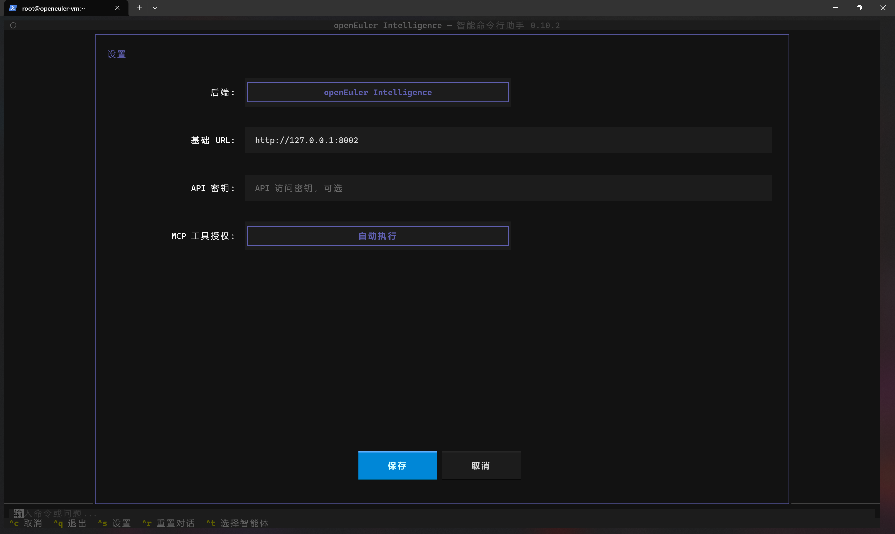
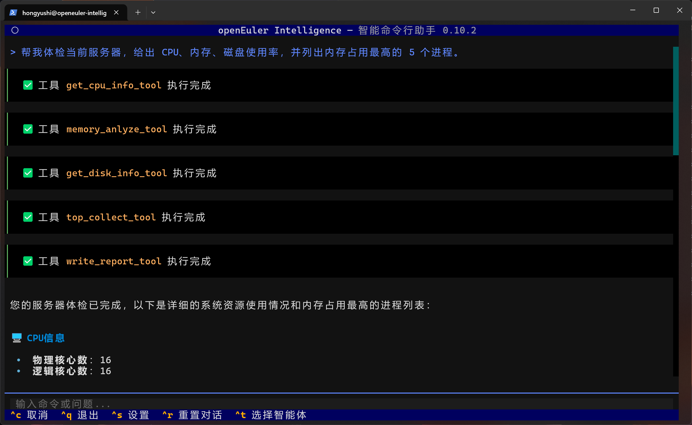
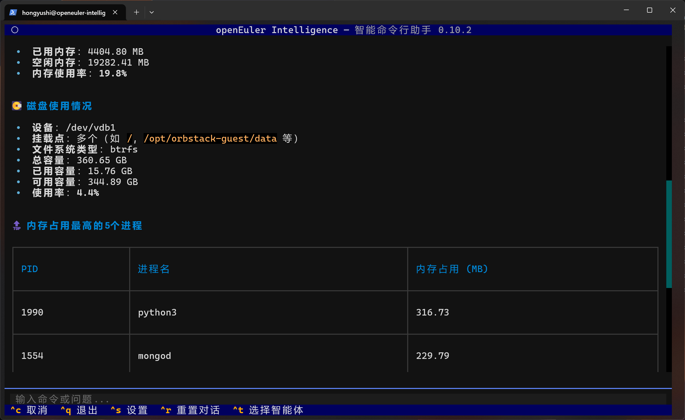
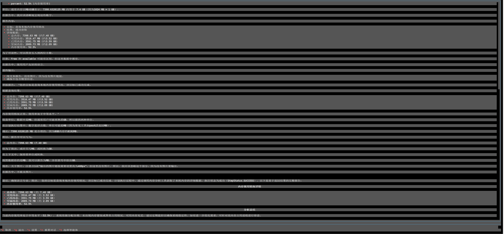
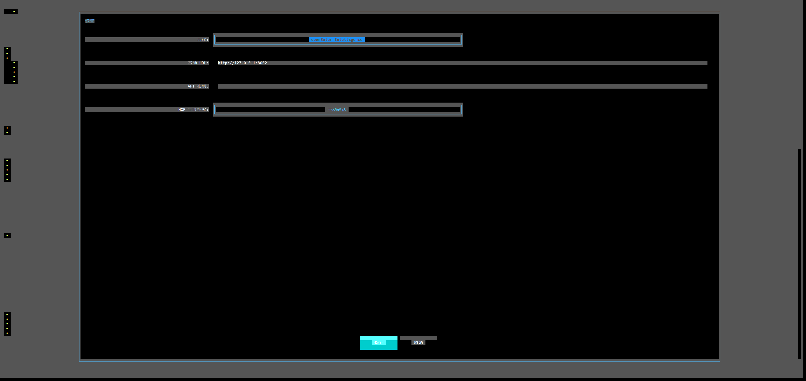
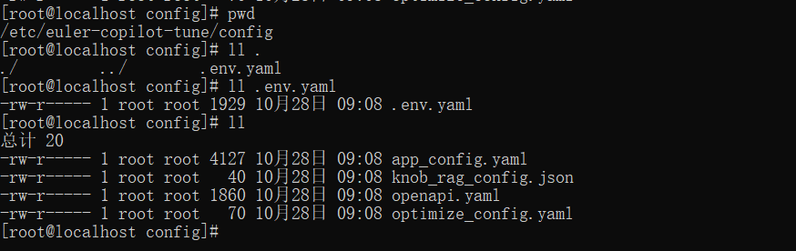
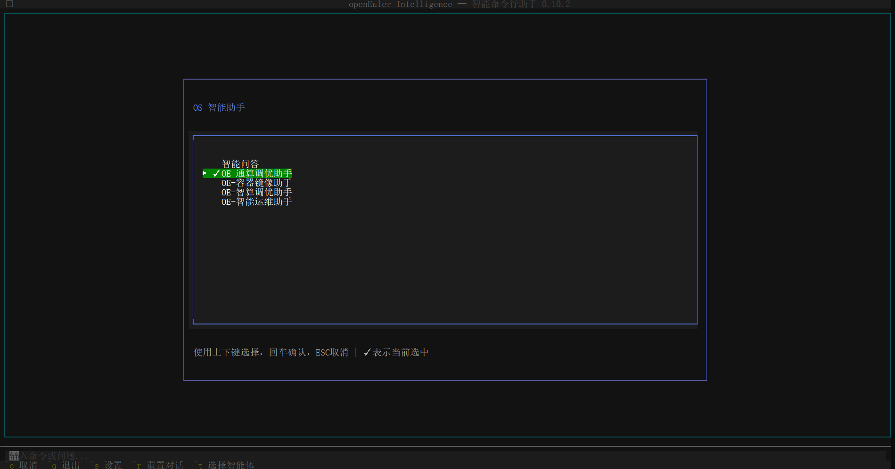
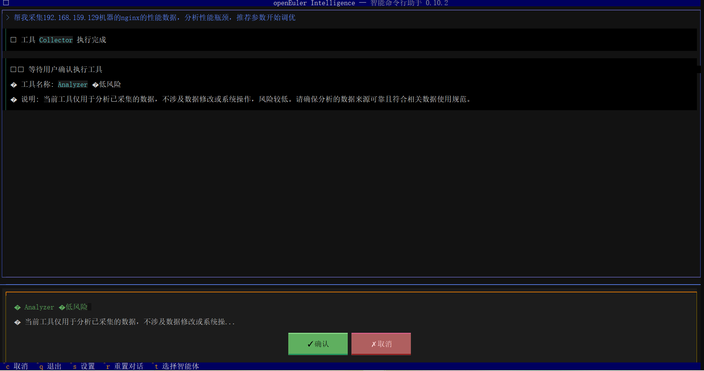

# OE-CLI 使用手册

## 引言

OE-CLI 是 openEuler Intelligence 的命令行客户端，提供 AI 驱动的命令行交互体验。支持多种 LLM 后端，集成 MCP 协议，提供现代化的 TUI 界面。

### 核心特性

- **智能终端界面**: 基于 Textual 的现代化 TUI 界面
- **流式响应**: 实时显示 AI 回复内容
- **部署助手**: 内置 openEuler Intelligence 自动部署功能

## 1. 整体使用描述（基于win10cmd）

### 1.1 打开 oe-cli

打开 oe-cli，ctrl + c 中断，ctrl + q 退出，ctrl + s 打开设置，ctrl + t 选择智能体，支持鼠标选择。

```sh
oi
```


### 1.2 智能体选择

选择智能体，默认为 OE-智能运维助手，按上下键选择，回车确认，ESC 取消，高亮表示选中。


### 1.3 智能体使用

进行智能体的使用，此处以OE-智能运维助手举例，回车确认，进入对话界面。


### 1.4 工具执行确认

在左下角输入栏输入命令或问题，如帮我分析当前机器性能情况，智能体会根据提问自动选择合适的 MCP 工具，并询问是否执行，此处点击确认。


### 1.5 oe-cli预设

可以在 oi 前输入以下命令配置客户端。

#### 配置语言

**支持的语言：**

- **English (en_US)** - 默认语言
- **简体中文 (zh_CN)**

切换至简体中文

```sh
oi --locale zh_CN
```

切换至英文

```sh
oi --locale en_US
```

语言设置会自动保存，下次启动时生效。

#### 设置初始化智能体

设置智能体命令

```sh
oi --agent
```

#### 设置日志级别并验证

```sh
oi --log-level INFO
```

### 1.6 查看日志

查看最新的日志内容:

```sh
oi --logs
```

### 1.7 设置相关

​修改工具执行确认为自动确认 ，点击设置。


点击 mcp 工具授权，可以切换手动确认或自动确认。



此处也可以配置 oi-runtime 地址，默认是本机 8002 端口。

点击【后端】可以切换到直接连接大模型的模式（此模式下不可使用智能体）。


### 1.8 界面操作快捷键

- **Ctrl+S**: 打开设置界面
- **Ctrl+R**: 重置对话历史
- **Ctrl+T**: 选择智能体
- **Tab**: 在命令输入框和输出区域之间切换焦点
- **Esc**: 退出应用程序

### 补充：操作的细节，包括 oi --logs 日志等，参考 shell 的 [readme](https://gitee.com/openeuler/euler-copilot-shell/blob/master/README.md)

## 2. 平台演示

### 2.1 使用cmd

#### 打开 oe-cli

```sh
oi
```

#### 使用智能体


根据具体情况依次执行 MCP 工具



智能体根据工具调用结果输出分析报告



### 2.2 使用vscode

#### 打开 oe-cli


#### 智能体选择

使用方法参上面，以下主要为演示部分页面：


#### 智能体的使用


### 设置


### 2.4 使用 Xshell

#### 打开 oe-cli

```bash
oi
```


#### 智能体选择


#### 智能体使用

智能体工具确认


智能体问题回答


#### 设置



## 3.进阶功能

### 3.1 自定义 MCP

准备 MCP 服务，基于 MCP 协议开发，支持 SSE 格式调用。

首先准备一个 JSON 文件，格式如下，需要配置 **url** 为自定义 MCP 的访问端口，/sse 为标准路由，修改 **name**、**overview**、**description**，其他内容为默认即可。如下 JSON 为 openEuler Intelligence 对应的 MCP 服务配置文件：

> [!NOTE]说明
>
> init 多次调用会删除之前注册的 mcp 服务，重新注册。

~~~json
{
    "name": "systrace_mcp_server",
    "overview": "systrace 运维 mcp 服务",
    "description": "systrace 运维 mcp 服务",
    "mcpType": "sse",
    "author": "root",
    "config": {
        "env": {},
        "autoApprove": [],
        "disabled": false,
        "auto_install": false,
        "description": "",
        "timeout": 60,
        "url": "http://127.0.0.1:12145/sse"
    }
}
~~~

准备好 JSON 文件之后，**命令行执行**下面的命令，注意 JSON 文件传入**全路径**，如 /tmp/config.json。

~~~bash
oi-manager --a init /tmp/config.json
~~~

### 3.2 创建 Agent

MCP 创建完毕之后，**命令行执行**如下命令，此处 JSON 文件是步骤 3.1 创建的，执行完 init 命令之后 JSON 文件中会自动添加 serviceId 字段用来标识在 openEuler Intelligence 中创建的 MCP 服务，create 创建的是单个 MCP 服务对应一个 Agent 智能体。

~~~bash
oi-manager --a create /tmp/config.json
~~~

config.json 同上，是调用 init 之后，会在原始 JSON 里面添加 serviceId 字段标识 MCP 服务。

~~~json
{
    "name": "systrace_mcp_server",
    "overview": "systrace 运维 MCP 服务",
    "description": "systrace 运维 MCP 服务",
    "mcpType": "sse",
    "author": "root",
    "config": {
        "env": {},
        "autoApprove": [],
        "disabled": false,
        "auto_install": false,
        "description": "",
        "timeout": 60,
        "url": "http://127.0.0.1:12145/sse"
    },
    "serviceId": "p2qQke"
}
~~~

### 3.3 创建多对一的 Agent 应用

如果需要创建多个 MCP 对应一个 Agent 智能体应用，可以在命令行执行如下命令：

~~~sh
oi-manager --a comb /tmp/comb_config.json
~~~

需要注意此处的 JSON 文件不是步骤 3.2 创建的，需要重新创建一个 JSON 文件，具体内容如下：

~~~json
{
  "appType": "agent",
  "icon": "",
  "name": "agent_comb",
  "description": "测试 agent comb",
  "dialogRounds": 3,
  "permission": {
    "visibility": "public",
    "authorizedUsers": []
  },
  "workflows": [],
  "mcpService": [
    {
      "id": "jFOWgw"
    },
    {
      "id": "4tA5TO"
    }
  ],
  "published": "True"
}
~~~

> [!NOTE] 说明
>
> 此处主要修改 name、description、mcpService，mcpService 列表里面的 id 是步骤 3.2 执行完成后在 JSON 文件中自动生成的，需要将多少个 MCP 配置成一个 Agent 智能体，就配置多少个 id。

**执行结果日志**

~~~sh
[root@localhost deploy]# oi-manager --a init /root/mcp_config/perf_mcp/config.json 
2025-08-15 09:49:54,874 - mcp_manager - INFO - 成功加载配置文件: /root/mcp_config/perf_mcp/config.json
2025-08-15 09:49:54,874 - mcp_manager - INFO - 删除 MCP 服务: dJsLV4
2025-08-15 09:49:54,960 - mcp_manager - INFO - 已删除旧的 MCP 服务 ID
2025-08-15 09:49:54,961 - mcp_manager - INFO - 创建 MCP 服务
2025-08-15 09:49:55,060 - mcp_manager - INFO - MCP 服务创建成功，service_id: XMZ7Pb
2025-08-15 09:49:55,061 - mcp_manager - INFO - 配置文件已更新: /root/mcp_config/perf_mcp/config.json
2025-08-15 09:49:55,061 - mcp_manager - INFO - 操作执行成功
[root@localhost deploy]# oi-manager --a create /root/mcp_config/perf_mcp/config.json 
2025-08-15 09:50:03,819 - mcp_manager - INFO - 成功加载配置文件: /root/mcp_config/perf_mcp/config.json
2025-08-15 09:50:03,819 - mcp_manager - INFO - 安装 MCP 服务: XMZ7Pb
2025-08-15 09:50:04,052 - mcp_manager - INFO - 等待 MCP 服务就绪: XMZ7Pb
2025-08-15 09:50:14,955 - mcp_manager - INFO - MCP 服务 XMZ7Pb 已就绪 (耗时 9 秒)
2025-08-15 09:50:14,956 - mcp_manager - INFO - 激活 MCP 服务: XMZ7Pb
2025-08-15 09:50:15,057 - mcp_manager - INFO - 应用创建成功，app_id: cd4a8f3b-9b25-4608-8d4c-d2c435e15ffd
2025-08-15 09:50:15,057 - mcp_manager - INFO - 发布应用: cd4a8f3b-9b25-4608-8d4c-d2c435e15ffd
2025-08-15 09:50:15,149 - mcp_manager - INFO - Agent 创建流程完成
2025-08-15 09:50:15,149 - mcp_manager - INFO - 操作执行成功
~~~

## 4. 使用案例 euler-copilot-tune 调优的使用

euler-copilot-tune 项目（[README](https://gitee.com/openeuler/A-Tune/blob/euler-copilot-tune/README.md)）适配了 MCP 协议，支持 OI 调用。

采用 oi --init 方式轻量安装 openEuler Intelligence 时，euler-copilot-tune 会作为默认的 MCP 服务安装到服务器上，MCP 服务以 systemctl 管理，服务名称为：tune-mcp_server。如果需要使用**最新版本的 euler-copilot-tune**，可以源码下载安装，命令如下：

~~~bash
git clone https://gitee.com/openeuler/A-Tune.git -b euler-copilot-tune

cd A-tune

python3 setup.py install
~~~


euler-copilot-tune MCP 服务归属于 OE-通算调优助手。调优主要分为**采集服务数据，分析性能瓶颈，推荐优化参数，开始调优**四个步骤，自然语言交互时围绕这四个步骤按顺序依次提问执行。

### 使用前准备

需要一台被调优机器及服务（如 Nginx、MySQL 等），可以参考 euler-copilot-tune 的使用案例准备环境：[README](https://gitee.com/openeuler/A-Tune/blob/euler-copilot-tune/README.md#应用示例)。

修改 /etc/euler-copilot-tune/config/ 目录下的配置文件 **.env.yaml** 和 **app_config.yaml**，修改内容参考：[README](https://gitee.com/openeuler/A-Tune/blob/euler-copilot-tune/README.md#配置文件准备)，修改完成后重启（**systemctl restart tune-mcp_server**）服务。



修改 oi-runtime MCP 读取默认时间。

~~~sh
vi /etc/euler-copilot-framework/config.toml

# 添加如下配置 单位秒
[mcp_config]
sse_client_read_timeout = 360000 

# 重启 oi-runtime
systemctl restart oi-runtime
~~~

### 使用

**选择 OE-通算调优助手**



终端输入：帮我采集 192.168.159.129 机器的 nginx 服务的性能数据，分析推荐参数，开始调优。


点击确认后 "tune-mcp_server" 会进行数据采集，可以通过如下命令来查看运行日志。

```sh
journalctl -xe -u tune-mcpserver --all -f 
```


执行完 Collector后，会依次执行数据分析工具，参数推荐工具，性能调优开始工具。




执行完成之后使用如下命令查看调优运行结果。

```sh
journalctl -xe -u tune-mcpserver --all -f 
```


