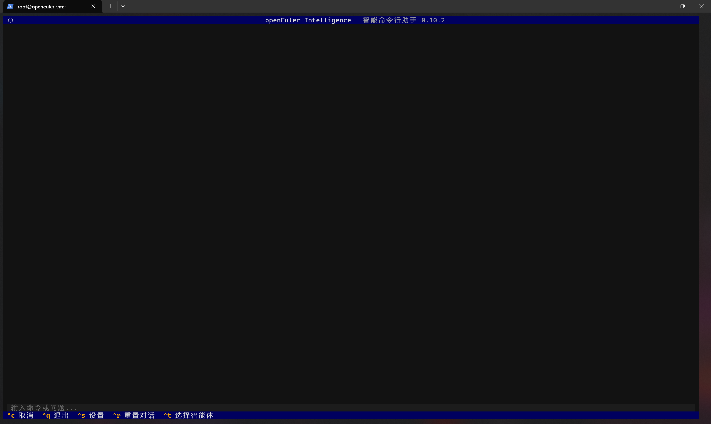
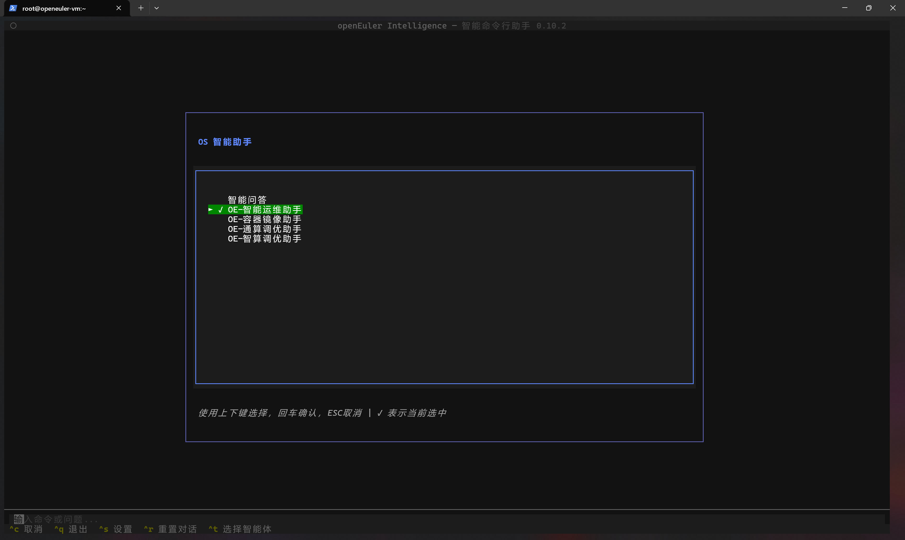
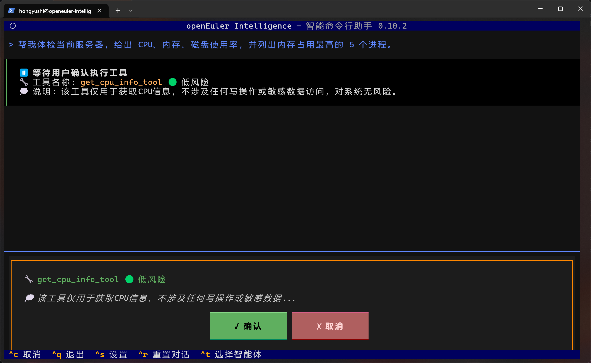
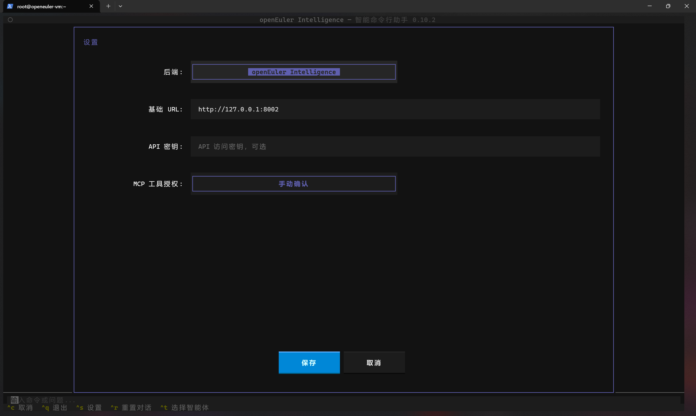
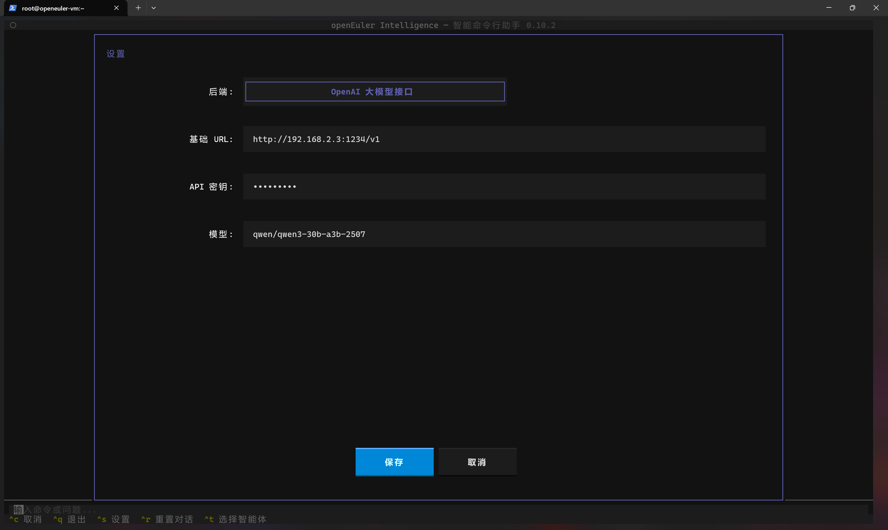
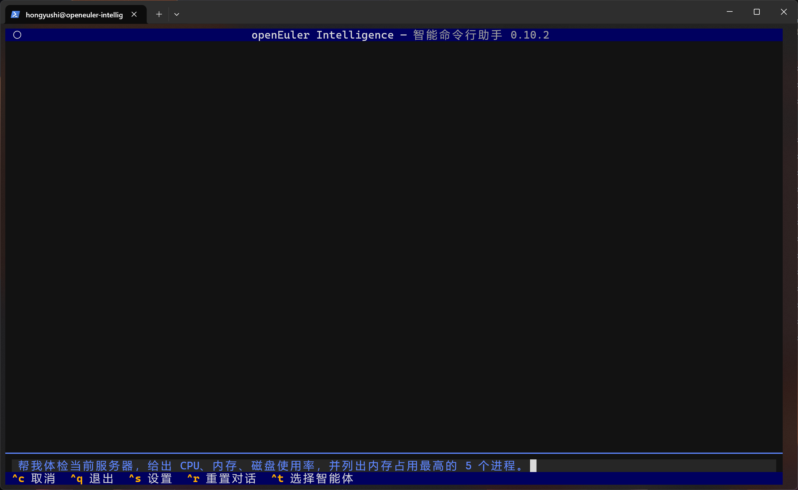

# Witty Assistant 使用手册

## 引言

Witty Assistant 是 openEuler AI 助手的命令行客户端，提供 AI 驱动的命令行交互体验。支持多种 LLM 后端，集成 MCP 协议，提供现代化的 TUI 界面。

### 核心特性

- **智能终端界面**: 基于 Textual 的现代化 TUI 界面
- **流式响应**: 实时显示 AI 回复内容
- **部署助手**: 内置 sysAgent 后端服务自动部署功能

## 1. 整体使用描述（基于win10cmd）

### 1.1 打开 Witty Assistant

打开 Witty Assistant，ctrl + c 中断，ctrl + q 退出，ctrl + s 打开设置，ctrl + t 选择智能体，支持鼠标选择。

```sh
witty
```



### 1.2 智能体选择

选择智能体，默认为 OE-智能运维助手，按上下键选择，回车确认，ESC 取消，高亮表示选中。



### 1.3 智能体使用

进行智能体的使用，此处以OE-智能运维助手举例，回车确认，进入对话界面。


### 1.4 工具执行确认

在左下角输入栏输入命令或问题，如帮我分析当前机器性能情况，智能体会根据提问自动选择合适的 MCP 工具，并询问是否执行，此处点击确认。



### 1.5 Witty Assistant 预设

可以在 witty 前输入以下命令配置客户端。

#### 配置语言

**支持的语言：**

- **English (en_US)** - 默认语言
- **简体中文 (zh_CN)**

切换至简体中文

```sh
witty --locale zh_CN
```

切换至英文

```sh
witty --locale en_US
```

语言设置会自动保存，下次启动时生效。

#### 设置初始化智能体

设置智能体命令

```sh
witty --agent
```

#### 设置日志级别并验证

```sh
witty --log-level INFO
```

### 1.6 查看日志

查看最新的日志内容:

```sh
witty --logs
```

### 1.7 设置相关

​修改工具执行确认为自动确认 ，点击设置。



点击 mcp 工具授权，可以切换手动确认或自动确认。


此处也可以配置 sysAgent 地址，默认是本机 8002 端口。

点击【后端】可以切换到直接连接大模型的模式（此模式下不可使用智能体）。



### 1.8 界面操作快捷键

- **Ctrl+S**: 打开设置界面
- **Ctrl+R**: 重置对话历史
- **Ctrl+T**: 选择智能体
- **Tab**: 在命令输入框和输出区域之间切换焦点
- **Esc**: 退出应用程序

### 补充：操作的细节，包括 witty --logs 日志等，参考 shell 的 [readme](https://atomgit.com/openeuler/euler-copilot-shell/blob/master/README.md)

## 2. 平台演示

### 2.1 使用cmd

#### 打开 Witty Assistant

```sh
witty
```

#### 使用智能体





根据具体情况依次执行 MCP 工具


智能体根据工具调用结果输出分析报告


### 2.2 使用vscode

#### 打开 Witty Assistant


#### 智能体选择

使用方法参上面，以下主要为演示部分页面：


#### 智能体的使用


### 设置


### 2.4 使用 Xshell

#### 打开 Witty Assistant

```bash
witty
```


#### 智能体选择


#### 智能体使用

智能体工具确认


智能体问题回答


#### 设置


## 3. 使用案例 euler-copilot-tune 调优的使用

euler-copilot-tune 项目（[README](https://atomgit.com/openeuler/A-Tune/blob/euler-copilot-tune/README.md)）适配了 MCP 协议，支持 OI 调用。

采用 witty --init 方式轻量安装 sysAgent 后端服务时，euler-copilot-tune 会作为默认的 MCP 服务安装到服务器上，MCP 服务以 systemctl 管理，服务名称为：tune-mcp_server。如果需要使用**最新版本的 euler-copilot-tune**，可以源码下载安装，命令如下：

```bash
git clone https://atomgit.com/openeuler/A-Tune.git -b euler-copilot-tune

cd A-tune

python3 setup.py install
```


euler-copilot-tune MCP 服务归属于 OE-通算调优助手。调优主要分为**采集服务数据，分析性能瓶颈，推荐优化参数，开始调优**四个步骤，自然语言交互时围绕这四个步骤按顺序依次提问执行。

### 使用前准备

需要一台被调优机器及服务（如 Nginx、MySQL 等），可以参考 euler-copilot-tune 的使用案例准备环境：[README](https://atomgit.com/openeuler/A-Tune/blob/euler-copilot-tune/README.md#应用示例)。

修改 /etc/euler-copilot-tune/config/ 目录下的配置文件 **.env.yaml** 和 **app_config.yaml**，修改内容参考：[README](https://atomgit.com/openeuler/A-Tune/blob/euler-copilot-tune/README.md#配置文件准备)，修改完成后重启（**systemctl restart tune-mcp_server**）服务。


修改 sysagent MCP 读取默认时间。

```sh
vi /etc/sysagent/config.toml

# 添加如下配置 单位秒
[mcp_config]
sse_client_read_timeout = 360000 

# 重启 sysagent
systemctl restart sysagent
```

### 使用

**选择 OE-通算调优助手**


终端输入：帮我采集 192.168.159.129 机器的 nginx 服务的性能数据，分析推荐参数，开始调优。


点击确认后 "tune-mcp_server" 会进行数据采集，可以通过如下命令来查看运行日志。

```sh
journalctl -xe -u tune-mcpserver --all -f 
```


执行完 Collector后，会依次执行数据分析工具，参数推荐工具，性能调优开始工具。


执行完成之后使用如下命令查看调优运行结果。

```sh
journalctl -xe -u tune-mcpserver --all -f 
```


