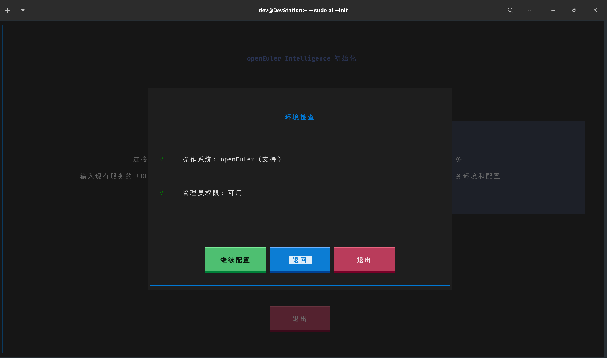
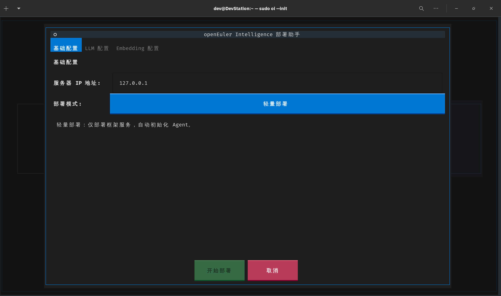
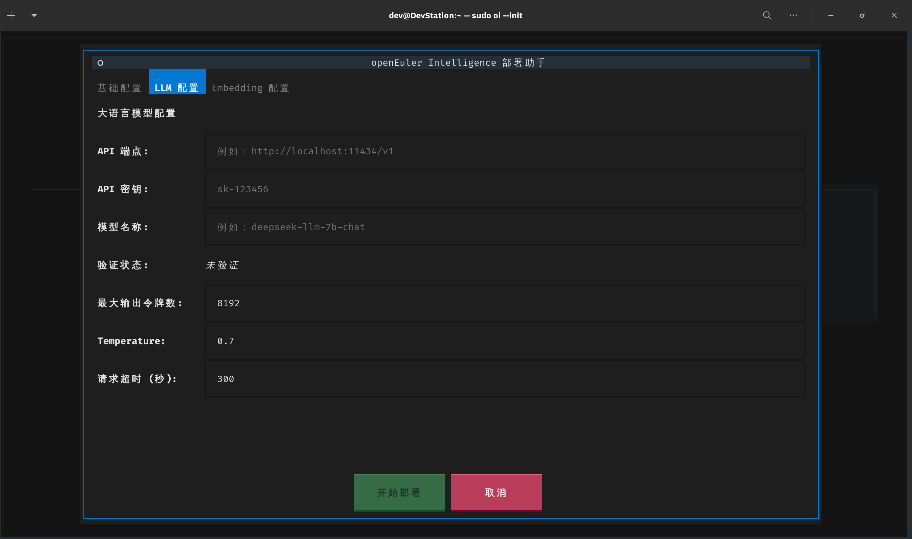
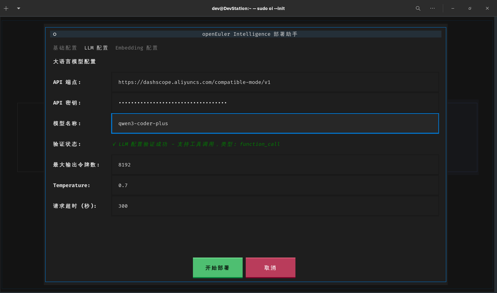
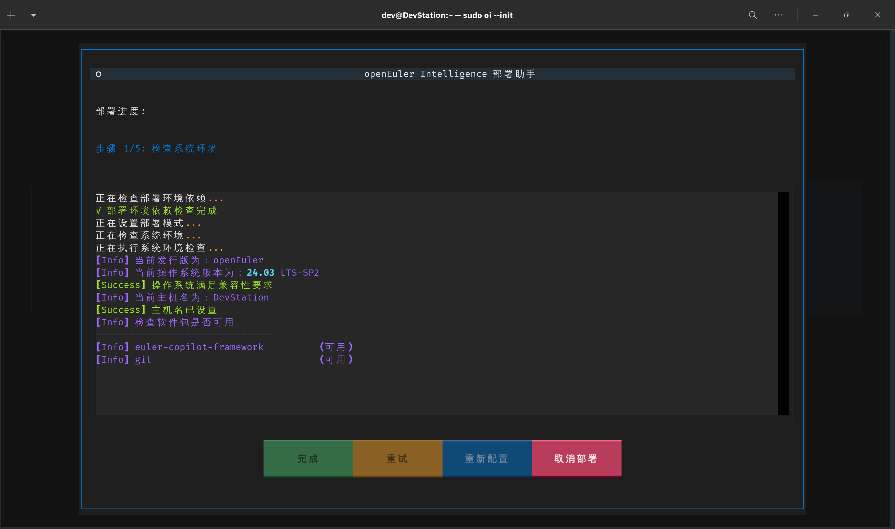
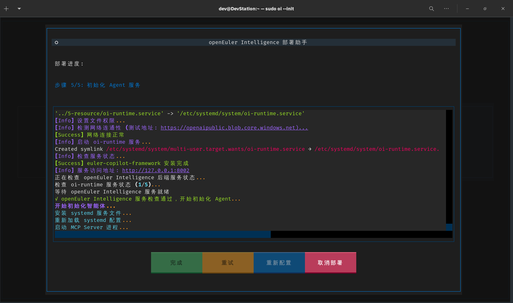
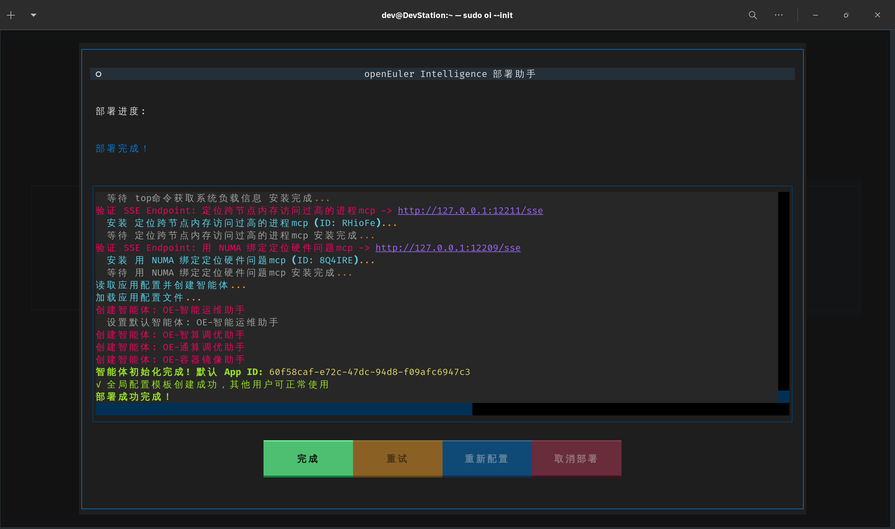

# Witty Assistant 部署手册

## 1. 环境要求

- **操作系统**：openEuler 24.03 LTS SP2 或更高版本
- **内存**：至少 8GB RAM
- **存储**：至少 20GB 可用磁盘空间
- **网络**：稳定的互联网连接（如果无法访问外部网络，请提前下载所需资源，详见 Q&A）
- **大模型服务**：
  - 线上：需要能支持工具调用的线上大模型 API 访问权限，如百炼、DeepSeek Chat、GLM-4.5 等
  - 本地：支持部署在本地的 LLM 服务，如 llama-server、ollama、vLLM、LM Studio 等，需要部署支持工具调用能力的大模型，如 Qwen3、GLM-4.5、Kimi K2、DeepSeek 3.2 等
- **系统权限**：需要具备 sudo 权限以安装必要的软件包和依赖项

## 2. 安装步骤

### 2.1 安装软件包

```bash
sudo dnf update -y
sudo dnf install -y witty-assistant witty-assistant-installer
```

如果在 openEuler 24.03 LTS SP2 上找不到 `witty-assistant` 软件包，请参考 Q&A 中的解决方案。

### 2.2 初始化 Witty Assistant

```bash
sudo witty --init
```


部署全新服务的过程中涉及安装 RPM 包，请使用具有管理员权限的用户运行该命令。

**特别说明**：命令行客户端的界面样式会随着终端的适配情况出现差异，建议使用支持 256 色及以上的终端模拟器以获得最佳体验。本文档以 openEuler DevStation 内置的 GNOME 终端为例。

### 2.3 选择部署新服务

在欢迎界面选择“部署新服务”，然后按回车键继续。



选择“继续配置”，进入参数配置界面。

### 2.4 配置参数

在参数配置界面，根据实际情况设置以下参数：

- **服务地址**：设置 sysAgent 服务的 IP，默认值为 `127.0.0.1`；
- **部署模式**：选择“轻量部署”或“全量部署”，轻量部署模式仅支持命令行界面，默认初始化全部内置的智能体，并自动选择“智能运维助手”为默认智能体；全量部署模式支持图形界面和命令行界面，但需要通过 Web 图形界面手动按需初始化智能体。



完成基础配置后，点击上方“LLM 配置”标签页，进入大模型配置界面。



依次配置大模型服务参数：

- API 端点：填写线上或本地大模型服务的 API 地址；
- API 密钥：根据所选大模型服务的要求，填写 API Key 或 Token；
- 模型名称：选择所需使用的大模型。

另外，请确保所选大模型支持工具调用能力，否则智能体将无法正常工作。



**Embedding 模型配置：**

- “轻量部署”模式下，若不配置 Embedding 模型，可能会导致部分智能体功能受限；
- “全量部署”模式下必须填写 Embedding 模型，否则无法继续部署；
- 支持的 Embedding 端口格式有 OpenAI 兼容格式和 MindIE 格式，请根据实际情况填写。

### 2.5 启动部署

完成大模型配置后，点击下方“开始部署”按钮，启动部署程序。





部署过程可能需要较长时间，请耐心等待。部署完成后，系统会提示成功信息。



轻量部署模式完成后，会显示已经初始化的智能体以及自动配置的默认智能体。

## 3. 内网离线环境部署

### 3.1 预下载资源

在内网环境中部署时，请提前下载以下资源：

- 下载 MongoDB Server 安装包，放置在 `/opt/mongodb` 目录下：
  - x86_64 版本：[mongodb-org-server-7.0.21-1.el9.x86_64.rpm](https://repo.mongodb.org/yum/redhat/9/mongodb-org/7.0/x86_64/RPMS/mongodb-org-server-7.0.21-1.el9.x86_64.rpm)
  - aarch64 版本：[mongodb-org-server-7.0.21-1.el9.aarch64.rpm](https://repo.mongodb.org/yum/redhat/9/mongodb-org/7.0/aarch64/RPMS/mongodb-org-server-7.0.21-1.el9.aarch64.rpm)
- 下载 MongoDB Shell 安装包，放置在 `/opt/mongodb` 目录下：
  - x86_64 版本：[mongodb-mongosh-2.5.2.x86_64.rpm](https://downloads.mongodb.com/compass/mongodb-mongosh-2.5.2.x86_64.rpm)
  - aarch64 版本：[mongodb-mongosh-2.5.2.aarch64.rpm](https://downloads.mongodb.com/compass/mongodb-mongosh-2.5.2.aarch64.rpm)
- **全量部署**模式下，还需下载 MinIO RPM 安装包，放置在 `/opt/minio` 目录下：
  - x86_64 版本：[x86_64 版本下载页面](https://dl.min.io/server/minio/release/linux-amd64/)
    *请选择最新版本进行下载，例如：`minio-20250907161309.0.0-1.x86_64.rpm`*
  - aarch64 版本：[aarch64 版本下载页面](https://dl.min.io/server/minio/release/linux-arm64/)
    *请选择最新版本进行下载，例如：`minio-20250907161309.0.0-1.arm64.rpm`*

### 3.2 使用大模型服务

#### 3.2.1 内网线上大模型服务

若内网环境的大模型服务须通过 HTTPS 访问，请确保证书已正确配置在系统中，避免部署过程中出现证书验证失败的问题。若无法配置有效的证书，请在环境变量中添加以下内容以跳过证书验证：

```bash
export OI_SKIP_SSL_VERIFY=true
```

将上述命令添加到 `~/.bashrc` 或 `~/.bash_profile` 文件中，以确保每次登录时该环境变量均被设置。

#### 3.2.2 本地部署大模型服务

若没有可用的大模型服务，可以在本地部署一个支持工具调用能力的大模型服务。sysAgent 支持标准的 OpenAI API (v1/chat/completions)。

若本地设备没有 GPU，建议使用激活参数更少的 MoE 模型，如 Qwen3-30B-A3B，以获得更好的性能表现。本地部署大模型需要较大的计算资源，建议使用至少 32GB 内存和多核 CPU 的服务器或 PC 进行部署。

### 3.3 为 sysAgent 配置代理

若内网环境需要通过代理服务器访问大模型服务，请在 `sysagent` 的 service 文件 (`/etc/systemd/system/sysagent.service`) 中设置以下内容：

```bash
[Service]
Environment="HTTP_PROXY=http://<proxy-server>:<port>"
Environment="HTTPS_PROXY=http://<proxy-server>:<port>"
Environment="NO_PROXY=localhost,127.0.0.1"
```

将 `<proxy-server>` 和 `<port>` 替换为实际的代理服务器地址和端口号。保存文件后，执行以下命令以重新加载服务配置并重启 `sysagent` 服务：

```bash
sudo systemctl daemon-reload
sudo systemctl restart sysagent
```

## 4. 常见问题解答 (Q&A)

### Q1: openEuler 24.03 LTS SP2 搜不到软件包怎么办？

**A1**: 官方源默认没有配置 EPOL 仓的 update 源，可以手动添加 EPOL 仓的源配置文件 `/etc/yum.repos.d/openEuler.repo`，内容如下：

```ini
[update-EPOL]
name=update-EPOL
baseurl=https://repo.openeuler.org/openEuler-24.03-LTS-SP2/EPOL/update/main/$basearch/
metadata_expire=1h
enabled=1
gpgcheck=1
gpgkey=http://repo.openeuler.org/openEuler-24.03-LTS-SP2/OS/$basearch/RPM-GPG-KEY-openEuler
```

### Q2: 安装界面的语言如何设置？

**A2**: 安装界面的默认语言会根据终端的语言环境变量自动选择。可以通过设置 `LANG` 环境变量来指定语言，例如：

```bash
export LANG=zh_CN.UTF-8  # 设置为中文
export LANG=en_US.UTF-8  # 设置为英文
```

部署完成后，如果需要更改界面语言，可以在命令行界面使用以下命令：

```bash
witty --locale zh_CN  # 切换到中文
witty --locale en_US  # 切换到英文
```

### Q3: 部署过程中遇到 pip 包下载很慢怎么办？

**A3**: 可以使用国内的 pip 镜像源，例如清华大学的镜像源。可以通过修改 pip 配置文件来使用清华镜像源：

```bash
mkdir -p ~/.pip
echo "[global]" > ~/.pip/pip.conf
echo "index-url = https://pypi.tuna.tsinghua.edu.cn/simple" >> ~/.pip/pip.conf
```

### Q4: 如果无法访问外网，如何获取所需的依赖包？

**A4**: 可以在有外网的环境中下载所需的依赖包，然后通过 U 盘等方式将其拷贝到目标环境中进行安装。具体步骤如下：

1. 在有外网的环境中，使用以下命令下载所需的依赖包：

   ```bash
   pip download -d /path/to/download/dir <package-name>
   ```

   将 `<package-name>` 替换为实际需要下载的包名，`/path/to/download/dir` 替换为实际的下载目录。

2. 将下载的依赖包拷贝到目标环境中。

3. 在目标环境中，使用以下命令安装依赖包：

   ```bash
   pip install --no-index --find-links=/path/to/download/dir <package-name>
   ```

   将 `/path/to/download/dir` 替换为实际的下载目录，`<package-name>` 替换为实际需要安装的包名。

### Q5: 服务器系统版本受制约，无法升级到 openEuler 24.03 LTS SP2，怎么办？

**A5**: 可以尝试在当前系统版本上手动安装所需的软件包和依赖项。由于 openEuler 24.03 LTS 以上的版本都使用 6.6 版本的内核和 Python 3.11，因此只需要将 `/etc/os-release` 和 `/etc/openEuler-release` 文件中的版本信息修改为 24.03 LTS SP2 即可。

请注意，使用这种方法安装需要自行准备所需的软件包和依赖项，可能会遇到兼容性问题，建议在测试环境中进行验证后再应用到生产环境中。

### Q6: 全量部署后，如何访问图形界面？

**A6**: 全量部署完成后，可以通过浏览器访问图形界面。默认情况下，图形界面的访问地址为 `http://localhost:8080`。

### Q7: 全量部署后，Shell 端无法连接后端服务怎么办？

**A7**: 如果运行环境支持完整桌面端，例如 DevStation 或 VNC 连接，请运行 `witty --login` 命令打开浏览器登录。注意，首次登录前请先在 Web 端确认已注册有效的账号，并确保浏览器不会拦截弹出窗口。

如果无法使用完整桌面端，例如 SSH 连接或纯命令行环境，请先通过浏览器登录。浏览器正常登录后，需要打开“开发者工具”，从“应用”选项卡中找到“本地存储”，查看 `ECSESSION` 键对应的值。然后在 Shell 端按下 `Ctrl + S` 打开设置页面，找到“API 密钥”输入框，将 `ECSESSION` 的值粘贴进去并保存。保存后，Shell 端即可正常连接后端服务。

### Q8: 全量部署后，如何初始化智能体？

**A8**: 全量部署后，需先在网页端注册名为 `openEuler` 的管理员用户，然后登录图形界面。先在“插件中心”中注册所需的 MCP Server 服务，然后在“应用中心”中创建并配置智能体。具体操作请参考 Web 图形界面的使用手册。
